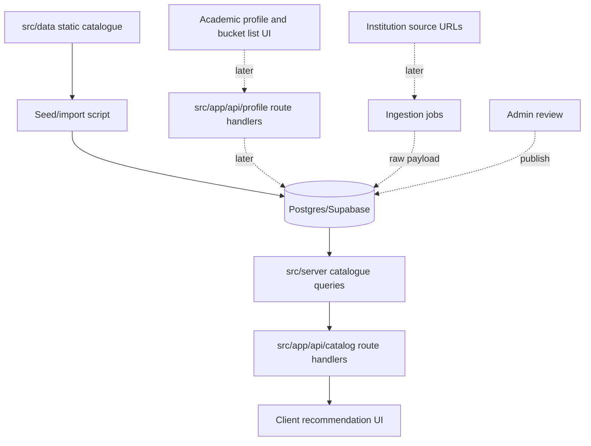

# Backend Data Foundation Implementation Plan

## Summary

Move the current static, client-only Next.js app toward a database-backed foundation without introducing a separate backend service yet. The first progression stabilizes the existing recommendation/admission logic with tests, designs a relational data model, seeds the current catalogue into DB-shaped data, and ships one read-only backend vertical slice before adding user persistence or ingestion automation.

---

## Problem Frame

The app currently stores institutions, programs, recommendation logic, admission thresholds, academic scores, and saved programs in frontend TypeScript and `localStorage`. That is fast for prototyping, but it blocks source-backed admission data, data review, persistence across devices, uploaded documents, and an ingestion pipeline.

The Monday `Backend Infra` task lists MongoDB, Node.js backend, TypeScript frontend, and optional AWS/Redis. The repo shape argues for a narrower first step: keep Next.js as the backend-for-frontend, use Postgres/Supabase for relational academic data, and defer Redis/AWS until a real queue, cache, or storage requirement appears.

---

## Requirements

**Baseline Stability**

- R1. The existing recommendation, bucket-list, and admission-calculation behavior must be covered by characterization tests before data is moved.
- R2. `npm run build` and `npm test` must be reliable local verification commands.
- R3. The first backend migration must not change the user-facing quiz or recommendation flow.

**Data Foundation**

- R4. Institutions, programs, admission requirements, thresholds, source URLs, and requirement versions must have a normalized relational model.
- R5. Raw scraped or imported payloads must be stored separately from reviewed canonical data.
- R6. Each canonical admission requirement must be traceable to an official or reviewed source URL.
- R7. Existing static catalogue data must be importable into the new schema without deleting the current static fallback in the first progression.

**Backend Slice**

- R8. The first backend endpoint must be read-only and limited to catalogue data.
- R9. The frontend must be able to consume backend catalogue data behind a small typed boundary without importing DB code into client components.
- R10. Backend code must live inside the existing Next.js app unless a later worker/runtime need justifies a separate service.

**User Data and Ingestion Readiness**

- R11. User profiles and saved programs must have a schema that can replace `localStorage` later without forcing auth into the first read-only slice.
- R12. Uploaded academic documents must be modeled as stored files with metadata, not transient client-only file names.
- R13. Ingestion jobs must support source difficulty tiers: easy scrape, browser-required, and hard/manual.
- R14. Ingestion output must require review before updating canonical admission data.

---

## Key Technical Decisions

- KTD1. Use Postgres/Supabase instead of MongoDB: the core data is relational, versioned, source-backed, and query-heavy across institutions, programs, requirements, users, and saved programs. Postgres also supports `jsonb` for raw scrape payloads without giving up joins and constraints.
- KTD2. Keep backend work inside Next.js first: App Router route handlers are enough for catalogue reads, profile persistence, and upload handoff. A separate Node service adds deployment and API surface before the product has independent service needs.
- KTD3. Use a typed DB layer rather than ad hoc SQL inside route handlers: schema definitions, migrations, and query functions should live under `src/db/` and `src/server/` so client components only consume typed API outputs.
- KTD4. Keep static data as a fallback during the first slice: the current `src/data/` catalogue remains the source for existing UI until the read-only backend path is verified.
- KTD5. Treat scraping as ingestion plus review, not direct publishing: scraper output lands as raw/imported records and only reviewed data changes canonical requirements.
- KTD6. Defer Redis, AWS, and a standalone worker: add them only when ingestion volume, queue latency, file storage, or runtime isolation creates a concrete need.

---

## High-Level Technical Design

The first shipped vertical slice should stop at `DB -> ServerQueries -> API -> ClientUI` for catalogue reads. Profile persistence, uploads, scraping, and review workflows are designed now but implemented after the read-only slice is working.

---

## Implementation Units

### U1. Baseline Dependency and Verification Setup

- **Goal:** Make the current app buildable and testable before architecture changes.
- **Files:** `package.json`, `package-lock.json`, `vitest.config.ts`, `src/test/setup.ts`, `tsconfig.json`
- **Patterns:** Keep `npm run build` as the production build command. Add `npm test` for unit tests.
- **Test Scenarios:**
  - `npm run build` completes with the current Next.js app.
  - `npm test` runs with no tests failing.
  - TypeScript path alias `@/` resolves in tests.
- **Verification:** `npm run build`; `npm test`

### U2. Characterization Tests for Core Logic

- **Goal:** Lock current behavior before moving static data behind DB-backed access.
- **Files:** `src/utils/sekhemCalculators.ts`, `src/utils/recommendationEngine.ts`, `src/utils/bucketListEngine.ts`, `src/utils/__tests__/sekhemCalculators.test.ts`, `src/utils/__tests__/recommendationEngine.test.ts`, `src/utils/__tests__/bucketListEngine.test.ts`
- **Patterns:** Test exported functions directly. Prefer stable fixture inputs over broad snapshot tests.
- **Test Scenarios:**
  - TAU engineering bonus applies only to TAU engineering/exact-sciences programs and caps at 800.
  - Technion calculation uses the Technion linear scale and rounds to one decimal.
  - Direct psychometric admission marks a user accepted through the direct track when the cutoff is met.
  - Recommendation ordering changes when avoidance tags penalize overlapping categories.
  - Bucket-list analysis returns `requirements` for non-sekhem programs.
  - Bucket-list analysis returns `no-data` when scores or thresholds are missing.
- **Verification:** `npm test`

### U3. Database and Migration Tooling

- **Goal:** Add a migration-backed relational schema without wiring the UI to it yet.
- **Files:** `drizzle.config.ts`, `src/db/schema.ts`, `src/db/client.ts`, `src/db/types.ts`, `src/env.ts`, `.env.example`, `package.json`, `package-lock.json`
- **Patterns:** Keep DB client creation server-only. Validate required environment variables in one module.
- **Test Scenarios:**
  - Schema compiles under TypeScript.
  - DB client module is not imported by any `use client` component.
  - Missing DB env values fail with a clear server-side error.
- **Verification:** `npm test`; `npm run build`

### U4. Core Catalogue Schema

- **Goal:** Model the canonical catalogue and admission data.
- **Files:** `src/db/schema.ts`, `src/db/migrations/*`, `src/db/seeds/catalogueSeed.ts`
- **Proposed Tables:** `institutions`, `programs`, `program_institutions`, `admission_requirements`, `admission_thresholds`, `source_urls`, `requirement_versions`
- **Patterns:** Store canonical fields in typed columns. Use `jsonb` only for variable metadata or raw source payload references.
- **Test Scenarios:**
  - Institution IDs from `src/data/institutions.ts` can be represented without collisions.
  - Program IDs from `src/data/degrees/index.ts` can be represented without collisions.
  - A program can link to multiple institutions when needed.
  - Thresholds support university-specific scales and null/unavailable values.
  - Requirement versions preserve previous values when a reviewed value changes.
- **Verification:** migration generation/check command; seed dry-run test

### U5. Seed Existing Static Catalogue

- **Goal:** Convert current static data into repeatable seed/import data.
- **Files:** `scripts/seed-catalogue.ts`, `src/db/seeds/catalogueSeed.ts`, `src/data/institutions.ts`, `src/data/degrees/index.ts`, `src/data/degrees/types.ts`
- **Patterns:** Import from current static modules, normalize to schema rows, and upsert by stable IDs.
- **Test Scenarios:**
  - Every institution in `INSTITUTIONS` is mapped to exactly one seed row.
  - Every program in `allPrograms` is mapped to exactly one seed row.
  - Programs with `institutionDetails` produce source/requirement candidate rows.
  - Running the seed twice is idempotent.
  - Seed validation reports missing `institutionId` or unknown institution names before writing.
- **Verification:** seed dry run; seed against local/dev DB; row-count assertion

### U6. Read-Only Catalogue API Slice

- **Goal:** Serve catalogue data from the backend through a typed route handler.
- **Files:** `src/server/catalogue/queries.ts`, `src/server/catalogue/serializers.ts`, `src/app/api/catalog/programs/route.ts`, `src/app/api/catalog/institutions/route.ts`, `src/types/catalogue.ts`
- **Patterns:** Route handlers call server query modules. Client components call API utilities, not DB utilities.
- **Test Scenarios:**
  - `GET /api/catalog/institutions` returns stable institution IDs, names, regions, and URLs.
  - `GET /api/catalog/programs` returns stable program IDs, names, categories, admission type, and linked institutions.
  - API output omits raw scrape payloads and internal review fields.
  - API returns a controlled error shape when DB access fails.
- **Verification:** route handler tests if practical; `npm run build`; manual API request in dev

### U7. Frontend Catalogue Boundary

- **Goal:** Introduce a frontend data-access boundary while preserving current UI behavior.
- **Files:** `src/lib/catalogueClient.ts`, `src/app/page.tsx`, `src/components/RecommendationResults.tsx`, `src/components/BucketList.tsx`, `src/utils/recommendationEngine.ts`
- **Patterns:** Keep recommendation calculations pure. Pass catalogue data into components/utilities instead of importing all static data from deep inside UI where practical.
- **Test Scenarios:**
  - App renders with static fallback when backend data is unavailable.
  - App renders the same recommendation categories for a known RIASEC input before and after backend catalogue hydration.
  - Saved program toggling still works with `localStorage`.
  - No server-only module is bundled into client components.
- **Verification:** `npm test`; `npm run build`; manual quiz flow

### U8. User Persistence Schema, Not UI Migration

- **Goal:** Prepare user/profile persistence without forcing auth into the first backend slice.
- **Files:** `src/db/schema.ts`, `src/types/index.ts`, `src/hooks/useUserProfile.ts`
- **Proposed Tables:** `users`, `user_profiles`, `saved_programs`, `uploaded_documents`
- **Patterns:** Keep `localStorage` as the live UI path for this progression. Model server persistence separately so migration can happen in a later vertical slice.
- **Test Scenarios:**
  - `saved_programs` supports many saved programs per user.
  - `user_profiles` supports psychometric, bagrut, RIASEC, geography, and avoidance data.
  - Uploaded document metadata can represent psychometric and bagrut files separately.
  - No profile route requires auth until an auth decision is made.
- **Verification:** schema tests or migration checks; `npm run build`

### U9. Ingestion and Review Groundwork

- **Goal:** Model data retrieval pipeline state before implementing scrapers.
- **Files:** `src/db/schema.ts`, `src/server/ingestion/types.ts`, `src/server/ingestion/reviewTypes.ts`
- **Proposed Tables:** `ingestion_sources`, `ingestion_jobs`, `ingestion_payloads`, `review_items`
- **Patterns:** Store source difficulty as enum-like values: `easy`, `browser_required`, `hard_manual`. Keep raw payloads separate from canonical rows.
- **Test Scenarios:**
  - An ingestion source can be linked to an institution and optional program.
  - A job records status, started time, completed time, error text, and source difficulty.
  - A payload can be stored without publishing canonical data.
  - A review item can point to the proposed canonical field it would change.
- **Verification:** schema tests or migration checks

### U10. Documentation and Operational Notes

- **Goal:** Document the backend foundation enough for future work to continue consistently.
- **Files:** `README.md`, `.env.example`, `docs/backend-data-model.md`
- **Patterns:** Keep setup instructions short and executable. Document deferred decisions explicitly.
- **Test Scenarios:**
  - README explains build, test, env setup, and seed command.
  - `.env.example` contains no secrets and lists required DB variables.
  - Data model doc explains canonical vs raw/reviewed data.
- **Verification:** docs review; command copy-check where practical

---

## Acceptance Examples

- AE1. Given the current static app, when tests are added, then recommendation and admission calculations are covered before any DB-backed refactor begins.
- AE2. Given the seed script runs against an empty dev DB, when it completes, then institution and program row counts match the current static catalogue.
- AE3. Given the seed script runs twice, when the second run completes, then it updates existing rows instead of duplicating catalogue records.
- AE4. Given the catalogue API is enabled, when the frontend requests programs, then it receives public catalogue fields only.
- AE5. Given the DB is unavailable, when the frontend loads, then the first progression should still be able to fall back to static data or fail with a controlled error boundary, not a blank crash.
- AE6. Given a scraper produces a new threshold value later, when ingestion stores it, then canonical requirements do not change until review approves the item.

---

## Scope Boundaries

**Included in this progression**

- Test harness and characterization tests.
- Database schema and migration tooling.
- Seed/import path from existing static data.
- Read-only catalogue API.
- Minimal frontend boundary for catalogue data.
- User/profile and ingestion schema groundwork.
- Setup documentation.

**Deferred for later**

- Full Supabase Auth integration.
- Replacing `localStorage` with server profile persistence.
- Real file upload storage and OCR/parsing.
- Admin review UI.
- Production scraping workers.
- Redis-backed queues or caching.
- AWS-specific infrastructure.
- Separate Express/Nest/Node backend.

---

## System-Wide Impact

The main architectural change is introducing a server-owned data layer into an app that currently imports all product data directly into client components. Implementation should avoid a big-bang migration. The safe path is to keep existing static imports available while the database-backed read path is built, seeded, tested, and compared.

The second impact is data provenance. Once admission data becomes source-backed, canonical records and raw ingestion payloads must remain separate. This prevents scraper mistakes from becoming user-facing admission guidance without review.

---

## Risks and Dependencies

| Risk | Impact | Mitigation |
| --- | --- | --- |
| Next.js 16 API details differ from older App Router examples | Route handler or server-action code may follow stale patterns | Use local `node_modules/next/dist/docs/` after install and official Next.js docs before implementation |
| Static data contains inconsistent institution names or IDs | Seed import may create duplicate or orphaned rows | Add seed validation before writes |
| Admission formulas regress during refactor | Users receive incorrect eligibility guidance | Land characterization tests before DB work |
| Supabase auth/storage choices leak into early schema | First progression becomes too large | Model persistence/upload metadata now, implement auth/upload later |
| Scraped data is wrong or stale | Bad requirements could be published | Require review before canonical updates |

---

## Sources and Existing Patterns

- `src/hooks/useUserProfile.ts` shows the current `localStorage` persistence boundary.
- `src/utils/sekhemCalculators.ts` contains the admission calculation logic that needs characterization tests.
- `src/utils/recommendationEngine.ts` contains the recommendation scoring logic that needs characterization tests.
- `src/utils/bucketListEngine.ts` contains saved-program qualification analysis.
- `src/data/institutions.ts` is the current master institution catalogue.
- `src/data/degrees/index.ts` is the current combined program catalogue.
- Official Next.js App Router docs confirm backend endpoints should use `route.ts` route handlers under `app`.
- Official Supabase Next.js docs should be used when auth is introduced; auth is not part of the first read-only backend slice.
