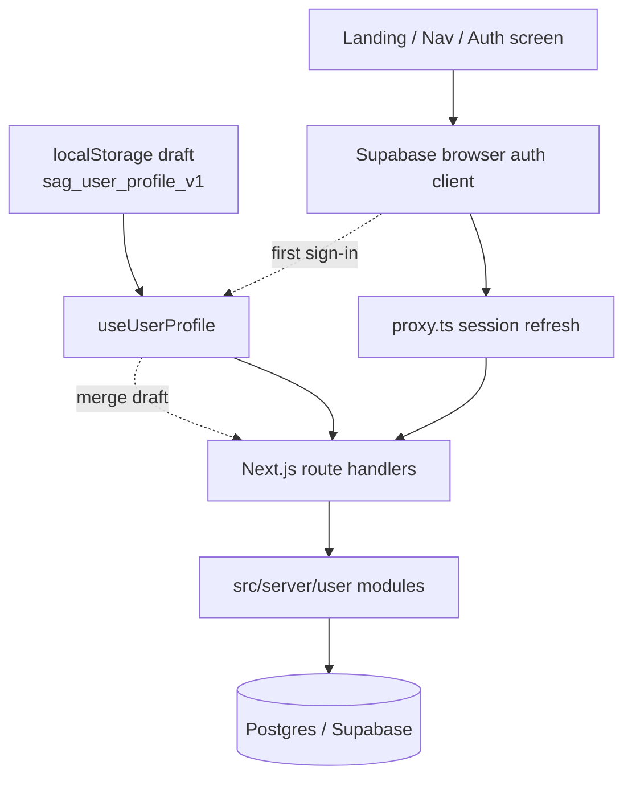

# Authenticated User Persistence Implementation Plan

## Summary

Add Supabase-backed sign-in and move academic profile data plus saved programs from browser-only `localStorage` into authenticated server persistence. Keep the current recommendation flow usable without forcing an account wall, and migrate existing `localStorage` data into the server path the first time a user signs in.

---

## Problem Frame

The current app persists user state exclusively through `src/hooks/useUserProfile.ts`, which reads and writes the `sag_user_profile_v1` `localStorage` key. That keeps the product fast to prototype, but it prevents cross-device continuity, loses data when a browser is cleared, and leaves the existing `users` / `user_profiles` / `saved_programs` schema unused.

The backend foundation work already established the intended architecture: Next.js route handlers, Drizzle-backed server modules, and a relational schema ready for later user persistence. This task is the first live user-data vertical slice on top of that foundation, and it now includes sign-in as part of the persistence boundary rather than as a later prerequisite.

---

## Requirements

- R1. The current quiz, recommendation, calculator, bucket-list, and landing flows must remain usable while this work lands.
- R2. Users must be able to sign up, sign in, and sign out through Supabase Auth.
- R3. Authenticated users must have backend-backed persistence for academic profile data and saved programs.
- R4. Existing `sag_user_profile_v1` browser data must migrate into the authenticated server path without silent data loss.
- R5. Signed-out users must still be able to explore the product without a mandatory auth gate.
- R6. User-owned rows must only be readable and writable by the owning authenticated user.
- R7. The implementation must follow the existing repo shape: Next.js route handlers -> server modules -> Drizzle/Postgres.
- R8. The plan must not pull in uploaded-document workflows, ingestion, or broader account-management features.
- R9. The work must respect Next.js 16 conventions, including `proxy.ts` instead of the deprecated `middleware.ts` path.
- R10. `npm run build` and the targeted Vitest suites must remain viable verification paths.

---

## Key Technical Decisions

- KTD1. Use Supabase Auth for identity and session management, but keep the app's persistence logic in route handlers and server modules. The browser handles sign-in state; the server remains the source of truth for profile reads and writes.
- KTD2. Treat authenticated server persistence as canonical and reduce `localStorage` to a temporary draft and migration source. Signed-out users can still browse with local draft state, but cross-device durability belongs to the signed-in server path.
- KTD3. Use email/password auth for the first shipped slice. It matches the fetched auth prior art, keeps sign-in comprehensible, and avoids widening this task into social auth or multi-provider UX.
- KTD4. Align user-owned tables to Supabase Auth user IDs instead of the current app-local `users` table as the identity source of truth. If the existing local `users` table is unused, retire it from the active path rather than maintaining duplicate identity records.
- KTD5. Implement an explicit first-sign-in merge policy: server-first for scalar profile fields unless the server value is empty, union for `savedProgramIds`, and idempotent replay protection for repeated sign-ins.
- KTD6. Use Next.js 16 `proxy.ts` session refresh mechanics and server-side user validation. Do not rely on deprecated `middleware.ts` naming or on client session state alone for authorization-sensitive reads and writes.

---

## System-Wide Impact

- End users gain sign-in and cross-device persistence, but should not lose the anonymous exploration path.
- The frontend moves from a pure browser-local profile model to an auth-aware synchronization model.
- The database stops treating `user_profiles` and `saved_programs` as future scaffolding and starts enforcing real ownership boundaries.
- Operations now require Supabase auth environment configuration, redirect URL setup, and row-level security review for user-owned tables.

---

## High-Level Technical Design



The browsing experience stays available before sign-in, but authenticated persistence flows through route handlers and server modules. `localStorage` remains only as a draft and migration input, not as the durable source of truth.

---

## Output Structure

```text
src/
  app/
    api/
      profile/
        route.ts
      saved-programs/
        route.ts
  components/
    AuthScreen.tsx
  context/
    AuthContext.tsx
  lib/
    supabase/
      client.ts
      server.ts
  server/
    user/
      migration.ts
      profile.ts
      serializers.ts
proxy.ts
```

---

## Implementation Units

### U1. Supabase Auth Foundation and Runtime Wiring

- **Goal:** Add the auth runtime primitives and UI shell needed to sign users in and out without breaking anonymous product usage.
- **Requirements:** R1, R2, R5, R9, R10
- **Dependencies:** None
- **Files:** `package.json`, `package-lock.json`, `.env.local.example`, `src/app/layout.tsx`, `src/components/AuthScreen.tsx`, `src/context/AuthContext.tsx`, `src/lib/supabase/client.ts`, `src/lib/supabase/server.ts`, `proxy.ts`
- **Approach:** Add `@supabase/supabase-js` and `@supabase/ssr`, introduce browser and server helpers, wrap the app in an auth provider, and add a dedicated auth screen that can be invoked from the current flow. Use `proxy.ts` rather than the older `middleware.ts` naming, and keep the app functional when Supabase env values are absent in local development.
- **Patterns to follow:** Mirror the existing server/client separation used by `src/server/catalogue/queries.ts`. Reuse the current Hebrew UI tone from `src/components/LandingPage.tsx` and `src/components/NavBar.tsx`.
- **Test scenarios:**
  - Happy path: the app renders with auth enabled, a user can sign up, sign in, and sign out through the auth provider surface.
  - Edge case: the app renders without Supabase env values and shows auth as unavailable rather than crashing.
  - Error path: invalid credentials produce a visible, localized error state and do not leave the UI stuck in a loading state.
  - Integration: `proxy.ts` refreshes sessions on matched routes without intercepting static asset requests.
- **Verification:** `npm run build` succeeds; targeted auth provider and component tests pass; the auth entry points are reachable from the current UI.

### U2. Identity Schema Realignment and Row-Level Security

- **Goal:** Realign user-owned persistence tables to Supabase Auth identities and secure them for real authenticated usage.
- **Requirements:** R2, R3, R6, R7, R10
- **Dependencies:** U1
- **Files:** `src/db/schema.ts`, `src/db/types.ts`, `src/db/migrations/*`, `docs/backend-data-model.md`
- **Approach:** Replace the current app-local identity assumption with Supabase-auth-backed ownership. Convert user-owned foreign keys to the Supabase user ID shape, retire the local `users` table from the active path if it is unused, and add row-level security plus ownership policies for `user_profiles` and `saved_programs`. If `uploaded_documents` must follow the same user ID type for schema consistency, align the key shape without implementing new document behavior.
- **Patterns to follow:** Follow the existing Drizzle schema and migration style in `src/db/schema.ts`. Apply Supabase RLS guidance to every user-owned table touched in the public schema.
- **Test scenarios:**
  - Happy path: a valid authenticated user ID can own a profile row and multiple saved-program rows.
  - Edge case: saving the same program twice does not create duplicate rows.
  - Error path: unauthorized access to another user's rows is rejected by policy.
  - Integration: the migration path works when catalogue data already exists and user-owned tables are still empty.
- **Verification:** migration generation remains clean; schema types compile; policy tests or SQL validation confirm ownership rules.

### U3. User Persistence Server Modules and Auth-Checked APIs

- **Goal:** Introduce the server-side read/write boundary for authenticated profile hydration and saved-program mutations.
- **Requirements:** R3, R6, R7, R10
- **Dependencies:** U1, U2
- **Files:** `src/app/api/profile/route.ts`, `src/app/api/saved-programs/route.ts`, `src/server/user/profile.ts`, `src/server/user/profile.test.ts`, `src/server/user/serializers.ts`, `src/types/index.ts`
- **Approach:** Add typed route handlers for authenticated profile retrieval and mutation. Route handlers should resolve the current Supabase user on the server, delegate to `src/server/user` modules, and return a normalized snapshot that the client hook can hydrate from. Keep toggle-heavy saved-program writes narrow rather than resubmitting the entire profile object for every bookmark action.
- **Patterns to follow:** Match the route-handler and serializer structure already used under `src/app/api/catalog/*` and `src/server/catalogue/*`.
- **Test scenarios:**
  - Happy path: `GET /api/profile` returns the authenticated user's current snapshot with profile fields plus `savedProgramIds`.
  - Happy path: adding and removing a saved program mutates only the authenticated user's rows.
  - Edge case: an authenticated user with no profile row yet receives stable defaults rather than a null-shaped payload.
  - Error path: unauthenticated requests receive a controlled auth failure response.
  - Integration: profile upsert and saved-program toggles remain consistent when called in sequence during a single session.
- **Verification:** route-handler tests pass; API shapes remain typed; `npm run build` succeeds.

### U4. Auth-Aware `useUserProfile` Replacement

- **Goal:** Replace the current localStorage-only hook with a hook that supports both signed-out drafts and authenticated server sync.
- **Requirements:** R1, R3, R5, R7, R10
- **Dependencies:** U1, U3
- **Files:** `src/hooks/useUserProfile.ts`, `src/hooks/useUserProfile.test.tsx`, `src/app/page.tsx`, `src/types/index.ts`
- **Approach:** Preserve the current ergonomic surface of `useUserProfile` where practical so `src/app/page.tsx` does not need a wholesale rewrite. Signed-out mode should continue using a local draft; signed-in mode should hydrate from the server snapshot, perform optimistic updates through the new APIs, and keep client state coherent if an API write fails.
- **Execution note:** Start with failing hook tests for signed-out hydration and signed-in server hydration before changing the hook implementation.
- **Patterns to follow:** Keep the current hook's `hydrated` guard behavior and the existing page-level usage pattern in `src/app/page.tsx`.
- **Test scenarios:**
  - Happy path: signed-out startup hydrates the current draft from `sag_user_profile_v1`.
  - Happy path: signed-in startup replaces the local draft view with the server-backed snapshot.
  - Edge case: signing out returns the app to a predictable draft or empty state instead of leaking the prior authenticated profile.
  - Error path: failed server writes roll back or surface failure instead of silently dropping user changes.
  - Integration: bookmark toggles and academic-score updates still drive the current UI flow after the hook swap.
- **Verification:** hook tests pass; the main page still builds and navigates through the existing flow.

### U5. First-Sign-In Local Data Migration and Merge Rules

- **Goal:** Migrate legacy `localStorage` data into the backend path on first authenticated use without overwriting stronger server data.
- **Requirements:** R3, R4, R5, R10
- **Dependencies:** U3, U4
- **Files:** `src/server/user/migration.ts`, `src/server/user/migration.test.ts`, `src/hooks/useUserProfile.ts`, `src/app/api/profile/route.ts`
- **Approach:** Detect a legacy local draft when a session first becomes available, compute an explicit merge between the draft and the server snapshot, write the merged result through the authenticated API, and mark the draft as migrated so the process is safe to retry but not replay forever. Use server-first semantics for singular fields and union semantics for saved programs.
- **Patterns to follow:** Reuse the current `UserProfile` shape and the existing `sag_user_profile_v1` storage key as the migration source.
- **Test scenarios:**
  - Happy path: an empty server snapshot absorbs the full local draft on first sign-in.
  - Edge case: a partially populated server snapshot keeps existing scalar values while filling only missing fields from the draft.
  - Edge case: saved programs are deduplicated when both local and server state contain the same program IDs.
  - Error path: malformed local JSON is ignored rather than breaking the authenticated session flow.
  - Integration: an interrupted migration can be retried safely without duplicating saved-program rows or re-clobbering server data.
- **Verification:** migration tests pass; repeat sign-ins do not re-run a destructive merge.

### U6. Auth Entry Points, Save UX, and Regression Coverage

- **Goal:** Integrate sign-in into the current UI in a way that supports persistence without derailing the product's existing recommendation journey.
- **Requirements:** R1, R2, R5, R8, R10
- **Dependencies:** U1, U4, U5
- **Files:** `src/app/page.tsx`, `src/components/AuthScreen.tsx`, `src/components/BucketList.tsx`, `src/components/DegreePicker.tsx`, `src/components/LandingPage.tsx`, `src/components/NavBar.tsx`, `README.md`
- **Approach:** Add discoverable account entry points from the landing or nav surfaces, connect saved-program actions to the new persistence model, and keep anonymous exploration intact. Messaging should make it clear that an account enables sync and recovery, not that the entire app is gated behind auth. Update docs for env setup and auth expectations.
- **Patterns to follow:** Preserve the current landing and bucket-list interaction style from the working branch. Keep UI copy concise and aligned with the existing Hebrew experience.
- **Test scenarios:**
  - Happy path: an authenticated user can sign in, save programs, refresh, and still see the same saved state.
  - Happy path: an anonymous user can still complete the recommendation flow without being forced to authenticate immediately.
  - Edge case: a user who signs in after accumulating local saved programs sees those programs preserved after migration.
  - Error path: auth failures or profile-save failures surface clear UI feedback without blanking the page or losing the rest of the session.
  - Integration: nav and landing entry points reach the auth surface without breaking the current landing-page and degree-picker flow.
- **Verification:** targeted component and flow tests pass; `npm run build` succeeds; the documented env setup is enough to run the auth-enabled flow.

---

## Risks and Mitigations

- The fetched `feat/user-accounts` prior art uses `middleware.ts`, but the current app is on Next.js 16. Mitigation: treat that branch as UI/helper prior art only and standardize on `proxy.ts`.
- The current schema models user ownership with app-local text IDs rather than Supabase-auth-owned IDs. Mitigation: resolve identity shape first and make persistence code depend on the migrated schema, not on temporary adapter logic.
- Local-to-server migration can silently overwrite stronger server data if merge semantics are vague. Mitigation: codify and test the merge rules before wiring them into the hook.
- Supabase RLS can appear to work in happy-path server testing while still failing or overexposing data in real auth contexts. Mitigation: validate policies explicitly and keep server-side auth checks plus RLS as complementary defenses.

---

## Scope Boundaries

### Included

- Supabase sign-up, sign-in, and sign-out
- Auth-aware session wiring for Next.js 16
- Backend persistence for academic profile data and saved programs
- One-time migration from `sag_user_profile_v1`
- UI entry points needed to reach and benefit from sign-in

### Deferred to Follow-Up Work

- Password reset and account-recovery UX
- Social auth providers
- Uploaded-document persistence behavior
- Multi-device conflict resolution UI beyond the initial merge policy
- Admin account tools, moderation, or account deletion workflows

### Out of Scope

- Ingestion pipeline changes
- Catalogue schema or read-only catalogue API redesign
- Broader production cutover work outside user persistence

---

## Sources and Research

- Local repo boundaries:
  - `src/hooks/useUserProfile.ts`
  - `src/app/page.tsx`
  - `src/db/schema.ts`
  - `docs/backend-data-model.md`
  - `docs/plans/2026-06-08-backend-data-foundation.md`
- Fetched prior art:
  - Git ref `fce29f4` (`feat: add Supabase auth scaffolding + login screen (Phase 1)`) showed useful UI and helper direction, but it predates the current backend foundation and uses pre-Next-16 auth wiring.
- External guidance:
  - Supabase Next.js server-side auth docs: `https://supabase.com/docs/guides/auth/server-side/nextjs`
  - Supabase row-level security guidance: `https://supabase.com/docs/guides/database/postgres/row-level-security`
  - Next.js App Router authentication guidance: `https://nextjs.org/docs/app/guides/authentication`
