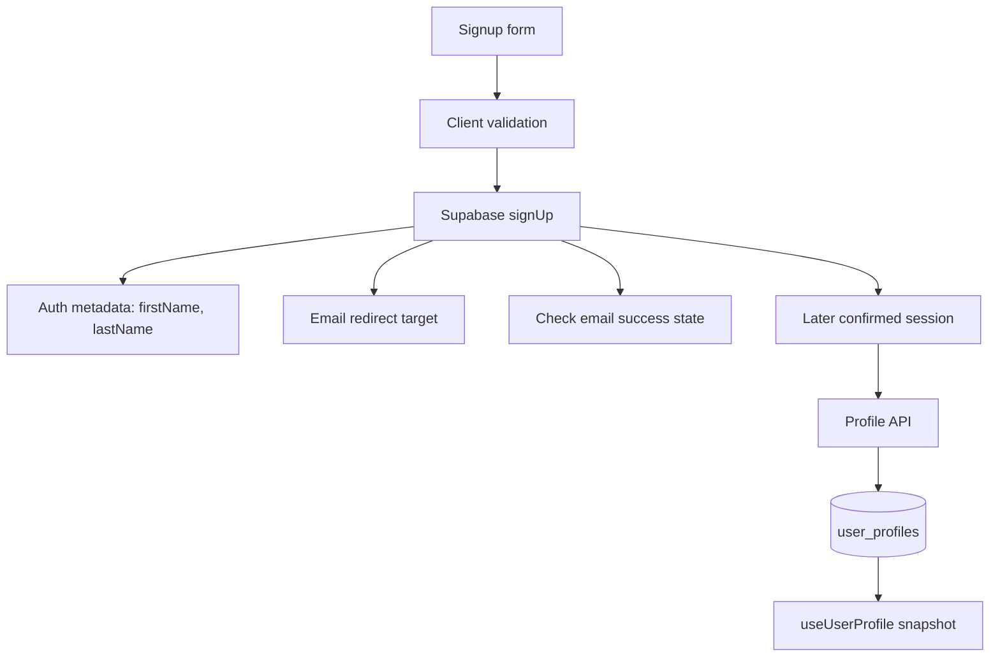

# Auth Signup Hardening Implementation Plan

## Summary

Harden the existing Supabase email/password signup path by making duplicate registration outcomes explicit, improving the email-confirmation handoff, fixing app-owned redirect handling, and persisting first and last name into the authenticated profile model.

---

## Problem Frame

The app already has Supabase Auth wiring, auth-aware profile persistence, `proxy.ts` session refresh, and user-owned profile tables. The remaining first-batch auth work is not a new authentication system; it is production hardening of the signup path that currently collects only email/password and shows a vague post-signup message.

The Monday scope also includes larger auth work, but Google OAuth and replacing Supabase email delivery are separate batches because they depend on external provider or email-sender configuration. This plan focuses on the smallest coherent batch that can be implemented and verified inside the current app path.

---

## Requirements

- R1. A second signup attempt for an existing or pending email must not look like a fresh successful registration.
- R2. Signup must collect first name and last name with validation that matches the current auth form behavior.
- R3. New profile identity fields must persist in the backend profile model and remain available after later sign-in.
- R4. Supabase signup metadata may carry first and last name at account creation, but app profile persistence remains the durable product source for these fields.
- R5. The post-signup success state must tell the user to check email for confirmation instead of implying they can immediately log in.
- R6. The app must pass an app-owned confirmation redirect target when signing up, while documenting required Supabase Dashboard URL configuration.
- R7. Existing anonymous exploration, profile migration, saved programs, and authenticated profile sync must keep working.
- R8. The implementation must keep using Next.js App Router route handlers and the existing `src/proxy.ts` session refresh pattern.
- R9. The work must not include Google OAuth, custom email-sender replacement, uploaded-document persistence, or production catalogue cutover.

---

## Key Technical Decisions

- KTD1. Keep duplicate-email handling in the client auth boundary for this batch. Supabase Auth owns the account creation response, and the app should translate ambiguous or known duplicate outcomes into clear product messages without introducing an admin-service preflight.
- KTD2. Persist names in `user_profiles` and also pass them through Supabase signup metadata. Supabase documentation supports metadata at signup, but the app's own profile table is the durable product model and avoids treating mutable auth metadata as the profile source of truth.
- KTD3. Add an app-origin redirect value to signup rather than hardcoding deployed URLs. This keeps local and production behavior configurable while matching Supabase's requirement that redirect URLs be allow-listed in project settings.
- KTD4. Treat confirmation email template/sender replacement as a follow-up batch. This plan fixes app behavior and configuration handoff, but it does not replace Supabase's email delivery path.
- KTD5. Extend the current auth/profile test surface instead of adding a new auth architecture. The repo already has `AuthContext`, `AuthScreen`, profile serializers, route handlers, and hook tests that should absorb this work.

---

## System-Wide Impact

This change touches user identity data, so schema, serialization, signup UX, and profile hydration need to move together. Existing saved-program and academic-score persistence should continue to use the same authenticated profile snapshot, with first and last name added as optional profile fields rather than a separate account model.

Operations will need to configure Supabase Auth redirect URLs for the deployed app. The code can compute and pass the target, but Supabase must allow it in the project Dashboard for confirmation links to land correctly.

---

## High-Level Technical Design

The signup form sends name metadata and a redirect target to Supabase, then shows a confirmation-oriented success state. The durable app profile fields live in `user_profiles` and flow through the existing profile snapshot path after authentication.

---

## Implementation Units

### U1. Signup Form State, Validation, and Messaging

- **Goal:** Add first/last name fields and replace the vague signup success message with explicit email-confirmation guidance.
- **Requirements:** R2, R5, R7
- **Dependencies:** None
- **Files:** `src/components/AuthScreen.tsx`
- **Approach:** Extend signup mode only with `firstName` and `lastName` inputs, validate non-empty trimmed values before calling auth, and reset or preserve form fields intentionally when switching modes. Keep login mode unchanged. Update the success state to tell users to check their email and return after confirmation.
- **Patterns to follow:** Preserve the current Hebrew UI tone, compact form shape, `submitting` state, and inline error/info rendering already used in `src/components/AuthScreen.tsx`.
- **Test scenarios:**
  - Happy path: a signup with valid email, password, first name, and last name calls the auth boundary with all four fields.
  - Edge case: signup mode with blank first or last name shows a validation error and does not call Supabase.
  - Edge case: switching between login and signup clears stale error/info state without losing the mode-specific affordance.
  - Error path: a translated duplicate-email or pending-confirmation message renders in the existing error area.
- **Verification:** Auth screen tests or component-level coverage prove validation and messaging behavior; manual inspection confirms login mode remains unchanged.

### U2. Auth Boundary Payload, Redirect Target, and Error Translation

- **Goal:** Make `signUp` accept names, pass Supabase metadata, include an app-owned email redirect target, and translate duplicate/pending account outcomes clearly.
- **Requirements:** R1, R2, R4, R5, R6, R8
- **Dependencies:** U1
- **Files:** `src/context/AuthContext.tsx`, `src/lib/supabase/env.ts`, `.env.local.example`
- **Approach:** Change the auth context `signUp` contract to accept profile identity fields and call Supabase with `options.data` for first and last name. Add a configurable public app URL or redirect origin used for `emailRedirectTo`, with a browser-origin fallback for local development when safe. Expand `translateAuthError` for already-registered, already-confirmed, pending-confirmation, and rate/confirmation cases surfaced by Supabase.
- **Patterns to follow:** Keep the existing `AuthResult` shape and `isSupabaseConfigured` behavior. Use public env values only for data safe to expose in the browser.
- **Test scenarios:**
  - Happy path: signup passes first and last name through Supabase metadata and includes a redirect target.
  - Edge case: missing configured app URL falls back to the current browser origin in client runtime.
  - Error path: Supabase duplicate-user and pending-confirmation messages translate to distinct, user-understandable Hebrew messages.
  - Error path: when Supabase is unconfigured, signup still returns the existing unavailable error.
- **Verification:** Unit tests cover the auth boundary helper behavior or isolate `translateAuthError`; `.env.local.example` documents every required public value.

### U3. Profile Schema and Serialization for Names

- **Goal:** Add first and last name to the backend profile snapshot so app-owned profile persistence stores the signup identity fields.
- **Requirements:** R3, R4, R7
- **Dependencies:** U2
- **Files:** `src/db/schema.ts`, `src/db/types.ts`, `src/db/migrations/0003_auth_signup_names.sql`, `src/server/user/serializers.ts`, `src/server/user/profile.test.ts`, `src/types/index.ts`, `docs/backend-data-model.md`
- **Approach:** Add nullable `first_name` and `last_name` columns to `user_profiles`, extend `UserProfile`, and update serializer build/read paths. Keep names optional in the type because legacy rows and anonymous drafts may not have them. Update backend data-model docs to state that profile identity fields live in `user_profiles`.
- **Execution note:** Start with serializer tests for sparse legacy rows and rows with names before changing schema code.
- **Patterns to follow:** Mirror the existing Drizzle schema and serializer style for scalar profile fields. Keep migration naming consistent with the repo's sequential Drizzle migration history, adjusting the exact generated filename if `drizzle-kit generate` produces one.
- **Test scenarios:**
  - Happy path: a row with first and last name serializes into the frontend profile snapshot.
  - Edge case: a legacy row with null names serializes without breaking existing profile consumers.
  - Happy path: building a profile row from a profile with names writes both columns.
  - Edge case: saved-program and academic-score serialization remains unchanged when names are present.
- **Verification:** Serializer tests pass; generated schema types compile; migration review confirms the columns are nullable and do not rewrite existing profile data.

### U4. Persist Signup Names Into the Profile Path

- **Goal:** Ensure names collected during signup become part of the authenticated app profile after the user confirms and signs in.
- **Requirements:** R3, R4, R7
- **Dependencies:** U3
- **Files:** `src/hooks/useUserProfile.ts`, `src/hooks/useUserProfile.test.tsx`, `src/server/user/migration.ts`, `src/server/user/migration.test.ts`
- **Approach:** Include names in local draft persistence and merge behavior so signup-collected values can be written through the existing authenticated profile API once a session is available. Preserve server-first merge semantics for existing profile fields: if the server already has a name, do not overwrite it from an older local draft; if the server is empty, fill it from the draft.
- **Patterns to follow:** Reuse the current `sag_user_profile_v1` local draft and `merge_local_draft` flow instead of adding a second profile write path.
- **Test scenarios:**
  - Happy path: a signed-up user with a local draft containing names gets those names into the server-backed snapshot after authentication.
  - Edge case: an existing server first name or last name is preserved during local draft merge.
  - Edge case: anonymous users can still use local profile data without names.
  - Error path: malformed local storage still fails closed and does not break authentication hydration.
- **Verification:** Hook and migration tests pass; the profile API payload remains backward-compatible for existing callers.

### U5. Confirmation Redirect Documentation and Acceptance Coverage

- **Goal:** Make the deployed confirmation-link requirement explicit and verify the first-batch signup behavior end to end at the code boundary.
- **Requirements:** R1, R5, R6, R8, R9
- **Dependencies:** U1, U2, U3, U4
- **Files:** `README.md`, `.env.local.example`, `src/components/AuthScreen.tsx`, `src/context/AuthContext.tsx`
- **Approach:** Document the required Supabase Dashboard redirect allow-list and the app env value used for `emailRedirectTo`. Add focused tests around signup outcome handling rather than relying only on manual QA. Keep confirmation email template/sender replacement documented as a follow-up, not hidden inside this batch.
- **Patterns to follow:** Keep documentation short and operational, matching the existing env example style.
- **Test scenarios:**
  - Happy path: signup success displays the check-email message and does not call `onSuccess` as if the user were logged in.
  - Error path: duplicate signup attempt displays an explicit existing-account or pending-confirmation message.
  - Integration: auth context receives names from `AuthScreen` and passes a redirect target to Supabase.
  - Configuration: docs identify the deployed origin that must be allow-listed in Supabase Auth settings.
- **Verification:** Targeted auth tests pass; `npm run build` remains viable; manual Supabase Dashboard checklist is clear enough for production configuration.

---

## Scope Boundaries

### Included

- Duplicate or pending email signup handling at the app auth boundary
- First and last name fields in signup
- First and last name persistence in the app profile model
- Confirmation-oriented post-signup UI messaging
- App-owned redirect target passed to Supabase signup
- Documentation for required Supabase redirect allow-list configuration

### Deferred to Follow-Up Work

- Replacing Supabase's confirmation email sender or full template system
- Google sign-up and sign-in
- Hydrating first and last name from Google identity data
- Uploaded-document storage and metadata persistence
- Production catalogue database cutover

### Out of Scope

- Password reset and account recovery
- Admin user-management tooling
- Account deletion or profile export
- Authorization model changes beyond preserving existing authenticated profile ownership

---

## Risks and Dependencies

- Supabase duplicate signup behavior can vary by email confirmation and project settings. The implementation should test against the actual project and translate both explicit errors and ambiguous successful responses into clear product states when possible.
- Redirect correctness depends on Supabase Dashboard configuration. Code can pass `emailRedirectTo`, but the deployed URL must be allow-listed outside the repo.
- Auth metadata is user-controlled and should not become an authorization source. Names can be copied into app profile data, but authorization must continue to use Supabase user IDs and existing RLS/server checks.
- Existing local draft migration may already have run for some users. Name merge behavior must handle absent migration markers and legacy drafts without overwriting server profile data unexpectedly.

---

## Documentation / Operational Notes

- Add a public app URL env value for confirmation redirects if the implementation cannot reliably derive the deployed origin at runtime.
- Supabase Dashboard must include the deployed app URL in Auth redirect settings before production verification.
- The existing `NEXT_PUBLIC_SUPABASE_PUBLISHABLE_KEY` convention should remain the preferred browser key; do not introduce service-role credentials into client code.

---

## Sources and Research

- Monday subitems: `Auth: prevent duplicate email registration`, `Auth: add first name + last name to signup and persistence`, and `Auth: fix post-signup message + confirmation redirect`.
- Existing implementation: `src/components/AuthScreen.tsx`, `src/context/AuthContext.tsx`, `src/hooks/useUserProfile.ts`, `src/app/api/profile/route.ts`, `src/server/user/serializers.ts`, `src/db/schema.ts`, `src/proxy.ts`.
- Prior plan: `docs/plans/2026-06-12-001-feat-authenticated-user-persistence-plan.md`.
- Local Next.js docs: `node_modules/next/dist/docs/01-app/02-guides/authentication.md` and `node_modules/next/dist/docs/01-app/01-getting-started/15-route-handlers.md`.
- Supabase changelog fetched on 2026-06-13: recent auth-relevant note about free-tier email template customization and no blocking breaking change found for this first batch.
- Supabase user-management docs fetched on 2026-06-13: public profile tables should reference `auth.users`, use RLS, and signup can include user metadata such as first name.
- Supabase redirect/signUp docs fetch was attempted but interrupted after large HTML responses; implementation should re-check official docs during execution before finalizing exact option names.
