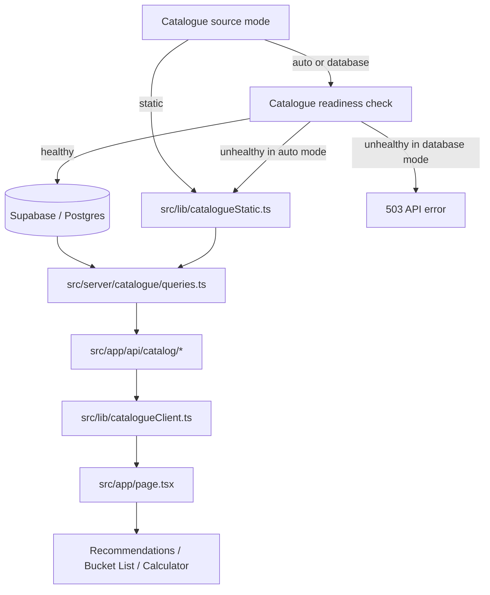

# Production Catalogue DB Cutover Plan

## Summary

Turn the catalogue backend slice into the live runtime source for institutions, programs, thresholds, and calculator configuration. Replace the current silent static fallback with explicit server-owned source selection, add production readiness checks, and document a reversible rollout path for the Supabase-backed catalogue.

---

## Problem Frame

The backend foundation shipped a read-only catalogue API, seed pipeline, and relational schema, but the app still treats the database as optional runtime infrastructure. `src/lib/catalogueClient.ts` falls back to static data on fetch failure, `src/app/page.tsx` bootstraps the UI from static catalogue helpers, and `src/server/catalogue/queries.ts` returns static data whenever `DATABASE_URL` is absent. That makes local development convenient, but it also masks whether the production catalogue is actually seeded, reachable, and complete enough to support recommendations and calculator flows.

The highest-leverage remaining backend-infra step is to cut the catalogue over deliberately. User persistence is already live, and uploads remain largely unimplemented UI-local metadata. Until catalogue reads become intentionally DB-backed in production, the project is still operating on a prototype fallback path instead of the backend data foundation it already built.

---

## Requirements

**Cutover behavior**

- R1. Production catalogue reads must use the DB-backed catalogue path intentionally rather than silently falling back to static data on fetch or query failures.
- R2. Source selection must be owned by the server boundary, not duplicated across client components.
- R3. Local and preview environments must still be able to run without a live DB through an explicit non-production source mode.

**Readiness and completeness**

- R4. The cutover path must verify that seeded catalogue data is present and complete enough for recommendation and calculator flows before it is treated as healthy.
- R5. Calculator configuration needed by `evaluateUniversities` and bucket-list analysis must come from the same catalogue source as institutions and programs.
- R6. Empty, partially seeded, or misconfigured DB states must fail with a controlled error shape or blocked cutover signal rather than a blank UI or silent static substitution.

**Operational safety**

- R7. The rollout must be reproducible from migrations and seed data tracked in git, with no required schema edits performed directly in the remote dashboard.
- R8. The plan must preserve a reversible rollback path that does not require emergency code edits if the DB-backed catalogue is unhealthy after cutover.
- R9. Existing recommendation ordering, calculator outcomes, and saved-program flows must continue to work against the DB-backed catalogue surface.

---

## Key Technical Decisions

- KTD1. Introduce an explicit server-owned catalogue source mode. The catalogue API should decide between `database`, `static`, and `auto` behavior from environment/config, while the client always consumes `/api/catalog/*` without its own fallback logic.
- KTD2. Fail closed in production database mode. When the DB-backed catalogue is selected and unavailable or incomplete, the API should return a controlled failure instead of substituting static data, so operational issues are visible and reversible.
- KTD3. Keep static data only as a deliberate development or rollback mode. Static catalogue helpers remain useful for local development and emergency rollback, but not as the default response to production runtime errors.
- KTD4. Treat readiness as catalogue completeness, not just DB reachability. A successful connection is insufficient if required rows, calculator configs, or linked programme data are missing; cutover health must validate the seeded dataset shape that the UI actually consumes.
- KTD5. Reuse the existing typed catalogue API boundary. The app already routes catalogue reads through `src/app/api/catalog/*`, `src/server/catalogue/*`, and `src/lib/catalogueClient.ts`; the cutover should strengthen that boundary rather than adding a second runtime path.

---

## High-Level Technical Design

The cutover moves source selection and fallback behavior behind the API boundary. Client components stop deciding when to use static data. Production uses `database` mode with explicit failure visibility, while local development can continue through `auto` or `static` mode when intentionally configured that way.

---

## Implementation Units

### U1. Catalogue Source Mode and Error Contract

- **Goal:** Move catalogue source selection behind the server API and remove silent client-side fallback.
- **Requirements:** R1, R2, R3, R6, R8
- **Dependencies:** None
- **Files:** `src/env.ts`, `src/server/catalogue/queries.ts`, `src/app/api/catalog/programs/route.ts`, `src/app/api/catalog/institutions/route.ts`, `src/lib/catalogueClient.ts`, `src/types/catalogue.ts`
- **Approach:** Add a small server-owned configuration surface for catalogue source mode. `database` requires DB-backed responses and returns controlled errors on failure. `static` always serves static data. `auto` can continue to use static data only for intentional non-production fallback. Remove the generic `catch { return static data }` behavior from the client fetch helpers so the API contract becomes the single source-selection boundary.
- **Patterns to follow:** Mirror the existing `ApiEnvelope` error shape and the environment-validation style already used in `src/env.ts` and Supabase auth env helpers.
- **Test Scenarios:**
  - Happy path: in `database` mode with healthy DB access, `/api/catalog/programs` and `/api/catalog/institutions` return DB-backed payloads.
  - Edge case: in `static` mode, the same endpoints return static payloads without touching the DB client.
  - Error path: in `database` mode with missing DB env or query failure, the API returns a controlled error payload and the client surfaces failure instead of substituting static data.
  - Edge case: in `auto` mode with no DB env in local development, the API returns static data and the client remains functional.
- **Verification:** The source mode is observable from API behavior alone, and client fetch helpers no longer contain a silent static fallback branch.

### U2. Readiness and Seed Completeness Checks

- **Goal:** Define and enforce the minimum seeded DB shape required for production catalogue health.
- **Requirements:** R4, R5, R6, R7, R9
- **Dependencies:** U1
- **Files:** `src/server/catalogue/queries.ts`, `src/server/catalogue/serializers.ts`, `src/db/seeds/catalogueSeed.ts`, `src/db/seeds/catalogueSeed.test.ts`, `src/lib/calculatorInstitutions.ts`
- **Approach:** Add readiness checks that validate the catalogue records the UI depends on, not just row existence. Validate institution coverage, program presence, linked institution relationships, and calculator-config availability for institutions used in calculator flows. Reuse the existing seeded calculator-config model already present in the schema and serializer path.
- **Execution note:** Add characterization-style seed/readiness coverage before tightening the runtime gate, so cutover criteria are executable rather than implicit.
- **Patterns to follow:** Extend the existing catalogue seed validation patterns in `src/db/seeds/catalogueSeed.ts` and keep serializer output aligned with `CatalogueInstitution` and `CatalogueProgram`.
- **Test Scenarios:**
  - Happy path: a seeded catalogue with institutions, programs, relations, thresholds, and calculator configs passes readiness.
  - Edge case: a DB with programs but missing calculator configs for calculator-backed institutions fails readiness with a clear reason.
  - Edge case: a DB with zero catalogue rows fails readiness and never appears healthy in `database` mode.
  - Integration: calculator institutions derived from DB-backed catalogue output still produce the input shape expected by `evaluateUniversities`.
- **Verification:** Readiness rules are codified in tests, and production health depends on the actual seeded catalogue shape instead of ad hoc manual inspection.

### U3. Client Bootstrap and UI Cutover Behavior

- **Goal:** Make the homepage and catalogue-driven flows start from the API boundary instead of static bootstrap state.
- **Requirements:** R1, R2, R5, R6, R9
- **Dependencies:** U1, U2
- **Files:** `src/app/page.tsx`, `src/components/DegreePicker.tsx`, `src/components/BucketList.tsx`, `src/components/ScoreForm.tsx`, `src/components/RecommendationResults.tsx`
- **Approach:** Replace static initial catalogue bootstrapping with API-driven loading and controlled fallback messaging. Keep recommendation and calculator logic pure, but ensure the UI can distinguish loading, empty, and unavailable catalogue states once the client is no longer secretly substituting static data.
- **Patterns to follow:** Preserve the current App Router client flow in `src/app/page.tsx` and continue routing all catalogue reads through `src/lib/catalogueClient.ts`.
- **Test Scenarios:**
  - Happy path: with DB-backed catalogue available, the app loads institutions and programs from the API and existing flows remain navigable.
  - Edge case: while catalogue data is still loading, the UI avoids computing recommendations or calculator choices from stale static bootstrap state.
  - Error path: when the catalogue API returns a controlled outage, the user sees a clear unavailable state rather than an empty recommendations or calculator screen.
  - Integration: saved-program, bucket-list, and degree-picker flows still operate against DB-backed catalogue identifiers.
- **Verification:** `src/app/page.tsx` no longer seeds state directly from static catalogue helpers for normal runtime boot, and UI states cover load, success, and outage explicitly.

### U4. Production Migration, Seed, and Verification Workflow

- **Goal:** Make remote catalogue rollout reproducible from tracked migrations, seed data, and a bounded verification checklist.
- **Requirements:** R4, R7, R8
- **Dependencies:** U2
- **Files:** `README.md`, `.env.local.example`, `docs/backend-data-model.md`
- **Approach:** Document the remote workflow around applying migrations, seeding catalogue data, and verifying readiness before switching production source mode. Carry forward the Supabase rule that remote schema changes should flow through migration files rather than direct dashboard edits. Document rollback as a configuration move back to `static` or `auto`, not an emergency schema rewrite.
- **Patterns to follow:** Keep operational documentation concise like the existing README env and DB sections, but make the cutover order explicit.
- **Test Scenarios:**
  - Configuration: docs identify the env values and source mode required for local, preview, and production catalogue behavior.
  - Operational: docs specify a pre-cutover readiness verification step before enabling production database mode.
  - Operational: rollback steps restore catalogue availability through configuration without requiring code changes.
  - Constraint: docs preserve migration-first remote DB workflow and do not instruct operators to edit production schema directly in the Supabase dashboard.
- **Verification:** A teammate can follow the documented rollout order and understand both the cutover trigger and the rollback trigger without reading implementation code.

---

## Acceptance Examples

- AE1. Given production is configured for database catalogue mode and the seeded DB is healthy, when the app loads programmes and institutions, then it serves DB-backed data through the catalogue API without static substitution.
- AE2. Given production is configured for database catalogue mode and the DB is unreachable or incomplete, when the app requests catalogue data, then the API returns a controlled failure and the UI shows an unavailable state instead of silently using static data.
- AE3. Given local development has no DB configured, when catalogue mode is `auto` or `static`, then the app still renders through the catalogue API boundary with intentional static data.
- AE4. Given a seeded DB is missing calculator configuration required by institution-backed calculation flows, when readiness verification runs, then cutover is blocked or flagged before user traffic relies on that dataset.

---

## Scope Boundaries

**Included in this progression**

- Server-owned catalogue source selection
- Controlled production failure behavior for catalogue outages
- Readiness validation for seeded catalogue completeness
- API-driven UI bootstrap for catalogue consumers
- Production migration, seed, verification, and rollback documentation

**Deferred to Follow-Up Work**

- Uploaded document storage and metadata persistence
- OCR or score extraction from uploaded documents
- Google sign-up and sign-in
- Replacing Supabase’s current email-sender / confirmation-email flow
- Ingestion workers, admin review UI, and automated source publishing

**Outside this plan**

- New recommendation logic or calculator formulas
- Auth model redesign beyond already-shipped profile persistence
- Replacing Supabase with another database or backend platform

---

## System-Wide Impact

This cutover changes the operational meaning of the catalogue API. Today, an outage or bad seed can be hidden by static fallback. After this work, catalogue health becomes a visible production dependency, which is the correct tradeoff for a backend data foundation but requires clearer readiness rules and rollback posture.

The change also consolidates catalogue truth. Recommendations, bucket-list analysis, and calculator institution configuration all become consumers of the same DB-backed source contract, reducing drift between static helpers and seeded relational data.

---

## Risks & Dependencies

| Risk | Impact | Mitigation |
| --- | --- | --- |
| Production DB is seeded incompletely before cutover | Users see missing programmes or broken calculator flows | Gate cutover on readiness checks that validate catalogue completeness, not just connectivity |
| Silent static fallback logic remains in one client path | Production appears healthy while serving stale prototype data | Centralize source selection in the API boundary and remove generic client fallback |
| Preview or local environments lose easy startup without DB | Development friction increases | Preserve explicit `static` / `auto` non-production modes |
| Remote schema drift occurs from dashboard edits | `db push` and migration history diverge | Keep rollout docs migration-first and treat remote dashboard schema edits as out of bounds |
| UI assumes catalogue is always present immediately | Empty or inconsistent render state during cutover | Add explicit loading and outage states during API bootstrap |

---

## Documentation / Operational Notes

- Production catalogue cutover should be a configuration change after migrations, seed, and readiness verification all succeed.
- Remote rollback should be a source-mode change first. Schema rollback is a separate operational decision and should not be the first recovery lever for catalogue outages.
- The README should stop describing static fallback as the normal runtime behavior once this cutover ships; fallback becomes intentional and environment-scoped.

---

## Sources & Research

- Existing backend foundation plan: `docs/plans/2026-06-08-backend-data-foundation.md`
- Current cutover surfaces: `src/lib/catalogueClient.ts`, `src/app/page.tsx`, `src/server/catalogue/queries.ts`, `src/app/api/catalog/programs/route.ts`, `src/app/api/catalog/institutions/route.ts`
- Seed and serializer paths already carrying calculator config: `src/db/seeds/catalogueSeed.ts`, `src/server/catalogue/serializers.ts`, `src/lib/calculatorInstitutions.ts`
- Supabase database migration guidance: https://supabase.com/docs/guides/deployment/database-migrations
- Supabase seed-data guidance: https://supabase.com/docs/guides/local-development/seeding-your-database
