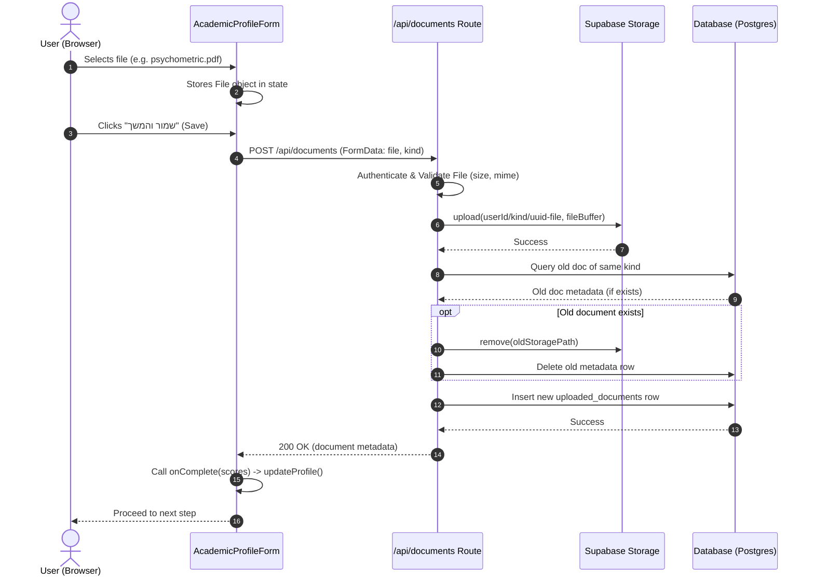

# feat: Uploaded Documents Storage and Metadata Persistence

## Summary

Implement backend storage and database persistence for academic documents (psychometric and bagrut transcripts) uploaded in the profile setup screen. Wire the frontend file-picker to upload files via a new server-proxied API route, store them in a secure Supabase Storage bucket, write metadata rows to the database, and display existing uploads when the form is re-opened.

---

## Problem Frame

The application includes file-picker UI elements in the academic profile funnel for psychometric and bagrut certificates. However, these pickers currently only save file metadata (name and size) in local component state. They are not persisted to a database, and the files are not uploaded to a backend. Users lose their uploaded documents on page refresh, and the backend has no record of these documents to verify calculated admission scores.

The database schema already defines an `uploaded_documents` table and user profiles RLS policies, but they are unused. This plan provides the complete integration to persist documents securely on the server.

---

## Requirements

### R1. Authentication & Security
- R1.1. Only authenticated users can upload documents. Anonymous sessions must be blocked with a clear 401 error.
- R1.2. Uploads must be stored securely. Files must not be publicly readable, and RLS policies must prevent users from accessing or modifying other users' documents.
- R1.3. Files must be uploaded to a dedicated private bucket named `documents` in Supabase Storage.

### R2. API & Data Persistence
- R2.1. A new Next.js API route must handle file uploads (`POST /api/documents`) and deletions (`DELETE /api/documents`).
- R2.2. The API must validate incoming uploads: maximum file size of 5MB, and allowed mime types restricted to images (`image/*`) and PDF (`application/pdf`).
- R2.3. On successful upload, a metadata row must be written to the `uploaded_documents` table using Drizzle, referencing the user's UUID.
- R2.4. A user can have at most one document per kind (`psychometric` or `bagrut`). Uploading a new document of the same kind must replace the old document both in storage and in the database.
- R2.5. Deleting a document must clean up both the metadata row and the physical file in Supabase Storage.

### R3. Frontend & Profile Integration
- R3.1. When fetching the user profile snapshot (`GET /api/profile`), the returned payload must include the metadata of any previously uploaded documents.
- R3.2. The `AcademicProfileForm` component must fetch and display previously uploaded files by pre-populating the file-picker state.
- R3.3. Document uploads and deletions must run during the form's "שמור והמשך" (Save and Continue) transition. The form must display a visual loading state while uploading is in progress.

---

## Scope Boundaries

### Included
- Secure storage of document files in Supabase Storage bucket `documents`.
- Database persistence of file metadata in the `uploaded_documents` table.
- A new server-proxied API endpoint `/api/documents` with standard validation and authentication.
- Retrieval of uploaded document metadata in the `/api/profile` endpoint.
- Frontend integration in `AcademicProfileForm` with visual loading indicators and initial file display.

### Deferred to Follow-Up Work
- Advanced OCR parsing to automatically extract scores from uploaded documents.
- Admin dashboard to review and verify uploaded documents.
- Support for uploading other document types (e.g., academic transcripts, ID cards) beyond psychometric and bagrut.

### Outside this product's identity
- Public hosting of user transcripts or sharing transcripts via public URLs.

---

## Key Technical Decisions

- **KTD1. Server-proxied uploads instead of direct client uploads:** Files are uploaded by the client to a Next.js API route (`POST /api/documents`), which forwards them to Supabase Storage. This design allows central validation of sizes, types, and counts on the server, keeps access credentials secure, and keeps direct-to-storage paths private.
- **KTD2. Folder-based isolation in Supabase Storage:** Files are stored in path structure `${userId}/${kind}/${uuid}` in the `documents` bucket. Using ONLY the unique UUID for the physical storage key (without raw user filenames) prevents path traversal injection and URL encoding issues. Row Level Security policies on the bucket restrict access so users can only perform read/write/delete operations on paths starting with their own `userId`.
- **KTD3. Cleanup of replaced documents:** When replacing a document of the same kind, the API route performs the database transaction and deletes the old file from Supabase Storage before returning a success response. This prevents storage bloat and orphan files.
- **KTD4. Bundled API calls in form submission:** File uploads are triggered during the form's save action. The frontend initiates parallel uploads for newly selected files and parallel deletions for removed files. It calls the profile update API only after all document operations complete successfully.

---

## High-Level Technical Design

The sequence diagram below visualizes the server-proxied file upload flow:

### Expected Supabase Storage RLS Policies
The `documents` bucket should be configured with the following RLS policies (documented for provisioning):
- **SELECT Policy:** `auth.uid()::text = (storage.foldername(name))[1]`
- **INSERT Policy:** `auth.uid()::text = (storage.foldername(name))[1]`
- **DELETE Policy:** `auth.uid()::text = (storage.foldername(name))[1]`

### Expected Database RLS Policies
For completeness, verify that the PostgreSQL database includes the following RLS policies for `uploaded_documents`:
- **DELETE Policy:** `CREATE POLICY "uploaded_documents_delete_own" ON "uploaded_documents" FOR DELETE TO authenticated USING (auth.uid() = user_id);`

---

## Implementation Units

### U1. Model & Serializer Extensions
- **Goal:** Update TypeScript types and backend serialization to handle uploaded document metadata.
- **Requirements:** R3.1
- **Dependencies:** None
- **Files:**
  - `src/types/index.ts`
  - `src/server/user/serializers.ts`
  - `src/server/user/profile.test.ts`
- **Approach:**
  - Add `uploadedDocuments` field to `UserProfile` in `src/types/index.ts`.
  - Update `UserProfileSnapshot` interface in `src/server/user/serializers.ts` to include `uploadedDocuments`.
  - Modify `serializeUserProfileSnapshot` in `src/server/user/serializers.ts` to accept `uploadedDocumentRows?: UploadedDocumentRow[]` and map them to the returned snapshot.
- **Test scenarios:**
  - Covers serialization happy path: verify `serializeUserProfileSnapshot` maps db rows containing a psychometric document to the correct frontend model shape.
  - Verification: Run unit tests with `npm test`.

### U2. Backend Profile Snapshot Wiring
- **Goal:** Fetch uploaded documents metadata from the database when constructing the profile snapshot.
- **Requirements:** R3.1
- **Dependencies:** U1
- **Files:**
  - `src/server/user/profile.ts`
  - `src/server/user/profile.test.ts`
- **Approach:**
  - Modify `getUserProfileSnapshot` to query `uploaded_documents` using Drizzle: `db.select().from(uploadedDocuments).where(eq(uploadedDocuments.userId, userId))`.
  - Pass the returned rows to `serializeUserProfileSnapshot`.
- **Test scenarios:**
  - Covers database integration: verify retrieving a profile snapshot queries and includes the user's uploaded documents.
  - Verification: Run unit tests with `npm test`.

### U3. Documents API Route
- **Goal:** Create the `/api/documents` API route to handle uploads and deletions.
- **Requirements:** R1.1, R1.2, R1.3, R2.1, R2.2, R2.3, R2.4, R2.5
- **Dependencies:** U2
- **Files:**
  - `src/app/api/documents/route.ts`
  - `src/app/api/documents/route.test.ts`
- **Approach:**
  - Use `createSupabaseServerClient` to authenticate the user and obtain their `userId`. Return 401 if unauthenticated.
  - For `POST`:
    - Parse multipart/form-data. Check for `file` and `kind`.
    - Validate that `kind` is either `'psychometric'` or `'bagrut'` (return 400 if invalid).
    - Validate file size (<= 5MB) and mime type (`image/*`, `application/pdf`). Return 400 for invalid data.
    - Generate unique file path using ONLY the UUID: `${userId}/${kind}/${crypto.randomUUID()}` (avoiding raw user filename in the storage path key).
    - Convert file to `Buffer` or `ArrayBuffer` and upload it to Supabase Storage bucket `documents`.
    - If there is an existing document of the same kind:
      - Perform the database metadata update/insert inside a database transaction first.
      - Trigger the deletion of the old file from Supabase Storage only AFTER the database transaction commits successfully. If the storage deletion fails, log a warning but do not roll back/fail the request, preventing transient storage failures from blocking updates.
  - For `DELETE`:
    - Parse query parameter `kind`.
    - Find the corresponding row in the database, delete the file from storage (log warning if storage deletion fails but proceed), and delete the database row.
- **Test scenarios:**
  - Covers happy-path upload: verify `POST /api/documents` validates size/type, uploads to storage, and writes metadata row.
  - Covers replacement flow: verify uploading a second document of the same kind triggers deletion of the old file and updates the DB metadata.
  - Covers unauthorized rejection: verify requests without auth cookie return 401.
  - Covers validation error: verify files larger than 5MB or with unsupported mime types return 400.
  - Verification: Write unit tests in `src/app/api/documents/route.test.ts` mocking the Supabase storage and Drizzle clients.

### U4. File Picker & Upload Logic in Form
- **Goal:** Update the frontend form to handle actual file objects, trigger uploads, and handle saving states.
- **Requirements:** R3.2, R3.3
- **Dependencies:** U3
- **Files:**
  - `src/components/AcademicProfileForm.tsx`
  - `src/components/AcademicProfileForm.test.tsx`
- **Approach:**
  - Add props `initialDocuments` to `AcademicProfileForm`.
  - Add state `const [psyFileObject, setPsyFileObject] = useState<File | null>(null)` and `const [bagrutFileObject, setBagrutFileObject] = useState<File | null>(null)`.
  - Clarify that `initialDocuments` is only used to populate display-only states (e.g. name and size), while `psyFileObject`/`bagrutFileObject` only track newly selected local `File` objects.
  - When a new file is selected, store the actual `File` object in `psyFileObject` or `bagrutFileObject`.
  - Add loading state `const [isSaving, setIsSaving] = useState(false)`.
  - In `handleSave`:
    - Set `isSaving` to `true`.
    - Run upload fetch requests to `POST /api/documents` for any newly selected file objects (`psyFileObject`/`bagrutFileObject`) in parallel.
    - Run delete fetch requests to `DELETE /api/documents?kind=...` in parallel if a pre-existing file was removed (i.e. display state is cleared and no new local File object is selected).
    - Once uploads and deletions succeed, invoke `onComplete(scores)`. If they fail, display an error message and set `isSaving` to `false`.
  - Disable inputs and buttons and render a loading spinner when `isSaving` is true.
- **Test scenarios:**
  - Covers rendering state: verify component renders pre-populated file names from `initialDocuments`.
  - Covers submit upload flow: verify form save uploads newly selected files, displays saving loader, and calls `onComplete`.
  - Covers file deletion on submit: verify removing a pre-populated file calls DELETE on form save.
  - Verification: Run unit tests using JSDOM environment in `src/components/AcademicProfileForm.test.tsx`.

### U5. Page Integration
- **Goal:** Connect the main funnel page to pass initial document metadata to the form.
- **Requirements:** R3.2
- **Dependencies:** U4
- **Files:**
  - `src/app/page.tsx`
- **Approach:**
  - Pass `initialDocuments={profile.uploadedDocuments}` to the `AcademicProfileForm` component in `src/app/page.tsx`.
- **Test scenarios:**
  - Verify that the profile snapshot's `uploadedDocuments` field is successfully passed to `AcademicProfileForm`.
  - Verification: Run vitest page integration tests.

---

## Risks & Dependencies

| Risk | Impact | Mitigation |
| --- | --- | --- |
| Supabase Storage bucket `documents` is not created or lacks RLS policies | File uploads fail with 403 or 404 errors | Explicitly outline provisioning steps and RLS scripts in deployment documentation. |
| Large file transfers timeout or fail on slow connections | User gets stuck on profile form with saving spinner | Implement timeout handling (e.g. 30 seconds) in fetch requests and return a clean error letting the user retry. |
| Storage quota exceeded in Supabase | File uploads fail silently or crash server | Check responses from Supabase Storage upload client, return clear error message, and log errors server-side. |
