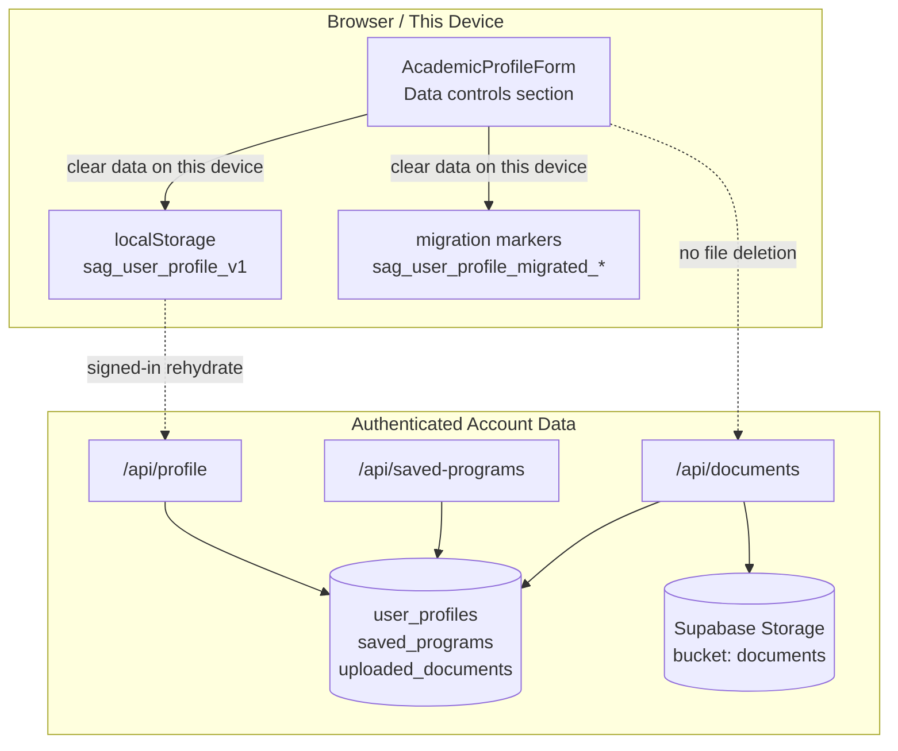

# feat: privacy controls and uploaded document lifecycle

## Summary

Define an explicit privacy/data-controls policy for browser drafts, authenticated profile data, saved programs, and uploaded documents, then ship the first usable slice: a user-facing "clear data on this device" control plus document-metadata/schema alignment that removes ambiguous retention behavior.

This plan intentionally separates device-data clearing from full account-data deletion. The first slice makes current behavior explicit and safe without widening into irreversible server-side purge flows.

---

## Problem Frame

The Monday board now has two adjacent `Data & Trust` tasks marked `High` and `Decision Needed`: `Add privacy and account data controls` and `Harden uploaded document data lifecycle`. The product already stores meaningful personal and academic data, but the lifecycle rules are only implicit in code.

The current persistence model spans two layers:

- Browser-resident draft state in `localStorage`, owned by `src/hooks/useUserProfile.ts`
- Authenticated server-owned state in `user_profiles`, `saved_programs`, `uploaded_documents`, and Supabase Storage

That split is not visible to the user. `useUserProfile` already exposes `clearProfile()`, but today it behaves as a profile reset write, not as an explicit privacy control, and there is no UI that defines what gets cleared locally versus what remains on the account. At the same time, uploaded documents already have real server storage and delete flows, but the app still treats filename-bearing metadata as part of the public `UserProfile` shape, leaving retention and ownership ambiguous.

The product needs one coherent policy that answers four concrete questions:

1. Which data is device data versus account data?
2. What does the first shipped "clear my data" control actually clear?
3. Which uploaded-document metadata is durable and user-visible?
4. Which code path owns document replacement and deletion?

---

## Requirements

### Data Controls

- R1. The repo must define the current data classes explicitly: browser draft data, authenticated profile data, saved programs, uploaded-document metadata, and uploaded-document files.
- R2. The first shipped control must distinguish device-scoped clearing from future account-scoped deletion.
- R3. Signed-out users must be able to clear all browser-resident profile data for the current device in one action.
- R4. Signed-in users must see accurate copy: device clearing must not claim to delete server-held profile rows, saved programs, uploaded-document metadata, or stored files.
- R5. The data-controls UI must live on an existing, reachable surface and must not require inventing a full account-settings area.

### Uploaded Document Lifecycle

- R6. The uploaded-document policy must define what metadata is stored durably, where files live, and which server path owns replacement and deletion.
- R7. Long-term document metadata must be minimized; raw `originalFileName` must not remain durable public profile data unless the plan explicitly justifies keeping it.
- R8. Public profile types and validators must align with the actual supported document kinds and retained metadata.

### Delivery Constraints

- R9. The first slice must preserve the current auth, academic-profile, recommendation, and bucket-list flows.
- R10. The first slice must not expand into full account deletion, legal export workflows, OCR, or storage-admin tooling.
- R11. Documentation, API validation, and tests must encode the chosen policy so future work does not have to rediscover it from implementation details.

---

## Key Technical Decisions

- KTD1. Separate device data from account data in both docs and code. Device data means the `sag_user_profile_v1` local draft and the `sag_user_profile_migrated_*` markers in browser storage. Account data means `user_profiles`, `saved_programs`, `uploaded_documents`, and the private `documents` storage bucket.
- KTD2. Ship the first privacy control as `clear data on this device`, not as `delete my account data`. This keeps the control truthful, immediately useful, and implementable without irreversible server-side delete semantics.
- KTD3. Split the hook semantics that are currently collapsed into `clearProfile()`. Browser-only clearing must not be implemented as an authenticated profile rewrite, because that silently changes server state when the user only asked to clear device data.
- KTD4. Treat `/api/documents` as the single owner of uploaded-document replacement and deletion. Local profile writes and device-clearing flows must never attempt to infer or purge storage objects on their own.
- KTD5. Minimize durable document metadata. The public `UserProfile` snapshot should only expose metadata that the user needs for the product flow and that the privacy policy is willing to retain. `originalFileName` is the main candidate to remove or replace with a generic display label because filenames can embed personal identifiers.
- KTD6. Align the public profile contract to supported document kinds only. The current `'other'` kind in shared types and validators should be removed unless the product is also adding a real upload path for it.
- KTD7. Put the policy in repo docs and then enforce it in types, validators, serializers, and UI copy. The policy itself is part of the feature; it is not follow-on documentation.

---

## System-Wide Impact

- The browser draft stops pretending to be the same thing as account data.
- The hook surface becomes safer by making local clearing and server-backed profile mutation separate actions.
- Uploaded-document retention becomes a cross-cutting data-minimization decision, not just an API implementation detail.
- The UI gains a truthful privacy control without requiring a full account-management feature set.

---

## High-Level Technical Design

The load-bearing rule is that device clearing only affects browser state. Server-owned profile rows, saved programs, document metadata rows, and storage files stay under authenticated APIs and are intentionally deferred from this slice's destructive controls.

---

## Scope Boundaries

### Included

- A documented data inventory and lifecycle policy
- Explicit device-data clearing semantics
- A reachable UI control for clearing browser data
- Type/schema/API alignment for uploaded-document metadata retention
- Test coverage for the new semantics

### Deferred to Follow-Up Work

- Full authenticated server-side profile deletion
- Saved-program deletion as part of an account-erasure workflow
- Uploaded-file purge as part of account erasure
- User-facing export/download of account data
- OCR or score extraction from uploaded documents

### Out of Scope

- Legal/privacy-process work outside the product repo
- Admin consoles for manual document review
- Public file sharing or external document access

---

## Acceptance Examples

- AE1. Signed-out device clear
  - **Covers:** R2, R3, R5
  - **Given:** A signed-out user has a populated `sag_user_profile_v1` draft in the browser.
  - **When:** They use the data-controls action on the academic profile screen.
  - **Then:** The browser draft and migration markers are removed, in-memory profile state resets to defaults, and subsequent navigation behaves like a fresh device session.

- AE2. Signed-in device clear
  - **Covers:** R2, R4, R9
  - **Given:** A signed-in user has a server-backed profile, saved programs, and uploaded-document metadata.
  - **When:** They use the same device-clear control.
  - **Then:** Local browser keys are removed, the UI explains that account data is unchanged, and the next authenticated hydrate restores the server snapshot.

- AE3. Document replacement
  - **Covers:** R6, R8
  - **Given:** A signed-in user uploads a replacement psychometric document.
  - **When:** `/api/documents` completes successfully.
  - **Then:** The old metadata row and storage object are replaced through the documents API path, and the public profile snapshot exposes only policy-approved metadata.

- AE4. Unsupported metadata shape
  - **Covers:** R7, R8, R11
  - **Given:** A profile payload includes an unsupported document kind or filename-bearing metadata that no longer belongs in the public contract.
  - **When:** The profile validator parses the payload.
  - **Then:** Validation rejects it rather than letting stale lifecycle semantics persist.

---

## Implementation Units

### U1. Data Inventory and Public Contract Alignment

- **Goal:** Define the privacy/data-controls policy in-repo and align shared types and validators to that contract.
- **Requirements:** R1, R2, R6, R7, R8, R11
- **Dependencies:** None
- **Files:** `docs/backend-data-model.md`, `README.md`, `src/types/index.ts`, `src/server/user/profileSchema.ts`, `src/server/user/profileSchema.test.ts`
- **Approach:** Add an explicit data-lifecycle section that names device data versus account data, defines the first shipped control as device-scoped, and documents uploaded-document ownership and retained metadata. Update shared types and Zod validators to match the policy, including removing unsupported document kinds and either removing `originalFileName` from the public snapshot shape or replacing it with a generic display-safe field.
- **Patterns to follow:** Reuse the existing ownership language in `docs/backend-data-model.md` and the strict request-contract style already present in `src/server/user/profileSchema.ts`.
- **Test scenarios:**
  - Happy path: a policy-aligned profile payload parses successfully.
  - Edge case: a payload with the old `'other'` document kind is rejected.
  - Edge case: omitted filename metadata still allows a valid uploaded-document snapshot shape.
  - Verification: schema tests cover accepted and rejected shapes, and docs use the same terminology as the types.

### U2. Hook-Level Split Between Device Clear and Profile Mutation

- **Goal:** Separate browser-only clearing from authenticated profile writes in `useUserProfile`.
- **Requirements:** R2, R3, R4, R9, R11
- **Dependencies:** U1
- **Files:** `src/hooks/useUserProfile.ts`, `src/hooks/useUserProfile.test.tsx`
- **Approach:** Replace the ambiguous `clearProfile()` behavior with an explicit device-clearing method such as `clearLocalProfileData()` or `clearDeviceData()`. That method should delete the browser draft key and migration-marker keys, reset in-memory state to defaults, and avoid calling the authenticated profile write APIs. If a server-reset capability is still useful later, name it separately and leave it out of this slice.
- **Patterns to follow:** Preserve the hook's existing optimistic state model and hydration guard behavior while making storage-key ownership explicit.
- **Test scenarios:**
  - Happy path: signed-out clearing removes the local draft and resets the hook state.
  - Happy path: signed-in clearing removes local keys without sending a profile write to `/api/profile`.
  - Edge case: the next signed-in hydrate restores server-backed state after a device clear.
  - Error path: malformed or missing storage entries do not throw during clear.
  - Verification: hook tests assert both key removal and no unintended network mutations.

### U3. Reachable Data Controls UI in the Academic Profile Flow

- **Goal:** Add a small, truthful privacy-controls surface without creating a full account-settings feature.
- **Requirements:** R3, R4, R5, R9
- **Dependencies:** U2
- **Files:** `src/components/AcademicProfileForm.tsx`, `src/components/AcademicProfileForm.test.tsx`, `src/app/page.tsx`
- **Approach:** Add a compact data-controls section to the academic profile screen, because it is already a natural surface for personal data and is reachable in both anonymous and authenticated flows. The section should expose the device-clear action, use explicit copy about what is and is not deleted, and vary the helper text for signed-out versus signed-in users. Pass only the minimal props needed from `src/app/page.tsx` rather than threading full auth internals into the form.
- **Patterns to follow:** Preserve the current form flow and localized tone; keep the control secondary to the main save/continue path.
- **Test scenarios:**
  - Happy path: the control renders for signed-out users and invokes the device-clear callback.
  - Happy path: signed-in users see copy that distinguishes local device data from account data.
  - Edge case: clearing data updates the displayed initial scores/document state in the form.
  - Verification: component tests assert rendering, callback wiring, and state reset behavior.

### U4. Uploaded-Document Metadata Minimization and Serializer Alignment

- **Goal:** Make uploaded-document persistence and public snapshot metadata match the new lifecycle policy.
- **Requirements:** R6, R7, R8, R9, R11
- **Dependencies:** U1
- **Files:** `src/app/api/documents/route.ts`, `src/app/api/documents/route.test.ts`, `src/server/user/serializers.ts`, `src/server/user/profile.ts`, `src/server/user/profile.test.ts`, `src/db/schema.ts`, `src/db/migrations/*`
- **Approach:** Keep `/api/documents` as the sole owner of upload, replacement, and explicit delete behavior, but reduce the durable/public metadata it writes and returns. If `original_file_name` is no longer policy-approved, migrate away from it in both schema and public snapshot handling, and update the UI to rely on safe metadata such as document kind and file size rather than raw user filenames.
- **Patterns to follow:** Preserve the current UUID-based storage path and the replace-then-cleanup ownership pattern already present in `src/app/api/documents/route.ts`.
- **Test scenarios:**
  - Happy path: upload returns only policy-approved metadata.
  - Happy path: profile snapshot serialization exposes the same minimized metadata shape.
  - Edge case: replacing a document still cleans up the prior DB row and storage object.
  - Edge case: deleting a document removes the metadata row without depending on local profile rewrites.
  - Verification: route and serializer tests agree on one metadata contract.

### U5. Documentation and Regression Closure

- **Goal:** Close the loop so the shipped slice is understandable to users and future implementers.
- **Requirements:** R1, R4, R10, R11
- **Dependencies:** U1, U2, U3, U4
- **Files:** `README.md`, `docs/backend-data-model.md`, `docs/plans/2026-06-15-003-feat-uploaded-documents-persistence-plan.md`
- **Approach:** Update docs to reflect that uploaded-document persistence is already live but now governed by a stricter lifecycle policy. Add a short note where appropriate that full account-data deletion is deferred, and make sure the prior uploaded-documents plan does not mislead future readers about filename retention or profile-snapshot shape.
- **Patterns to follow:** Keep docs declarative and repo-relative; use the same terminology as the code and this plan.
- **Test scenarios:**
  - Verification: every user-visible and developer-visible description of data ownership uses the same device-versus-account split.

---

## Risks & Dependencies

| Risk | Impact | Mitigation |
| --- | --- | --- |
| The current `clearProfile()` name is reused informally elsewhere | A refactor could silently change semantics or leave dead assumptions behind | Search for every call site, split the behavior explicitly, and prefer a new name over hidden semantic drift |
| Removing `originalFileName` changes UI expectations | The upload UI could lose a familiar label after rehydrate | Replace filename display with a product-safe label derived from document kind and size before removing the field from the public snapshot |
| Signed-in device clear is misunderstood as account deletion | Users could believe server data was erased when it was only removed locally | Put the server-vs-device distinction directly in the UI copy and keep this slice's action label precise |
| Public profile validation and serializer shape drift apart | Browser writes or hydrates could start failing in subtle ways | Drive the contract from shared types plus tests in both schema and serializer layers |
| Prior docs imply uploaded filenames are part of the intended model | Future work may accidentally reintroduce them | Update the canonical docs and this plan's referenced predecessor as part of the feature closure |

---

## Documentation / Operational Notes

- The policy should become canonical in `docs/backend-data-model.md`; avoid leaving the authoritative semantics only in a feature plan.
- This slice does not require new storage buckets or new auth providers. It reuses the existing `documents` bucket and current authenticated routes.
- A later account-erasure task should build from the same terminology: `device data`, `account profile data`, `saved programs`, `uploaded-document metadata`, and `uploaded-document files`.

---

## Sources and Research

- Monday board tasks:
  - `Add privacy and account data controls` (`12329557817`)
  - `Harden uploaded document data lifecycle` (`12329743528`)
- Local repo boundaries:
  - `src/hooks/useUserProfile.ts`
  - `src/components/AcademicProfileForm.tsx`
  - `src/app/page.tsx`
  - `src/app/api/documents/route.ts`
  - `src/server/user/profile.ts`
  - `src/server/user/serializers.ts`
  - `src/server/user/profileSchema.ts`
  - `src/db/schema.ts`
  - `docs/backend-data-model.md`
  - `docs/plans/2026-06-12-001-feat-authenticated-user-persistence-plan.md`
  - `docs/plans/2026-06-15-003-feat-uploaded-documents-persistence-plan.md`
  - `docs/solutions/database-issues/degree-picker-silent-save-failure.md`
