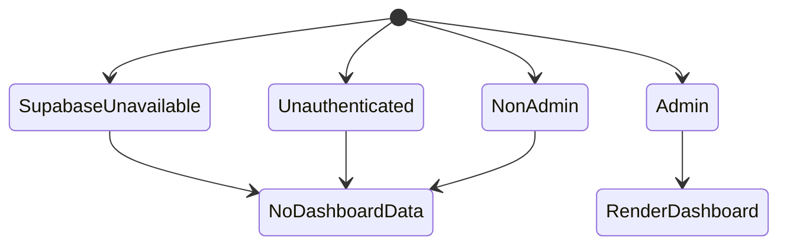
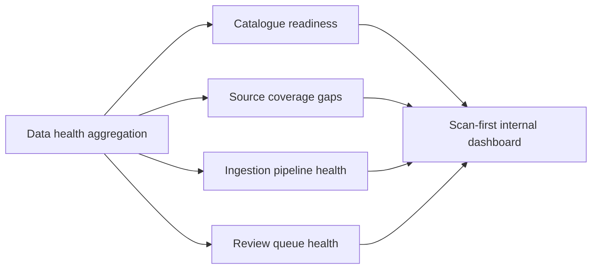

# Internal Data Health Dashboard

## Summary

Create a protected internal dashboard that answers one operator question: what catalogue data needs attention today? The first version should be read-only and focused on catalogue readiness, missing source coverage, ingestion pipeline health, and the review queue.

The dashboard must not become a public product surface or broaden normal app runtime privileges. It should use the existing Supabase auth session pattern for identity, an admin allowlist for authorization, and a separate read-only operational database connection for private ingestion and review tables.

---

## Problem Frame

The repo already separates reviewed canonical catalogue data from private operational ingestion and review data. Canonical tables are used by the app at runtime, while `ingestion_sources`, `ingestion_jobs`, `ingestion_payloads`, and `review_items` describe acquisition work before publication.

There is no operator-facing surface that combines those signals. The team can currently infer readiness from code, docs, scripts, database queries, or Monday, but not from one internal page. That makes the next data task slower than it needs to be and increases the chance that stale, missing, or unreviewed data is missed.

Security is part of the feature, not a deployment afterthought. Without an app-native guard, a route under `/internal` would still be visible to anyone who can reach the deployment.

---

## Assumptions

- The initial users of this page are team operators, not public end users.
- A Supabase-authenticated account is available for each operator who needs access.
- The first production-safe authorization mechanism can be an environment-backed admin email allowlist.
- A separate operational read-only database role can be created and exposed to the app as `OPS_DATABASE_URL`.
- True per-source freshness timestamps may be incomplete today, so the MVP should label incomplete signals as coverage or pipeline health instead of pretending to know exact freshness.

---

## Requirements

- R1. `/internal/data-health` must be inaccessible to unauthenticated users.
- R2. Authenticated users must only see the dashboard when their email is present in the configured admin allowlist.
- R3. Unauthorized users must receive no operational data in the response body.
- R4. Operational dashboard reads must use a separate read-only database connection, not the normal `DATABASE_URL` app runtime role.
- R5. The dashboard must show catalogue readiness signals covering institutions, programs, program links, sekhem thresholds, and calculator configurations.
- R6. The dashboard must show missing source coverage, including catalogue rows or requirement rows without source URLs.
- R7. The dashboard must show ingestion pipeline health by job status, difficulty, oldest pending or running work, and recent failures.
- R8. The dashboard must show review queue health by pending item count, oldest pending item, target field distribution, and recent approval or rejection activity when available.
- R9. The first version must be read-only; it must not approve review items, trigger scrapers, edit catalogue rows, or mutate operational tables.
- R10. The page must stay out of public navigation and product onboarding flows.
- R11. Tests must cover the access gate, allowlist parsing, least-privilege environment posture, and aggregation behavior.

---

## Key Technical Decisions

- KTD1. Use Supabase login plus an admin email allowlist, not a public route, token-only gate, or Vercel-only deployment protection. Vercel protection is still useful as a defense-in-depth setting, but the app should enforce its own data boundary.
- KTD2. Keep authorization intentionally small for the first version: an environment variable such as `ADMIN_EMAILS` or `INTERNAL_ADMIN_EMAILS` parsed into normalized emails. A roles table can wait until there are multiple admin classes or audit requirements.
- KTD3. Add `OPS_DATABASE_URL` for internal operational reads instead of granting `app_runtime` access to private operational tables. This preserves the public app runtime boundary that was just hardened.
- KTD4. Treat this as a data health dashboard, not a full data freshness dashboard, until the schema has source-level freshness timestamps and freshness service-level objectives. The UI can still surface timestamps that exist, but it should not overclaim.
- KTD5. Build the page server-side under the App Router so operational data is fetched after the access gate and never exposed through a public client API.
- KTD6. Reuse existing catalogue readiness logic where practical, but create a dedicated internal aggregation module for dashboard summaries. The dashboard needs capped issue lists and operational tables that public catalogue queries should not learn about.

---

## High-Level Technical Design

The diagrams below are directional. They describe the intended boundaries and flow, not exact implementation signatures.

### Request and Data Flow

```mermaid
flowchart TB
  Browser[Operator browser]
  Route[/internal/data-health]
  Guard[Internal admin guard]
  Supabase[Supabase server auth client]
  Page[Server-rendered dashboard page]
  Aggregator[Data health aggregation module]
  OpsDb[(OPS_DATABASE_URL read-only DB)]
  PublicTables[Canonical catalogue tables]
  OpsTables[Private ingestion and review tables]

  Browser --> Route
  Route --> Guard
  Guard --> Supabase
  Guard --> Page
  Page --> Aggregator
  Aggregator --> OpsDb
  OpsDb --> PublicTables
  OpsDb --> OpsTables
```

### Authorization States



### Dashboard Signal Groups



---

## Implementation Units

### U1. Internal Admin Access Gate

- **Goal:** Create the reusable guard that decides whether the current Supabase-authenticated user may access internal pages.
- **Requirements:** R1, R2, R3, R10, R11
- **Dependencies:** None
- **Files:** `src/server/internal/adminAuth.ts`, `src/server/internal/adminAuth.test.ts`, `src/lib/supabase/server.ts`
- **Approach:** Use `createSupabaseServerClient()` to read the current user server-side. Normalize the user's email and compare it against a normalized admin allowlist from the environment. Return a small authorization result that distinguishes unavailable auth, unauthenticated, non-admin, and admin states so the page can fail closed without exposing data.
- **Execution note:** Implement the allowlist parser and guard behavior test-first because small parsing mistakes can silently grant or deny access.
- **Patterns to follow:** Mirror the existing `requireAuthenticatedUserId()` Supabase server-client flow, but return a page-friendly result instead of API-route errors.
- **Test scenarios:**
  - Covers AE1. Given Supabase auth is unavailable, when the guard runs, then it returns a denied state and no user data.
  - Covers AE2. Given `getUser()` returns no user, when the guard runs, then it returns an unauthenticated denied state.
  - Covers AE3. Given an authenticated user whose email is not in the allowlist, when the guard runs, then it returns a non-admin denied state.
  - Covers AE4. Given an authenticated user whose email differs only by case or surrounding whitespace from the allowlist entry, when the guard runs, then it returns an admin state.
  - Edge case: given the allowlist environment variable is empty or missing, when any user tries to access the page, then the guard denies access.
  - Error path: given Supabase returns an auth error, when the guard runs, then it denies access without throwing operational details into the page response.
- **Verification:** The guard has deterministic tests for each auth state and does not require a live Supabase project to verify.

### U2. Operational Read-Only Database Client

- **Goal:** Add a separate database client for internal operational reads using `OPS_DATABASE_URL`.
- **Requirements:** R4, R11
- **Dependencies:** None
- **Files:** `src/env.ts`, `src/env.test.ts`, `src/db/opsClient.ts`, `docs/backend-data-model.md`
- **Approach:** Add an environment helper that reads `OPS_DATABASE_URL` separately from `DATABASE_URL`. Apply the same Supabase production safety posture that rejects `postgres` role URLs, and prefer a role name such as `ops_readonly` for this connection. Create a singleton Drizzle client with the same conservative `postgres.js` settings used by the existing runtime client unless implementation research shows a reason to diverge.
- **Patterns to follow:** Follow `src/db/client.ts` for singleton shape and `src/env.ts` for production URL validation. Keep app runtime and ops runtime naming explicit so future changes do not collapse the two credentials.
- **Test scenarios:**
  - Happy path: given `OPS_DATABASE_URL` points to a dedicated Supabase role, when the helper reads it in production, then it returns the value.
  - Error path: given `OPS_DATABASE_URL` is missing, when the dashboard aggregation attempts to read operational data, then the caller receives a controlled unavailable state.
  - Error path: given `OPS_DATABASE_URL` authenticates as `postgres` on a Supabase host in production, when the helper reads it, then it throws the least-privilege guard error.
  - Edge case: given a non-Supabase local development URL, when the helper reads it outside production, then it allows local development.
- **Verification:** Environment tests prove the normal app `DATABASE_URL` guard and the new ops URL guard remain separate.

### U3. Data Health Aggregation Module

- **Goal:** Produce capped, dashboard-ready summaries for catalogue readiness, source coverage, ingestion jobs, and review items.
- **Requirements:** R5, R6, R7, R8, R11
- **Dependencies:** U2
- **Files:** `src/server/data-health/queries.ts`, `src/server/data-health/queries.test.ts`, `src/server/catalogue/queries.ts`, `src/db/schema.ts`, `src/server/ingestion/types.ts`, `src/server/ingestion/reviewTypes.ts`
- **Approach:** Build one internal aggregation function that returns grouped counts, top risks, and capped detail lists. Reuse `evaluateCatalogueReadiness()` or extract shared readiness helpers if that avoids duplicating the same criteria. Keep raw payloads and proposed values out of summaries by default; the first dashboard needs counts, statuses, identifiers, target fields, timestamps, and error excerpts, not full unreviewed data dumps.
- **Technical design:** Directionally, the returned model should group data into `readiness`, `coverage`, `ingestion`, and `reviewQueue` sections. Each section should include summary counts plus capped issue rows so the UI can render without running client-side joins.
- **Patterns to follow:** Follow the query-layer separation used by `src/server/catalogue/queries.ts`: database access and transformation live in server modules, while routes or pages receive typed application data.
- **Test scenarios:**
  - Covers AE5. Given a seeded snapshot with programs, links, thresholds, and calculator configs, when aggregation runs, then readiness reports complete counts and no false missing-link issue.
  - Covers AE6. Given a requirement row with no `source_urls` row, when aggregation runs, then the coverage section includes it in missing source coverage.
  - Covers AE7. Given ingestion jobs in `pending`, `running`, `failed`, and `needs_review`, when aggregation runs, then the pipeline section groups counts by status and includes the oldest active work.
  - Covers AE8. Given pending and reviewed review items, when aggregation runs, then the review queue section reports pending count, oldest pending item, and target-field distribution.
  - Edge case: given empty operational tables, when aggregation runs, then it returns zero-count sections instead of crashing.
  - Error path: given the ops DB connection is unavailable, when aggregation runs, then the caller can render a controlled unavailable state without leaking credentials or SQL details.
- **Verification:** Tests demonstrate the aggregation contract from representative table rows and prove capped lists do not require loading unbounded operational data into the page.

### U4. Protected Internal Dashboard Page

- **Goal:** Add the `/internal/data-health` page that renders the guarded, read-only operational dashboard.
- **Requirements:** R1, R2, R3, R5, R6, R7, R8, R9, R10, R11
- **Dependencies:** U1, U3
- **Files:** `src/app/internal/data-health/page.tsx`, `src/app/internal/data-health/page.test.tsx`, `src/app/internal/data-health/DataHealthDashboard.tsx`, `src/app/internal/data-health/DataHealthDashboard.test.tsx`, `src/app/globals.css`
- **Approach:** Make the page dynamic and server-rendered. Run the admin guard before any data-health query. Render a terse denied or not-found response for unauthorized users and a controlled setup-error state when operational configuration is missing for an authorized admin. The dashboard UI should be scan-first: status summary, critical blockers, coverage gaps, ingestion failures, and review queue backlog before lower-priority counts.
- **Patterns to follow:** Preserve the existing app's visual direction where useful, but do not add the page to `NavBar`, landing flows, or client-side onboarding state. Use component-level tests for formatting and page-level tests for guard/query sequencing.
- **Test scenarios:**
  - Covers AE1. Given no authenticated user, when the page renders, then it does not call data-health aggregation and does not show operational data.
  - Covers AE3. Given a non-admin authenticated user, when the page renders, then it does not call data-health aggregation and does not show operational data.
  - Covers AE4. Given an admin authenticated user, when the page renders, then it calls aggregation and shows the dashboard sections.
  - Covers AE9. Given dashboard data with failed ingestion jobs and pending review items, when the component renders, then those risks appear before lower-priority informational counts.
  - Error path: given aggregation returns an unavailable state, when an admin opens the page, then the page shows an internal setup/error panel without revealing connection strings or SQL internals.
- **Verification:** Tests prove unauthorized states do not fetch operational data, and a local render with mocked data shows all four dashboard signal groups.

### U5. Operational Setup Documentation

- **Goal:** Document how to make the dashboard available safely in preview or production.
- **Requirements:** R2, R4, R9, R10
- **Dependencies:** U1, U2
- **Files:** `docs/backend-data-model.md`, `docs/internal-data-health-dashboard.md`, `README.md`
- **Approach:** Add a short operational doc covering required environment variables, expected read-only role purpose, protected-route behavior, and first-version limitations. Include the principle that `OPS_DATABASE_URL` may read private operational tables while `DATABASE_URL` remains the normal app runtime credential. Avoid hardcoding real secrets or project-specific passwords.
- **Patterns to follow:** Use the same direct operational tone as the existing `docs/backend-data-model.md` connection posture section.
- **Test scenarios:** Test expectation: none -- this unit is documentation-only and does not change runtime behavior.
- **Verification:** A teammate can identify which environment variables must be configured, why the ops connection exists, and why the dashboard remains read-only.

---

## Acceptance Examples

- AE1. Given an unauthenticated visitor opens `/internal/data-health`, when the page responds, then no operational counts, source URLs, ingestion jobs, or review items are present in the response.
- AE2. Given Supabase auth is unavailable, when anyone opens `/internal/data-health`, then the page fails closed and does not query the operational database.
- AE3. Given a signed-in user whose email is not allowlisted, when they open `/internal/data-health`, then they do not see the dashboard and the operational query module is not called.
- AE4. Given a signed-in allowlisted admin opens `/internal/data-health`, when `OPS_DATABASE_URL` is configured, then the page renders catalogue readiness, missing coverage, ingestion pipeline, and review queue sections.
- AE5. Given the catalogue is missing program-to-institution links or required sekhem thresholds, when an admin opens the dashboard, then those readiness gaps appear as attention items.
- AE6. Given an admission requirement has no source URL, when an admin opens the dashboard, then it appears in the missing source coverage section.
- AE7. Given ingestion jobs have failed or stayed pending/running for a long time, when an admin opens the dashboard, then those jobs appear in the pipeline health section.
- AE8. Given review items are pending, when an admin opens the dashboard, then the review queue shows backlog size, oldest pending item, and target-field distribution.
- AE9. Given both critical gaps and informational counts exist, when the dashboard renders, then critical gaps are visually prioritized over totals.

---

## System-Wide Impact

This feature adds the first internal app surface. That creates a reusable pattern for guarded internal pages, so the access gate should be small, explicit, and easy to reuse without becoming a general roles system too early.

The feature also adds a second database credential path. That is intentional, but it raises the bar for naming and documentation because future maintainers must not confuse `DATABASE_URL` for app runtime traffic with `OPS_DATABASE_URL` for internal read-only operational reporting.

---

## Risks & Dependencies

| Risk | Impact | Mitigation |
| --- | --- | --- |
| The route is reachable without app-native authorization | Private ingestion and review metadata could be exposed | Run the admin guard before all operational queries and test unauthorized states |
| `OPS_DATABASE_URL` accidentally uses the Supabase `postgres` role | The dashboard bypasses least-privilege hardening | Reuse production URL role validation and document the intended `ops_readonly` posture |
| Dashboard labels overclaim freshness | Operators trust stale or incomplete signals | Label MVP sections as readiness, coverage, pipeline, and review health until true freshness timestamps exist |
| Aggregation queries scan too much data | Internal page becomes slow or costly as ingestion grows | Use counts, grouping, capped issue lists, and targeted fields rather than full table dumps |
| Admin allowlist configuration is malformed | Team members are incorrectly granted or denied access | Normalize emails, ignore blank entries, and test parsing behavior |

---

## Scope Boundaries

### Included

- Protected `/internal/data-health` page
- Supabase-authenticated admin allowlist guard
- Separate operational read-only database client using `OPS_DATABASE_URL`
- Read-only summaries for catalogue readiness, source coverage, ingestion pipeline, and review queue
- Tests for guard behavior, environment posture, aggregation, and page access sequencing
- Setup documentation for internal dashboard operation

### Deferred to Follow-Up Work

- Admin roles stored in a database table
- Audit logging for internal dashboard views
- Review-item approval or rejection actions
- Scraper triggering, retry controls, or job mutation controls
- Real freshness service-level objectives based on source-specific `last_checked_at` and `last_changed_at` fields
- Slack or email alerts from dashboard thresholds

### Out of Scope

- Public navigation links to the dashboard
- Changes to the main recommendation or calculator user experience
- Broadening the existing `app_runtime` role to private operational tables
- Displaying raw ingestion payloads or full proposed values in the MVP

---

## Open Questions

- OQ1. Should the allowlist environment variable be named `ADMIN_EMAILS` or `INTERNAL_ADMIN_EMAILS`? The implementation should pick one and document it consistently.
- OQ2. Should unauthorized internal page responses use `404`, `403`, or redirect-to-auth behavior? The plan requires fail-closed behavior and no operational data; the exact UX can be chosen during implementation.
- OQ3. Does the operational read-only role already exist in Supabase, or does implementation need to add setup SQL/documentation for creating `ops_readonly`?

---

## Documentation / Operational Notes

- The dashboard should be paired with Vercel deployment protection where practical, but deployment protection must not be the only boundary.
- Production setup should configure Supabase public auth variables, admin email allowlist, and `OPS_DATABASE_URL`.
- The docs should explicitly state that `OPS_DATABASE_URL` is read-only and intended for internal reporting over private operational tables.
- If `OPS_DATABASE_URL` is missing, authorized admins should see a controlled setup state instead of a blank page or raw exception.

---

## Sources & Research

- Monday item `Create internal data freshness dashboard` (`12329621823`)
- `docs/backend-data-model.md`
- `docs/plans/2026-06-23-001-chore-autonomous-catalogue-scale-and-ingestion-plan.md`
- `src/db/schema.ts`
- `src/db/client.ts`
- `src/env.ts`
- `src/env.test.ts`
- `src/lib/supabase/server.ts`
- `src/app/api/_lib/auth.ts`
- `src/proxy.ts`
- `src/server/catalogue/queries.ts`
- `src/server/ingestion/types.ts`
- `src/server/ingestion/reviewTypes.ts`
