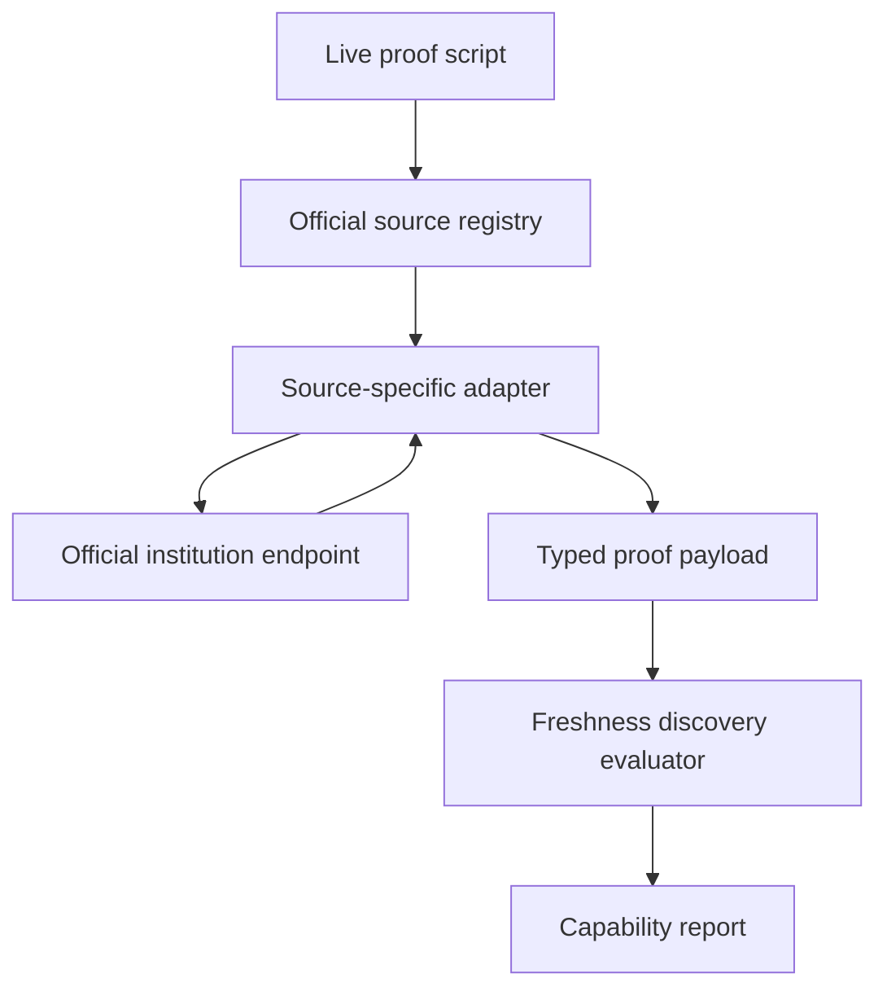
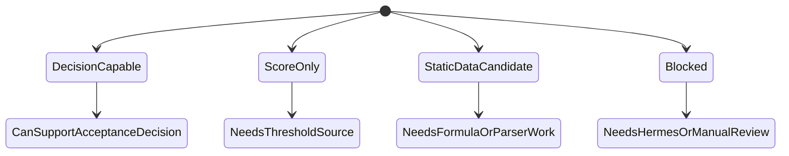

# Live Admissions Source Proof

## Summary

Extend the current weekly freshness discovery PR from fixture-only classification into a narrow live proof against official institution sources. The proof should show which sources can be reproduced end-to-end today, which are score-only or static-data candidates, and which must wait for a browser/Hermes lane.

This plan keeps scheduler, database persistence, dashboard review workflow, and full product decision integration out of scope. The current PR should prove the adapter contract and live feasibility before the team builds the weekly automation around it.

---

## Problem Frame

The current branch already proves a useful freshness model: source classes, normalized decision-bearing fingerprints, score-only separation, blocked-source labeling, and fixture tests. That is a good foundation, but it still leaves an important product question unanswered: which official institution sources can we actually reproduce well enough to trust for admission decisions?

The existing `scripts/admissions-calculators/*` files are not enough proof. Several scripts hard-code thresholds or local formulas, and some print broad program lists instead of parsing official decision-bearing response fields. For this PR to become a stronger base, it should include a live-source proof that draws a hard line between exact official-source reproduction, partial score evidence, and blocked sources.

---

## Requirements

**Live Official Proof**

- R1. The PR must include a typed adapter contract for official admissions sources, with explicit capability labels for `decision_capable`, `score_only`, and `blocked`.
- R2. At least two official sources must be reproduced end-to-end with live request definitions and parsed official response fields.
- R3. Haifa must be the first decision-capable proof target because its official calculator flow can return weighted score plus acceptance and rejection cutoffs.
- R4. TAU must be the second decision-capable proof target because its official GraphQL flow can return calculated score fields and program thresholds when the program lookup is reproduced.
- R5. The proof output must distinguish exact official-source data from hard-coded demo thresholds or inferred local formulas.

**Capability Matrix**

- R6. HUJI, Technion, BGU, BIU, Ariel, and Open University must be represented in a capability matrix even when the PR does not implement them as exact adapters.
- R7. Score-only sources must not be allowed to produce an accepted/rejected product decision without a separate official threshold or status source.
- R8. Browser-protected or anti-bot sources must be labeled as blocked for GitHub Actions v1 and candidates for Hermes/VPS later.

**PR Boundary**

- R9. The PR must remain a proof layer, not a weekly scheduler, database ingestion, dashboard review queue, or public UI integration.
- R10. Normal automated tests must avoid live network dependency; live official checks should be runnable as an explicit script or smoke command.
- R11. Documentation must make the outcome easy to read: exact, partial, blocked, next implementation target.

---

## Key Technical Decisions

- KTD1. Add source-specific adapters beside the freshness normalizer instead of replacing it. The current `freshnessDiscovery` module should remain the generic fingerprint/evaluation layer, while adapters produce typed official-source payloads that can be fed into it.
- KTD2. Treat Haifa and TAU as the winning proof targets for this PR. They are the most useful first pair because they can plausibly return both a user-specific score and official cutoff/status context without browser automation.
- KTD3. Do not treat the legacy calculator scripts as trusted evidence when they hard-code thresholds or formulas. The new proof should use them only as orientation and should prefer official endpoints plus parsed official response fields.
- KTD4. Keep live calls out of regular unit tests. Unit tests should mock official responses and prove parsing, capability classification, and output shape; the live script should be explicit because network availability and institution uptime are external variables.
- KTD5. Make blocked and partial outcomes first-class results, not failures. A source that is blocked by Radware, cookies, ASP.NET view state, or missing threshold data is useful discovery output when the result is labeled precisely.
- KTD6. Do not persist live proof output yet. Persistence belongs to the later weekly freshness implementation after the source contract is proven.

---

## High-Level Technical Design

The diagram below shows the intended proof flow, not exact implementation signatures.

The proof result should separate source reproduction from product admissions decisions.

---

## Implementation Units

### U1. Official Source Adapter Contract

- **Goal:** Define the typed contract that live source adapters return before freshness evaluation.
- **Requirements:** R1, R5, R7, R8, R9
- **Dependencies:** None
- **Files:** `src/server/ingestion/freshnessDiscovery.ts`, `src/server/ingestion/freshnessDiscovery.test.ts`, `src/server/ingestion/admissionsSourceAdapters.ts`, `src/server/ingestion/admissionsSourceAdapters.test.ts`
- **Approach:** Add a small adapter-facing model with institution id, source url, capability, proof level, normalized official payload, raw response metadata, and blocked/partial reasons. Keep this model separate from canonical catalogue rows and from user-facing admissions decisions.
- **Patterns to follow:** Reuse the current `FreshnessCapability` and `FreshnessSourceClass` language from `src/server/ingestion/freshnessDiscovery.ts`. Follow the repo's existing pattern of pure server modules with focused Vitest coverage.
- **Test scenarios:**
  - Happy path: given a decision-capable adapter payload with score and cutoffs, when it is evaluated, then the result remains `decision_capable` and produces a normalized fingerprint.
  - Edge case: given a score-only adapter payload with no cutoff/status fields, when it is evaluated, then it cannot be marked review-worthy for an acceptance decision by itself.
  - Error path: given an adapter returns a blocked reason, when the proof report is built, then the source is classified as blocked without throwing the whole run.
  - Integration: adapter payloads can feed the existing freshness evaluator without duplicating fingerprint logic.
- **Verification:** Unit tests prove the source adapter contract composes with the existing freshness discovery evaluator.

### U2. Live Proof Runner and Source Registry

- **Goal:** Add a runnable proof script that executes selected official-source adapters and prints a compact capability report.
- **Requirements:** R1, R2, R5, R6, R9, R10, R11
- **Dependencies:** U1
- **Files:** `scripts/admissions-live-source-proof.mjs`, `src/server/ingestion/admissionsSourceRegistry.ts`, `src/server/ingestion/admissionsSourceRegistry.test.ts`, `docs/weekly-admissions-source-freshness-discovery.md`
- **Approach:** Create a small registry of official proof targets with stable ids, institution names, source URLs, adapter ids, and expected capability. The script should run a default safe set, print JSON, and support a target filter so implementation can run one institution at a time.
- **Execution note:** Keep the script explicit and operator-run; do not add it to `npm test` or normal CI until live endpoint stability is known.
- **Patterns to follow:** Mirror the existing Vite SSR loading pattern in `scripts/admissions-freshness-discovery.mjs` so TypeScript server modules can be loaded without adding a new dependency.
- **Test scenarios:**
  - Happy path: given a registry with Haifa and TAU enabled, when the runner builds its plan, then it includes both as live proof targets.
  - Edge case: given a target filter for one institution, when the runner builds its plan, then unrelated adapters are skipped.
  - Error path: given one adapter fails or returns blocked, when the runner reports results, then other adapter results still appear.
  - Integration: the runner output includes source id, capability, proof level, official URL, normalized payload summary, and next action.
- **Verification:** The mocked runner tests prove report shape and failure isolation; the live script can be run manually to produce the PR's proof report.

### U3. Haifa Decision-Capable Adapter

- **Goal:** Reproduce the official Haifa calculator flow as the first exact decision-capable proof.
- **Requirements:** R2, R3, R5, R7, R10, R11
- **Dependencies:** U1, U2
- **Files:** `src/server/ingestion/adapters/haifaAdmissions.ts`, `src/server/ingestion/adapters/haifaAdmissions.test.ts`, `src/server/ingestion/admissionsSourceRegistry.ts`, `docs/weekly-admissions-source-freshness-discovery.md`
- **Approach:** Implement the `checkConnection` and `calculateChances` flow against `https://applicants.haifa.ac.il/enrollmentChances/CandChancesServlet`, preserving the official index page as the source URL. Parse only decision-bearing fields from the official JSON response, such as weighted score, acceptance cutoff, rejection cutoff, psychometric score, and status-like values when present.
- **Patterns to follow:** Replace the broad demo behavior in `scripts/admissions-calculators/6_haifa.js` with a focused adapter that does not hard-code program thresholds. Keep default proof inputs minimal and representative rather than trying to cover every Haifa program in this PR.
- **Test scenarios:**
  - Happy path: given mocked official Haifa JSON with weighted score and cutoffs, when the adapter parses it, then it returns `decision_capable` with those official values.
  - Edge case: given the response includes display labels and extra sections, when parsing runs, then only decision-bearing score/cutoff/status fields enter the normalized payload.
  - Error path: given `checkConnection` or `calculateChances` returns invalid JSON, when the adapter runs, then it returns a failed or blocked proof result with a useful reason.
  - Integration: given a parsed Haifa payload, when it flows through freshness evaluation, then the normalized fingerprint changes when an official cutoff changes.
- **Verification:** Unit tests use captured-shaped official response fixtures, and the live proof runner can produce a Haifa report without any hard-coded threshold table.

### U4. TAU Decision-Capable Adapter

- **Goal:** Reproduce the official TAU GraphQL score and threshold lookup as the second exact decision-capable proof.
- **Requirements:** R2, R4, R5, R7, R10, R11
- **Dependencies:** U1, U2
- **Files:** `src/server/ingestion/adapters/tauAdmissions.ts`, `src/server/ingestion/adapters/tauAdmissions.test.ts`, `src/server/ingestion/admissionsSourceRegistry.ts`, `docs/weekly-admissions-source-freshness-discovery.md`
- **Approach:** Implement the official `https://go.tau.ac.il/graphql` calls needed for `getLastScore` and the program-threshold lookup described in the Monday reverse-engineering report. Parse the calculated score fields and map the relevant faculty/program score to official acceptance and rejection thresholds.
- **Patterns to follow:** Use `scripts/admissions-calculators/2_tau.js` only as rough request-shape orientation. Remove the hard-coded program threshold table from the proof path and parse official threshold fields instead.
- **Test scenarios:**
  - Happy path: given mocked `getLastScore` and program lookup GraphQL responses, when the adapter runs for a representative program, then it returns `decision_capable` with calculated score and official thresholds.
  - Edge case: given multiple TAU score fields are returned, when the program/faculty mapping selects a score field, then the selected field is recorded in the payload.
  - Error path: given the GraphQL response contains errors or an unparsable body string, when the adapter runs, then it returns a failed proof result without producing inferred acceptance.
  - Integration: given a threshold changes in the mocked official response, when freshness evaluation runs, then the normalized fingerprint changes and the result is review-worthy.
- **Verification:** Tests prove score-field selection and threshold parsing; the live proof runner can produce a TAU report that is not based on hard-coded demo cutoffs.

### U5. Remaining Institution Capability Matrix

- **Goal:** Make the PR honest about what was not reproduced exactly.
- **Requirements:** R5, R6, R7, R8, R11
- **Dependencies:** U1, U2
- **Files:** `src/server/ingestion/admissionsSourceRegistry.ts`, `src/server/ingestion/admissionsSourceRegistry.test.ts`, `docs/weekly-admissions-source-freshness-discovery.md`
- **Approach:** Add registry entries and documentation for the known non-winner sources: HUJI as a static JSON plus bundled-JS reproduction candidate, Technion and BGU as score-only or partial calculator candidates unless official thresholds are separately mapped, BIU and Ariel as browser-protected blocked sources, and Open University as open-admission/no-calculator. Each entry should name the next action rather than pretending all sources are equally solved.
- **Patterns to follow:** Preserve the capability separation already introduced by `score_only_calculator` and `browser_required` in the freshness module.
- **Test scenarios:**
  - Happy path: given the capability matrix is built, when it is serialized, then every known institution has a capability and next action.
  - Edge case: given Open University has no calculator requirement, when classified, then it is not treated as a failed calculator adapter.
  - Error path: given a source is marked browser-required, when the runner encounters it, then it reports blocked and does not attempt a brittle GitHub Action fetch.
  - Integration: matrix output separates exact, partial, static-candidate, open-admission, and blocked categories.
- **Verification:** Registry tests prove the matrix is complete for the discussed institutions and does not collapse partial evidence into accepted/rejected decision support.

### U6. Proof Documentation and PR Evidence

- **Goal:** Update the discovery documentation so reviewers can understand exactly what the PR proves.
- **Requirements:** R5, R6, R9, R10, R11
- **Dependencies:** U2, U3, U4, U5
- **Files:** `docs/weekly-admissions-source-freshness-discovery.md`, `scripts/admissions-live-source-proof.mjs`
- **Approach:** Add a clear result table with columns for institution, official source URL, adapter status, reproduced fields, confidence, limitation, and next action. Include the command to run the live proof and an example compact output shape, but avoid embedding stale full live payloads as canonical truth.
- **Patterns to follow:** Keep the same concise, operational style as the existing discovery doc. State limitations as product risks, not engineering excuses.
- **Test scenarios:** Test expectation: none -- this unit is documentation plus script evidence formatting already covered by U2-U5 tests.
- **Verification:** A reviewer can answer which official sources were reproduced exactly, which were partial, and which are blocked without rereading chat history or Monday updates.

---

## Acceptance Examples

- AE1. Given the live proof script runs against Haifa with representative scores, when the official response includes weighted score and cutoffs, then the report classifies Haifa as `decision_capable` and shows the parsed official fields.
- AE2. Given the live proof script runs against TAU with representative scores and program selection, when the GraphQL responses include calculated score and thresholds, then the report classifies TAU as `decision_capable` and shows the selected official score field.
- AE3. Given Technion or BGU only returns a calculated score in the implemented proof, when the report is generated, then the source is classified as `score_only` or partial and cannot support accepted/rejected output alone.
- AE4. Given BIU or Ariel requires anti-bot/browser state, when the report is generated, then the source is classified as blocked for GitHub Actions v1 with Hermes/VPS as the next action.
- AE5. Given the PR reviewer reads the documentation, when they ask "which URLs did we mimic exactly?", then the answer is visible in the result table without inspecting implementation details.

---

## Scope Boundaries

### In Scope

- Typed source adapter contract for official admissions proof payloads.
- Live proof runner for a small set of official sources.
- Exact proof attempts for Haifa and TAU.
- Capability matrix for the other known institutions from the Monday reverse-engineering work.
- Documentation that distinguishes exact, partial, blocked, and open-admission sources.

### Deferred to Follow-Up Work

- Weekly GitHub Action scheduling for Sunday morning Israel time.
- Database schema or persistence for source freshness status.
- Internal data dashboard changes for `fresh`, `changed_needs_review`, `failed`, `stale`, `blocked`, and `never_checked`.
- Product runtime integration that tells a real user whether they were accepted.
- Full HUJI static JSON plus bundled-JS formula reproduction.
- Hermes/VPS worker for BIU, Ariel, or other browser-protected sources.
- Broad program coverage across every institution.

### Out of Scope

- Treating hard-coded demo thresholds as official acceptance criteria.
- Publishing scraper output directly into canonical admissions tables.
- Adding public UI copy or changing the current calculator user experience.
- Running live network checks as part of normal unit tests.

---

## Risks & Dependencies

| Risk | Impact | Mitigation |
| --- | --- | --- |
| Official endpoints change shape | A live adapter can fail even when our code is correct against the previous contract | Keep parser tests fixture-backed, make live failures explicit, and report source failure separately from code failure |
| TAU program-to-score-field mapping is incomplete | TAU could calculate a score but compare it to the wrong threshold | Start with one representative program and record the selected score field in proof output |
| Haifa labels or nested JSON structure vary by program | Parser could miss cutoffs for some programs | Parse narrowly, document representative coverage, and defer broad program coverage |
| Partial calculators look more complete than they are | Product could overclaim acceptance from score-only evidence | Keep `score_only` capability unable to produce accepted/rejected proof without official thresholds |
| Browser-protected sources tempt brittle automation | GitHub Actions v1 becomes flaky or blocked | Classify them as blocked and defer to Hermes/VPS rather than trying to bypass protections in this PR |

---

## Sources & Research

- Existing freshness proof: `src/server/ingestion/freshnessDiscovery.ts`, `src/server/ingestion/freshnessDiscovery.test.ts`, `scripts/admissions-freshness-discovery.mjs`, `docs/weekly-admissions-source-freshness-discovery.md`
- Existing demo scripts to replace or avoid relying on: `scripts/admissions-calculators/2_tau.js`, `scripts/admissions-calculators/6_haifa.js`, `scripts/admissions-calculators/3_technion.js`, `scripts/admissions-calculators/4_bgu.js`
- Ingestion and review boundary: `docs/data-ingestion-workflow.md`, `src/server/ingestion/types.ts`, `src/server/ingestion/reviewTypes.ts`
- Official Haifa calculator page: `https://applicants.haifa.ac.il/enrollmentChances/index.html`
- Official TAU GraphQL endpoint from Monday reverse-engineering notes: `https://go.tau.ac.il/graphql`
- Official HUJI program/admission surface and JSON data candidate: `https://go.huji.ac.il/programAdmission_401-4100?locale=he`, `https://go.huji.ac.il/jjson/huji.json.gz`
- Monday reverse-engineering updates inspected earlier for Hebrew University, TAU, Technion, BGU, BIU, Haifa, Open University, Ariel, Tel-Hai, and Buchmann-Mehta.
