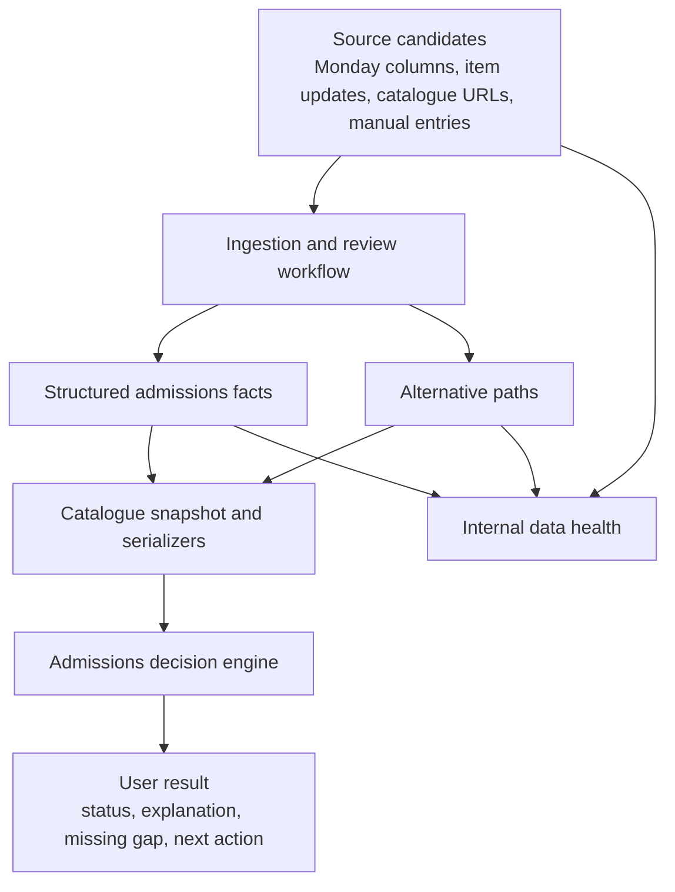

# Hybrid Admissions Decision Slice

## Summary

Build the first production-shaped admissions decision slice for a representative set of academic programs and institutions. The slice should combine calculator-backed, formula-backed, open-admission, and non-calculator admissions cases into one user-facing result model.

The product output is a clear admissions decision, not just a raw requirements dump. Every result must return a status, an explanation, what is missing or blocking, and the best next action. Calculator- and formula-backed cases can produce stronger numeric decisions. Non-calculator cases can still say the user was accepted when published conditions support that decision, but the result must carry confidence, source context, and unresolved manual gates when relevant.

---

## Problem Frame

PR #36 added broad scraping and calculator scripts for many institutions, but the generated scripts are not yet a reliable product path. They duplicate a lot of code, sometimes preserve broad prose instead of concise admissions facts, and mix trusted official data with weaker source candidates. The product needs smaller, structured facts that can be compared against a user's scores and turned into a clear next step.

The existing app already has useful foundations: catalogue tables, source URLs, ingestion and review tables, calculator configs, admission thresholds, catalogue serializers, data-health reporting, and a `CalculatorResults` surface. This plan extends those foundations for a representative admissions decision slice instead of trying to run all generated institution scripts end to end.

The first version should prove the model on a representative academic sample before scaling to all institutions.

---

## Requirements

- R1. The first implementation must cover a representative academic sample, not all institutions.
- R2. The sample must include calculator-backed, formula-backed, open-admission, non-calculator numeric/manual-gate, and weak-data cases.
- R3. Vocational, certificate, online, and non-degree options must not be primary admissions decisions in this slice; they may appear as alternatives or next actions.
- R4. The system must accept source candidates from Monday board URL columns and from item updates.
- R5. Source candidates must preserve provenance, including whether the URL came from a board column, item update, existing catalogue URL, or manual operator entry.
- R6. The system must prefer the most admissions-specific source candidate available for a program or institution.
- R7. Weak, generic, or missing sources must produce a low-confidence or insufficient-data decision rather than broad scraped prose being used as evidence.
- R8. Admissions facts must be concise and structured: thresholds, minimum psychometric, minimum bagrut average, English/math requirements, required subjects, interviews, tests, committees, and manual gates.
- R9. The model must distinguish unknown facts from explicitly absent requirements.
- R10. Alternative paths must be stored separately from primary admission facts: preparatory programs, transfer tracks, prior-study admission, exceptions committees, special-population tracks, similar programs, and lower-threshold institutions.
- R11. Every user-facing result must include four fixed sections: status, explanation, missing gap, and best next action.
- R12. The main statuses must support accepted, likely accepted but needs verification, close to accepted, not accepted but has a path, far from the track, and insufficient data.
- R13. Accepted is a valid product status when the user's data meets trusted published or calculated conditions.
- R14. Results must include confidence and source context so accepted decisions can be explained without pretending that Toar is the official institution.
- R15. Manual gates must be visible. If a user meets numeric thresholds but an interview, test, committee, portfolio, or document check remains, the result must say so.
- R16. Numeric gaps must be computed where the data supports it, including psychometric gaps, bagrut gaps, sekhem gaps, and minimum-floor gaps.
- R17. When numeric improvement is not the best path, the result must recommend the more realistic next action: prep program, transfer path, other institution, similar degree, manual check, or save for tracking.
- R18. Data-health reporting must show whether the representative slice has enough source and fact coverage to produce reliable decisions.

---

## Key Technical Decisions

- KTD1. Extend the reviewed catalogue data model with structured admissions facts and source candidates instead of using generated scraper text as the decision input.
- KTD2. Keep source provenance as product data. A URL from an item update is acceptable in v1, but the system must retain that origin for confidence and review.
- KTD3. Add a dedicated admissions decision model rather than forcing non-calculator cases into the existing `accepted` / `below` / `unavailable` calculator status shape.
- KTD4. Treat acceptance as a product decision with confidence. The displayed status may say "התקבלת", while the explanation names whether that came from a calculator, formula, published minimums, or partial verification.
- KTD5. Separate facts from alternatives. Primary admission facts decide the current result; alternatives shape the next action.
- KTD6. Use data health and review signals as the quality gate for scaling. The representative slice should make missing sources, weak sources, and unresolved manual gates visible before expanding to all institutions.

---

## High-Level Technical Design

The decision engine should receive structured catalogue data plus user academic scores. It should return one normalized result object per relevant institution/program pair:

- `status`: accepted, likely accepted needs verification, close, not accepted with path, far, or insufficient data.
- `confidence`: high, medium, or low.
- `explanation`: the specific published or calculated facts that drove the result.
- `missing`: score gaps and unresolved manual gates.
- `nextAction`: the best next move, with source links where useful.

---

## Implementation Units

### U1. Admissions Facts and Source Candidate Model

- **Goal:** Add canonical structures for concise admissions facts, source provenance, alternatives, and decision labels.
- **Requirements:** R4, R5, R6, R8, R9, R10, R12, R14, R15
- **Dependencies:** None
- **Files:** `src/db/schema.ts`, `src/db/types.ts`, `src/db/migrations/0007_hybrid_admissions_decision_slice.sql`, `src/db/migrations/meta/_journal.json`, `src/db/migrations/meta/0007_snapshot.json`, `src/types/catalogue.ts`, `src/data/degrees/types.ts`
- **Approach:** Add tables or typed structures for source candidates, admissions facts, and alternative paths linked to `admission_requirements`, programs, and institutions. Facts should encode field, comparison operator, value, unit, manual-gate type, explicit absence versus unknown, source reference, and review state. Source candidates should encode URL, origin, specificity, and confidence signals.
- **Patterns to follow:** Preserve the existing reviewed-canonical boundary in `admission_requirements`, `source_urls`, `ingestion_payloads`, and `review_items`. Keep broad source text outside the runtime decision payload.
- **Test scenarios:**
  - A source candidate from a board column and one from an item update both persist with distinct provenance.
  - A known absent requirement is distinguishable from an unknown requirement.
  - A manual gate can be attached to an otherwise passing numeric case.
  - An alternative path can be stored without being treated as a primary admission requirement.
- **Verification:** Schema and type tests compile, migrations apply locally, and seeded representative facts round-trip through the typed model.

### U2. Representative Slice Seed Data

- **Goal:** Seed a small academic sample that exercises every decision mode before scaling.
- **Requirements:** R1, R2, R3, R4, R5, R6, R7, R8, R10
- **Dependencies:** U1
- **Files:** `src/data/admissions/hybridSlice.ts`, `src/data/admissions/types.ts`, `src/db/seeds/catalogueSeed.ts`, `src/db/seeds/catalogueSeed.test.ts`
- **Approach:** Create a typed fixture for the representative slice and feed it through the existing catalogue seed flow. Include at least one calculator-backed university case, one formula-backed case, one open-admission case, one non-calculator case with numeric and manual requirements, and one weak-source case that should degrade to insufficient data or low confidence.
- **Patterns to follow:** Keep the sample academic-first. Non-degree and vocational options can appear only as alternatives.
- **Test scenarios:**
  - Calculator-backed and formula-backed programs retain their existing calculator config and thresholds.
  - Open admission produces an accepted decision when no blocking requirements exist.
  - Non-calculator numeric/manual-gate data appears as structured facts, not long notes.
  - Weak-source data does not become a high-confidence decision.
- **Verification:** `npm test -- src/db/seeds/catalogueSeed.test.ts` confirms the seed creates the expected source candidates, facts, and alternatives.

### U3. Catalogue Serialization Contract

- **Goal:** Expose structured admissions data through the catalogue payload without breaking existing clients.
- **Requirements:** R8, R9, R10, R11, R14, R15
- **Dependencies:** U1, U2
- **Files:** `src/server/catalogue/queries.ts`, `src/server/catalogue/serializers.ts`, `src/server/catalogue/serializers.test.ts`, `src/server/catalogue/queries.test.ts`, `src/types/catalogue.ts`, `src/data/degrees/types.ts`
- **Approach:** Load the new admissions fact, source candidate, and alternative-path records with the existing catalogue snapshot. Serialize them into institution details or a new admissions-specific field while preserving existing `admissionRequirements`, `specificAdmissionNotes`, source links, thresholds, and calculator config.
- **Patterns to follow:** Keep the API change additive. Existing consumers should continue working while new decision code reads the structured admissions fields.
- **Test scenarios:**
  - Programs without new admissions facts serialize exactly as before except for optional empty fields.
  - A representative non-calculator program serializes numeric facts, manual gates, source context, and alternatives.
  - A source from an item update remains visible in serialized source context.
  - Unknown and explicitly absent requirements remain distinct after serialization.
- **Verification:** Catalogue serializer and query tests pass, and `/api/catalog/programs` still returns the existing data contract with additive admissions fields.

### U4. Admissions Decision Engine

- **Goal:** Convert user scores plus structured admissions data into product decisions.
- **Requirements:** R11, R12, R13, R14, R15, R16, R17
- **Dependencies:** U3
- **Files:** `src/utils/admissionsDecisionEngine.ts`, `src/utils/__tests__/admissionsDecisionEngine.test.ts`, `src/utils/sekhemCalculators.ts`, `src/utils/__tests__/sekhemCalculators.test.ts`, `src/types/index.ts`
- **Approach:** Add a normalized decision engine that can consume calculator results, formula-backed thresholds, minimum floors, open-admission facts, non-calculator facts, manual gates, weak data, and alternatives. Reuse the current sekhem and minimum-floor calculations where they already work, but return a richer decision output with status, confidence, explanation, missing gap, and next action.
- **Patterns to follow:** Keep calculator math deterministic and separately tested. Do not bury manual-gate or weak-source handling inside display components.
- **Test scenarios:**
  - Accepted: user meets trusted calculator or published minimums and receives accepted status with high or medium confidence.
  - Likely accepted needs verification: user appears to meet conditions, but a source or fact is incomplete.
  - Close to accepted: user has a small computable psychometric, bagrut, or sekhem gap and receives the most efficient improvement recommendation.
  - Not accepted but has a path: user misses known conditions but has prep, transfer, exception, similar-program, or lower-threshold alternatives.
  - Far from the track: the gap is large and the next action avoids suggesting direct registration first.
  - Insufficient data: source coverage is too weak to compute a decision and the next action points to official source, manual check, user-supplied data, or save-for-tracking.
- **Verification:** Unit tests cover each status and prove manual gates prevent overconfident accepted decisions when unresolved.

### U5. Product Result Surface

- **Goal:** Show the admissions decision in the app with the four fixed result sections.
- **Requirements:** R11, R12, R13, R14, R15, R17
- **Dependencies:** U4
- **Files:** `src/components/CalculatorResults.tsx`, `src/components/CalculatorResults.test.tsx`, `src/components/RecommendationResults.tsx`, `src/components/RecommendationResults.test.tsx`
- **Approach:** Update the calculator/admissions results UI to consume normalized admissions decisions. Every result card should show the user's status, why they received it, what is missing, and the best next action. Preserve existing filters by institution type and region, but let non-calculator academic programs appear with conservative or source-aware decisions instead of being excluded from the result list.
- **Patterns to follow:** Keep the UI concise and action-oriented. Do not display scraped paragraphs as explanations.
- **Test scenarios:**
  - Accepted card shows accepted status, confidence, source, met conditions, and registration/date/save next action.
  - Close card shows the computed score gap and one prioritized improvement action.
  - Manual-gate card shows accepted or likely accepted status with unresolved interview/test/committee text in the missing section.
  - Insufficient-data card shows official source link and manual-check or save-for-tracking action.
- **Verification:** Component tests cover the four fixed sections and the six statuses.

### U6. Data Health and Review Coverage

- **Goal:** Make the representative slice auditable before expanding.
- **Requirements:** R5, R6, R7, R18
- **Dependencies:** U1, U2, U3
- **Files:** `src/server/data-health/queries.ts`, `src/server/data-health/queries.test.ts`, `src/app/internal/data-health/DataHealthDashboard.tsx`, `src/app/internal/data-health/DataHealthDashboard.test.tsx`, `src/server/ingestion/types.ts`, `src/server/ingestion/reviewTypes.ts`
- **Approach:** Extend data-health aggregation to report source candidate coverage, admissions fact coverage, weak/generic source candidates, unresolved review items, manual-gate counts, and decision readiness for the representative slice. Use existing review items for facts that need approval rather than publishing unreviewed scraper output.
- **Patterns to follow:** Keep the dashboard read-only. It should reveal gaps and review needs, not edit catalogue rows.
- **Test scenarios:**
  - A representative program with no admission-specific source candidate appears as a coverage issue.
  - A weak-source case appears as low confidence or insufficient data readiness.
  - A program with only broad scraped text and no structured facts is flagged as not decision-ready.
  - Manual gates are counted separately from missing numeric facts.
- **Verification:** Data-health tests demonstrate the slice can be audited before the product relies on it.

### U7. Operator Documentation and Generated Script Boundary

- **Goal:** Document the strategy so future scraper work produces structured facts instead of redundant text.
- **Requirements:** R1, R3, R7, R8, R10, R11, R18
- **Dependencies:** U1 through U6
- **Files:** `docs/data-ingestion-workflow.md`, `docs/hybrid-admissions-decision-slice.md`, `docs/backend-data-model.md`, `CONCEPTS.md`
- **Approach:** Add a short operator-facing doc that explains source candidate intake, fact extraction, review, publication, confidence, and decision output. Explicitly state that generated per-institution scripts are not the preferred product path unless they emit reviewed structured facts.
- **Patterns to follow:** Use the same canonical-versus-raw language already present in backend/data ingestion docs.
- **Test scenarios:** Documentation-only unit; no automated tests required.
- **Verification:** A teammate can read the doc and know which data to extract from a non-calculator institution page and which text is too broad to publish into decisions.

---

## Acceptance Examples

- AE1. Given a user meets a trusted calculator threshold for a program, when they view the result, then the status is accepted and the result explains the calculator source, met condition, confidence, and next action.
- AE2. Given a user meets published non-calculator minimums but an interview remains, when they view the result, then the status is accepted or likely accepted according to confidence, and the missing section names the unresolved interview gate.
- AE3. Given a user is slightly below a known psychometric or bagrut minimum, when they view the result, then the status is close to accepted and the next action recommends the most efficient improvement path.
- AE4. Given a user is below known requirements but the institution offers a prep program, transfer path, or exceptions committee, when they view the result, then the status is not accepted but has a path and the next action lists those realistic routes.
- AE5. Given the available source is weak, generic, or lacks structured admissions facts, when the user views the result, then the status is insufficient data and the next action points to official source, manual check, user-supplied data, or save-for-tracking.
- AE6. Given a vocational or certificate option is relevant, when the result suggests it, then it appears as an alternative path rather than a primary academic acceptance decision.

---

## System-Wide Impact

This work changes the admissions product contract. The app will move from a calculator-only or requirements-note experience toward a normalized decision result that covers calculator and non-calculator institutions.

The database and catalogue API will gain new additive admissions structures. The UI will use those structures to explain decisions. Data-health will become the operator checkpoint for whether a program is decision-ready.

---

## Risks & Dependencies

| Risk                                                 | Impact                                                                   | Mitigation                                                                                    |
| ---------------------------------------------------- | ------------------------------------------------------------------------ | --------------------------------------------------------------------------------------------- |
| Accepted status is shown from weak data              | Users may overtrust an incomplete decision                               | Require confidence, source context, and insufficient-data fallback for weak/generic sources   |
| Manual gates are hidden by numeric pass/fail logic   | Users think registration is guaranteed when an interview or test remains | Store manual gates separately and always surface them in the missing section                  |
| Broad scraped paragraphs leak into explanations      | Results become noisy and hard to trust                                   | Decision engine consumes structured facts only; docs define broad prose as non-decision input |
| Schema grows too much before the sample proves value | Implementation slows before product learning                             | Keep first seed to a representative academic slice                                            |
| Existing calculator result UI breaks                 | Current calculator-backed behavior regresses                             | Keep catalogue API changes additive and preserve current calculator math tests                |

---

## Scope Boundaries

### Included

- Representative academic admissions slice
- Source candidates from Monday columns and item updates
- Structured admissions facts and alternatives
- Six-status admissions decision model
- Four fixed user result sections
- Calculator, formula, open-admission, non-calculator, and weak-data scenarios
- Data-health coverage for decision readiness

### Deferred for Later

- Full automation across all institutions
- Official-domain validation as a hard blocker
- Browser-based reverse engineering for every remaining calculator
- Full review UI for editing admissions facts
- Direct Monday API synchronization if local board export/update data is not already available

### Out of Scope

- Using broad scraped page prose as decision evidence
- Treating vocational/certificate options as primary academic admissions decisions
- Replacing the whole catalogue model
- Claiming Toar is issuing an official institutional admission letter

---

## Sources & Research

- `docs/brainstorms/2026-06-25-hybrid-admissions-decision-slice-requirements.md`
- PR #36: `feat(admissions): add admission calculator and retrieval scripts for all institutions`
- `src/db/schema.ts`
- `src/db/types.ts`
- `src/server/catalogue/queries.ts`
- `src/server/catalogue/serializers.ts`
- `src/server/data-health/queries.ts`
- `src/server/ingestion/types.ts`
- `src/utils/sekhemCalculators.ts`
- `src/components/CalculatorResults.tsx`
- `src/components/RecommendationResults.tsx`
- `src/data/degrees/types.ts`
- `src/types/catalogue.ts`
- `src/types/index.ts`
