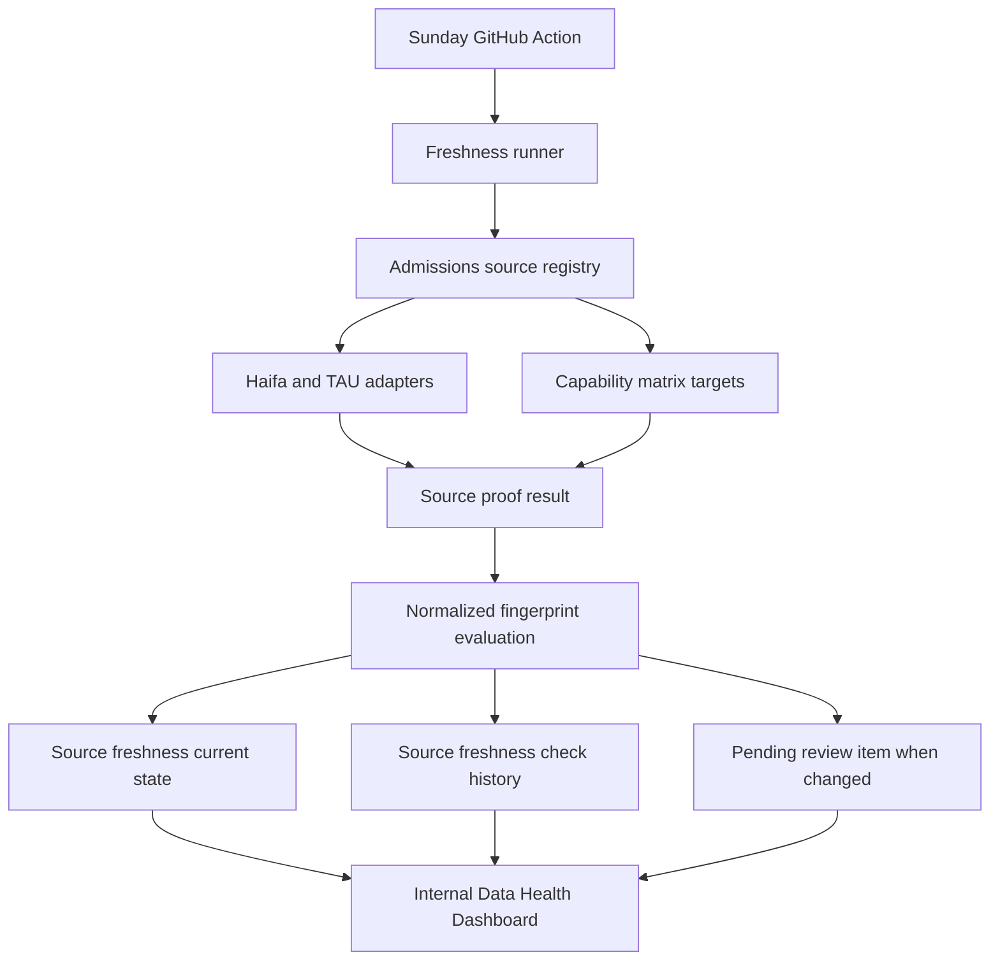
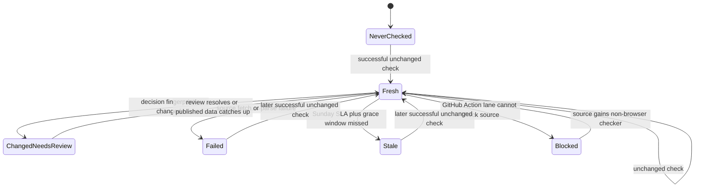

# Production Admissions Source Freshness

## Summary

Productionize the admissions source freshness proof into a scheduled, persisted, operator-visible system. The work should integrate the exact Haifa and TAU proof adapters from `feat/weekly-admissions-freshness-discovery`, persist source freshness and change history, run weekly from GitHub Actions, and extend the internal Data Health Dashboard with freshness status.

---

## Problem Frame

The Monday handoff for `Productionize admissions live-source freshness after PR #49` says the proof branch already validated the official-source adapter foundation: Haifa and TAU can be checked exactly, several institutions are partial or blocked, and normalized decision-bearing fingerprints are available. What is missing is the production loop: persistence, scheduled execution, change detection against prior fingerprints, review handoff, and dashboard visibility.

The current checkout contains the internal Data Health Dashboard and readonly `OPS_DATABASE_URL` pattern. The proof branch contains the source adapter modules, live proof runner, and discovery documentation, but it also contains broad unrelated changes. The safest implementation path is to bring over the focused proof layer and wire it into the dashboard branch rather than merging the whole branch blindly.

---

## Assumptions

- Implementation should start from a branch based on `feat/internal-data-health-dashboard`, then selectively integrate proof-layer files from `feat/weekly-admissions-freshness-discovery`.
- The GitHub Action can use a repository `DATABASE_URL` secret for write operations, matching the existing DB verification workflow shape.
- The Data Health Dashboard remains read-only and continues to use `OPS_DATABASE_URL`; production writes happen only in the scheduled checker.
- Haifa and TAU are the only exact live adapters in the first production slice. Other institutions keep their existing capability labels until separate proof work upgrades them.

---

## Requirements

**Freshness Execution**

- R1. The system must run a machine freshness check every Sunday morning Israel time and support manual GitHub Actions dispatch.
- R2. The scheduled job must run exact adapters for Haifa and TAU by default and include capability-matrix outcomes for partial, blocked, static-candidate, and open-admission targets.
- R3. Ordinary source-level outcomes such as changed, failed, blocked, or stale must be recorded without failing the whole job.
- R4. Job-level configuration errors such as missing database credentials must fail clearly before source checks begin.

**Persistence and Review**

- R5. The database must persist current source freshness state and immutable check history at institution or program scope.
- R6. A changed decision-bearing normalized fingerprint must produce `changed_needs_review` state and a pending review item without overwriting canonical admissions data.
- R7. Previously reviewed catalogue data must remain active while a changed source is pending review.
- R8. Score-only calculator output must be tracked as freshness evidence but must not create acceptance or rejection review work by itself.
- R9. Browser-required sources must be marked blocked for the GitHub Action lane with a reason and next action.

**Dashboard and Operations**

- R10. `/internal/data-health` must show global freshness totals for fresh, changed, failed, stale, blocked, and never-checked sources.
- R11. `/internal/data-health` must show capped per-source freshness rows with scope, source URL, status, last checked time, last successful check time, last changed time, blocked or failure reason, and next action.
- R12. The dashboard must preserve its existing auth guard and readonly ops database boundary.
- R13. Operator docs must explain the weekly schedule, status meanings, review boundary, and blocked-source lane.

---

## Key Technical Decisions

- KTD1. Selectively integrate the proof layer instead of merging the whole discovery branch. The proof branch carries many unrelated app, data, and tooling changes; this plan needs only the admissions source adapter modules, live proof script, tests, and discovery docs.
- KTD2. Store freshness as first-party operational data tied to `ingestion_sources`. This keeps recurring checks independent of Monday and aligns with the existing ingestion and review boundary.
- KTD3. Split current state from history. A current-state table supports fast dashboard reads, while an append-only check table keeps auditability for changed, failed, blocked, and recovered sources.
- KTD4. Use review items as the publication boundary for changed source output. Machine checks create evidence and review pressure; they do not mutate canonical admission requirements or thresholds.
- KTD5. Keep scheduler writes and dashboard reads on different database credentials. The weekly job needs write access through `DATABASE_URL`; `/internal/data-health` should continue to read through `OPS_DATABASE_URL` and the existing internal admin guard.
- KTD6. Make partial and blocked outcomes first-class. Score-only, static-candidate, browser-required, and open-admission targets should appear in freshness reporting without pretending they are equivalent to exact decision-capable adapters.

---

## High-Level Technical Design

---

## Implementation Units

### U1. Integrate Proof-Layer Modules

- **Goal:** Bring the proven admissions source adapter contract, registry, exact adapters, live proof runner, and tests onto the dashboard branch without unrelated branch changes.
- **Requirements:** R2, R8, R9
- **Dependencies:** None
- **Files:** `src/server/ingestion/freshnessDiscovery.ts`, `src/server/ingestion/freshnessDiscovery.test.ts`, `src/server/ingestion/admissionsSourceAdapters.ts`, `src/server/ingestion/admissionsSourceAdapters.test.ts`, `src/server/ingestion/admissionsSourceRegistry.ts`, `src/server/ingestion/admissionsSourceRegistry.test.ts`, `src/server/ingestion/admissionsLiveProofRunner.ts`, `src/server/ingestion/admissionsLiveProofRunner.test.ts`, `src/server/ingestion/adapters/haifaAdmissions.ts`, `src/server/ingestion/adapters/haifaAdmissions.test.ts`, `src/server/ingestion/adapters/tauAdmissions.ts`, `src/server/ingestion/adapters/tauAdmissions.test.ts`, `scripts/admissions-live-source-proof.mjs`, `docs/weekly-admissions-source-freshness-discovery.md`
- **Approach:** Port only the files that make up the proof layer from `feat/weekly-admissions-freshness-discovery`. Keep their tests fixture-backed and keep live network checks behind the explicit script.
- **Patterns to follow:** Preserve the pure server-module style from the proof branch and the existing Vitest patterns under `src/server/*`.
- **Test scenarios:**
  - Given mocked Haifa official responses, when the Haifa adapter parses them, then it returns decision-capable proof fields and a normalized fingerprint.
  - Given mocked TAU GraphQL responses, when the TAU adapter selects the representative score field, then it returns decision-capable proof fields and thresholds.
  - Given a blocked BIU or Ariel target, when the registry builds capability results, then the runner reports blocked without attempting a live fetch.
  - Given a score-only Technion or BGU target, when freshness evaluation runs, then the result is tracked as score-only and not review-worthy for acceptance.
- **Verification:** Proof-layer tests pass on the dashboard branch and the live proof script remains manually runnable without entering normal CI.

### U2. Freshness Persistence Model

- **Goal:** Add schema, migrations, and types for source freshness current state and check history.
- **Requirements:** R5, R7, R8, R9, R12
- **Dependencies:** U1
- **Files:** `src/db/schema.ts`, `src/db/types.ts`, `src/db/migrations/0007_source_freshness.sql`, `src/db/migrations/meta/_journal.json`, `src/db/migrations/meta/0007_snapshot.json`, `src/server/ingestion/types.ts`, `docs/backend-data-model.md`
- **Approach:** Add enums for source class, freshness capability, and freshness status. Add a current-state table keyed by `ingestion_sources.id`, plus a history table for every check attempt. Persist scope, timestamps, status, blocked/failure reason, raw fingerprint, normalized fingerprint, normalized decision payload, capability, and review item linkage where present. Treat `stale` as derived from the current state and the Sunday SLA when that avoids mutating rows only because time passed.
- **Patterns to follow:** Mirror the existing Drizzle schema naming style and keep operational tables readable by `OPS_DATABASE_URL` grants documented in `docs/internal-data-health-dashboard.md`.
- **Test scenarios:**
  - Given an institution-level source, when current freshness is stored, then it can be represented without a program id.
  - Given a program-specific source, when current freshness is stored, then institution and program scope remain distinct.
  - Given a blocked source, when persisted, then blocked reason and capability survive serialization.
  - Given a failed check, when persisted, then canonical catalogue rows remain unchanged.
  - Given a source has no successful check inside the SLA plus grace window, when dashboard-facing state is built, then it can be classified as stale without changing canonical data.
- **Verification:** Migration metadata matches the schema, type checks compile, and docs identify the new readonly grants needed for dashboard access.

### U3. Freshness Check Service and Review Handoff

- **Goal:** Convert proof results into persisted freshness state, check history, and review items when normalized decision data changes.
- **Requirements:** R3, R5, R6, R7, R8, R9
- **Dependencies:** U1, U2
- **Files:** `src/server/ingestion/sourceFreshness.ts`, `src/server/ingestion/sourceFreshness.test.ts`, `src/server/ingestion/reviewTypes.ts`, `src/server/ingestion/types.ts`
- **Approach:** Add a service that loads previous normalized fingerprints, evaluates each proof result, writes history, upserts current state, and creates a pending review item only for decision-capable changed output. Duplicate pending review items for the same unresolved source change should be avoided.
- **Execution note:** Implement this unit test-first because it owns the most important data boundary: changed machine output must not publish canonical admissions truth.
- **Patterns to follow:** Reuse `ingestion_payloads` and `review_items` as the evidence and review boundary instead of adding a parallel review queue.
- **Test scenarios:**
  - Given no prior fingerprint, when a decision-capable source succeeds, then current state becomes fresh and no review item is created.
  - Given the same normalized fingerprint, when the next check succeeds, then current state remains fresh and history records the new check.
  - Given a changed decision-capable fingerprint, when the service runs, then current state becomes `changed_needs_review`, a payload is stored, and one pending review item is created.
  - Given the same changed fingerprint runs again while a pending review item exists, then no duplicate pending review item is created.
  - Given a score-only fingerprint changes, then history and current state update but no acceptance review item is created.
  - Given a source fetch fails, then current state records failed with a reason and the prior canonical data remains untouched.
- **Verification:** Tests prove state transitions, history writes, duplicate review suppression, and canonical-data non-mutation.

### U4. Scheduled GitHub Action and Runner Script

- **Goal:** Add the weekly and manual execution path that runs freshness checks and persists results.
- **Requirements:** R1, R2, R3, R4, R9
- **Dependencies:** U1, U2, U3
- **Files:** `.github/workflows/admissions-freshness.yml`, `scripts/admissions-source-freshness.mjs`, `package.json`, `src/server/ingestion/admissionsLiveProofRunner.ts`, `src/server/ingestion/sourceFreshness.test.ts`
- **Approach:** Create a workflow scheduled for Sunday morning Israel time using UTC cron and `workflow_dispatch`. The script should initialize the database, run exact adapters plus the capability matrix, persist every result, and exit non-zero only for job-level setup or infrastructure failures.
- **Patterns to follow:** Match `.github/workflows/ci.yml` for Node setup, npm cache, and dependency installation. Use the Vite SSR script loading style from the proof scripts unless implementation replaces it with an established local runner pattern.
- **Test scenarios:**
  - Given missing `DATABASE_URL`, when the script starts, then it exits with a configuration error before source checks run.
  - Given one adapter fails and another succeeds, when the runner completes, then both outcomes are persisted and the process reports source-level failure without aborting the whole batch.
  - Given manual dispatch passes a target id, when the script runs, then only that target is checked.
  - Given a browser-required target appears in the matrix, when the scheduled run evaluates it, then it records blocked without network fetch.
- **Verification:** Workflow YAML is present, script tests cover orchestration through mocks, and local dry-run behavior can exercise persistence logic without live endpoint dependency.

### U5. Dashboard Freshness Reporting

- **Goal:** Extend the internal Data Health Dashboard data model and UI with freshness totals and capped source rows.
- **Requirements:** R10, R11, R12
- **Dependencies:** U2, U3
- **Files:** `src/server/data-health/queries.ts`, `src/server/data-health/queries.test.ts`, `src/app/internal/data-health/DataHealthDashboard.tsx`, `src/app/internal/data-health/DataHealthDashboard.test.tsx`, `src/app/internal/data-health/page.test.tsx`, `docs/internal-data-health-dashboard.md`
- **Approach:** Load current freshness state through the ops database, compute global totals by status, and render freshness as a new operator section alongside readiness, source coverage, ingestion pipeline, and review queue. Rows should be capped and scan-first: source id, institution/program scope, status, last check timestamps, reason, and next action.
- **Patterns to follow:** Keep the page read-only and preserve the current fail-closed admin guard before any operational query. Do not render raw normalized payloads in the dashboard.
- **Test scenarios:**
  - Given freshness rows with fresh, changed, failed, stale, blocked, and never-checked statuses, when aggregation runs, then totals include each status.
  - Given a changed source with a pending review item, when the dashboard renders, then the row points to review work without exposing full proposed values.
  - Given an institution-wide and program-specific row for the same institution, when the dashboard renders, then their scopes are distinguishable.
  - Given an unauthorized user opens the page, then data-health aggregation still is not called.
  - Given `OPS_DATABASE_URL` lacks the new table grants, then an allowlisted admin sees the existing controlled unavailable state rather than SQL details.
- **Verification:** Query and component tests cover every status and prove the dashboard remains read-only and guarded.

### U6. Operational Documentation and Grants

- **Goal:** Document how the weekly freshness system runs, what each status means, and which database grants are required.
- **Requirements:** R4, R6, R7, R9, R13
- **Dependencies:** U2, U4, U5
- **Files:** `docs/data-ingestion-workflow.md`, `docs/internal-data-health-dashboard.md`, `docs/backend-data-model.md`, `docs/weekly-admissions-source-freshness-discovery.md`, `README.md`
- **Approach:** Update the ingestion workflow and dashboard docs to explain the source freshness lifecycle, Sunday schedule, manual dispatch, blocked-source lane, and review-before-publication rule. Update the ops readonly grants to include new freshness tables.
- **Patterns to follow:** Use the same operational tone as `docs/internal-data-health-dashboard.md` and avoid embedding live proof payloads as canonical truth.
- **Test scenarios:** Test expectation: none -- documentation-only unit.
- **Verification:** A maintainer can identify how to run the checker, what each dashboard status means, and which grants are needed without relying on Monday history.

---

## Acceptance Examples

- AE1. Given the Sunday workflow runs with database credentials configured, when Haifa and TAU exact adapters succeed with unchanged normalized fingerprints, then their source rows become fresh with updated last checked and last successful timestamps.
- AE2. Given TAU returns a changed official threshold, when the weekly checker compares it to the prior normalized fingerprint, then the source becomes `changed_needs_review`, a pending review item is created, and the canonical threshold remains unchanged.
- AE3. Given Technion produces only score output, when the checker runs, then the score-only output is persisted as source freshness evidence but does not create accepted/rejected review work.
- AE4. Given BIU requires browser cookies or Radware state, when the GitHub Action evaluates the target, then it records blocked with a browser-lane next action and continues the batch.
- AE5. Given an allowlisted operator opens `/internal/data-health`, when freshness rows exist, then the dashboard shows global freshness totals and capped per-source rows without exposing raw payloads.
- AE6. Given an unauthenticated visitor opens `/internal/data-health`, when the route handles the request, then no freshness or operational data is queried or rendered.

---

## System-Wide Impact

This introduces the first recurring machine check that writes operational catalogue evidence. It does not change the public admissions decision surface, but it changes how operators decide whether admissions sources are current enough to trust.

The work also adds a new database write path from GitHub Actions. That raises the bar for clear failure behavior: source-level failures belong in freshness state, while setup or database failures should fail the workflow.

---

## Risks & Dependencies

| Risk | Impact | Mitigation |
| --- | --- | --- |
| Whole-branch merge pulls unrelated discovery changes into dashboard work | Large conflict set and hidden regressions | Selectively port proof-layer files and tests from `feat/weekly-admissions-freshness-discovery` |
| Changed source output mutates canonical data too early | Users could see unreviewed admissions facts | Store changed output as payload plus pending review item only |
| Score-only calculators are mistaken for decision-capable sources | Product may overclaim acceptance or rejection | Keep `score_only` separate in schema, dashboard, and review creation logic |
| GitHub Action cannot reach some official sources | Weekly run appears broken when source class is merely unsupported | Record blocked or failed source-level state and continue remaining checks |
| Ops readonly role lacks new grants | Dashboard freshness section is unavailable in production | Update docs and grants alongside schema migration |
| Live official endpoints drift | Adapter can fail even when the app is otherwise healthy | Keep parser tests fixture-backed and treat live failure as source-level freshness state |

---

## Scope Boundaries

### Included

- Focused integration of the existing source proof modules for Haifa, TAU, and the capability matrix.
- Freshness persistence, check history, and review item creation for changed decision-capable output.
- Sunday GitHub Action plus manual dispatch for the weekly checker.
- Internal Data Health Dashboard freshness totals and source rows.
- Operator documentation for schedule, status meanings, grants, and review boundary.

### Deferred to Follow-Up Work

- Hermes/VPS browser lane for BIU, Ariel, and other browser-protected sources.
- Product runtime accepted/rejected admissions decisions from freshness data.
- Broad program coverage beyond the representative Haifa and TAU proof targets.
- HUJI static JSON plus bundled-JS reproduction.
- A full review UI for approving changed source output if the existing review path is not sufficient.

### Out of Scope

- Polling Monday as part of the recurring weekly freshness loop.
- Publishing changed machine output directly into canonical admissions tables.
- Treating score-only calculator output as acceptance evidence.
- Adding public UI copy or changing the user-facing calculator results flow.

---

## Sources & Research

- Monday item `12375316114`, `Productionize admissions live-source freshness after PR #49`.
- Proof branch: `feat/weekly-admissions-freshness-discovery` at commit `76beb54`.
- Existing proof artifacts on the proof branch: `src/server/ingestion/admissionsSourceAdapters.ts`, `src/server/ingestion/admissionsSourceRegistry.ts`, `src/server/ingestion/admissionsLiveProofRunner.ts`, `src/server/ingestion/freshnessDiscovery.ts`, `scripts/admissions-live-source-proof.mjs`, `docs/weekly-admissions-source-freshness-discovery.md`.
- Existing dashboard implementation: `src/server/data-health/queries.ts`, `src/app/internal/data-health/DataHealthDashboard.tsx`, `src/app/internal/data-health/page.tsx`, `docs/internal-data-health-dashboard.md`.
- Existing schema and operational tables: `src/db/schema.ts`, `src/server/ingestion/types.ts`, `src/server/ingestion/reviewTypes.ts`.
- Related plan: `docs/plans/2026-06-25-003-feat-weekly-admissions-source-freshness-plan.md`.
- Relevant learning: `docs/solutions/architecture-patterns/protect-internal-dashboards-with-a-dedicated-readonly-ops-database-url.md`.
- Relevant database rollout learning: `docs/solutions/database-issues/restore-soldier-catalogue-after-remote-schema-and-config-drift.md`.
