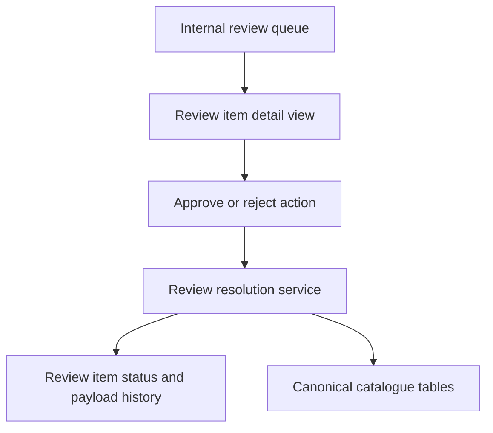

# Operator Review Flow

## Summary

Add a minimal internal operator workflow for pending review items so an allowlisted admin can inspect evidence, approve or reject a review item, and publish approved catalogue changes through one auditable path. This is a separate feature from the current read-only Data Health Dashboard and must keep the review boundary intact.

---

## Problem Frame

The repo already persists machine-collected evidence and review queue state, but the current operator surface stops at readonly reporting. `/internal/data-health` can show backlog and freshness state, yet it cannot reveal enough evidence to make a decision, record that decision, or apply approved catalogue changes.

That gap is now product-significant. Weekly freshness work and future ingestion work already create `review_items`, and the system needs a safe way to resolve them without bypassing traceability or turning the dashboard into an overprivileged admin panel. The wrong implementation would collapse evidence viewing, approval, and canonical publication into one opaque surface.

---

## Assumptions

- The first operator audience is the same allowlisted internal admin set already used for `/internal/data-health`.
- The first version only needs to resolve existing `review_items`; it does not need bulk actions, assignment workflows, or comments.
- Approval should publish through a server-owned path that is more constrained than arbitrary table editing.
- Rejection must preserve evidence history and keep repeated future runs comparable against prior decisions.

---

## Requirements

**Access and Safety**

- R1. Only allowlisted internal admins may view review-item evidence or invoke approve/reject/publish actions.
- R2. Unauthorized requests must fail before loading review-item detail or mutation controls.
- R3. Review-item actions must execute through a server-owned mutation path, not through direct client access to operational or canonical tables.

**Review Workspace**

- R4. Operators must be able to list pending review items with enough context to choose one to inspect.
- R5. Operators must be able to open a review item detail view that shows normalized evidence, source provenance, target field, prior published value when available, and the proposed change shape.
- R6. The detail view must not dump unbounded raw payloads by default; raw evidence should stay capped, structured, and intentional.

**Decision Recording**

- R7. Operators must be able to reject a review item without mutating canonical catalogue data.
- R8. Operators must be able to approve a review item and publish the approved change through one auditable path.
- R9. Review item status transitions must be explicit and traceable: pending -> approved or pending -> rejected.
- R10. Repeat runs of the same unresolved machine evidence must remain comparable against the stored review outcome.

**Publication Boundary**

- R11. Approved publication must update only the intended canonical catalogue surface for the review item's target field.
- R12. Publication must preserve traceability back to the reviewed payload and source.
- R13. If publication fails, the system must not leave the item falsely marked approved-and-published.

**Verification**

- R14. Tests must cover access control, detail loading, rejection behavior, approval/publish behavior, and failure rollback.

---

## Key Technical Decisions

- KTD1. Keep the existing admin gate. The first operator flow should reuse Supabase-authenticated allowlisted admin access rather than inventing a second role system before the workflow exists.
- KTD2. Separate decision from arbitrary editing. Operators should approve or reject review items, not edit raw canonical rows inline. Publication belongs to a server-owned translator from review item shape to canonical mutation.
- KTD3. Show normalized evidence first. The operator detail view should lead with source, target field, proposed value, prior value, and structured evidence fields. Raw payload dumps are a secondary inspection surface, not the default.
- KTD4. Make publication idempotent where practical. Re-running the same approval path should not duplicate canonical rows or corrupt review history.
- KTD5. Record publication outcome explicitly. Approval alone is not enough; the system must distinguish a recorded approval from a successful canonical publish when failures occur mid-flight.

---

## High-Level Technical Design

The important boundary is the service. The UI may request a decision, but only the server-side review resolution service may translate an approved review item into canonical catalogue writes.

---

## Implementation Units

### U1. Review Item Detail Query Contract

- **Goal:** Add a server-side query contract for loading one review item's decision context.
- **Requirements:** R1, R2, R4, R5, R6, R14
- **Dependencies:** None
- **Files:** `src/server/data-health/queries.ts`, `src/server/data-health/queries.test.ts`, `src/server/ingestion/reviewTypes.ts`
- **Approach:** Extend the current review queue data model with a detail query that returns status, target field, proposed value, source provenance, related payload id, and a bounded evidence shape suitable for UI rendering. If prior canonical value can be derived cheaply, include it in the detail contract.
- **Patterns to follow:** Reuse the current guarded data-health query layering rather than letting page components query tables directly.
- **Test scenarios:**
  - Given a pending review item exists, when the detail query runs as an admin, then it returns structured evidence and the target field context.
  - Given no matching review item exists, when the detail query runs, then it returns a controlled not-found outcome.
  - Given a non-admin request reaches the route, when the server handles it, then no review-item detail is loaded.
- **Verification:** Query tests prove the detail contract stays bounded and access-controlled.

### U2. Review Resolution Service

- **Goal:** Introduce the server-owned service that rejects or approves review items and applies approved canonical mutations.
- **Requirements:** R3, R7, R8, R9, R10, R11, R12, R13, R14
- **Dependencies:** U1
- **Files:** `src/server/ingestion/reviewResolution.ts`, `src/server/ingestion/reviewResolution.test.ts`, `src/server/ingestion/reviewTypes.ts`, `src/db/schema.ts`
- **Approach:** Add explicit actions for reject and approve. Reject updates review status and any decision metadata without touching canonical tables. Approve validates the review item's target field, applies the canonical write through one translation path, and only then records the published outcome. If the canonical write fails, leave the item unresolved or mark a failure state rather than pretending publication succeeded.
- **Execution note:** Implement test-first for approve/reject transitions and failure rollback.
- **Patterns to follow:** Preserve the existing ingestion/review boundary from `src/server/ingestion/sourceFreshness.ts`; the review resolution service is the first controlled crossing of that boundary.
- **Test scenarios:**
  - Given a pending review item, when reject runs, then status becomes rejected and canonical data is unchanged.
  - Given a pending review item with a supported target field, when approve runs, then the intended canonical value is updated and traceability remains linked to the reviewed payload.
  - Given publication throws after decision intent is recorded, when approve runs, then the item is not left falsely published.
  - Given the same approval path is retried, when the underlying canonical state is already aligned, then the service behaves idempotently or fails safely without duplication.
- **Verification:** Service tests prove safe transitions, canonical write boundaries, and rollback behavior.

### U3. Protected Operator UI

- **Goal:** Add the minimal UI flow for listing pending items, opening one item, and invoking approve/reject actions.
- **Requirements:** R1, R2, R4, R5, R6, R7, R8, R14
- **Dependencies:** U1, U2
- **Files:** `src/app/internal/data-health/page.tsx`, `src/app/internal/data-health/page.test.tsx`, `src/app/internal/data-health/DataHealthDashboard.tsx`, `src/app/internal/data-health/DataHealthDashboard.test.tsx`, `src/app/internal/reviews/[reviewItemId]/page.tsx`, `src/app/internal/reviews/[reviewItemId]/page.test.tsx`
- **Approach:** Keep the dashboard queue as the entry point, then route to a dedicated review detail page or pane rather than embedding publication controls directly into every dashboard row. Use explicit action buttons for approve/reject and server actions or POST routes for mutation.
- **Patterns to follow:** Preserve the existing fail-closed admin access checks before rendering any review detail or mutation controls.
- **Test scenarios:**
  - Given pending review items exist, when an admin views the queue, then they can navigate to a detail view.
  - Given an admin opens the detail view, when the page renders, then it shows structured evidence, target field, prior value, and proposed value context.
  - Given an unauthorized user reaches the detail route, when the page handles the request, then it fails closed.
  - Given approve or reject completes, when the operator returns to the queue, then the item no longer appears as pending.
- **Verification:** UI tests prove guarded access and the approve/reject flow on representative review items.

### U4. Operational Documentation

- **Goal:** Document how operators should use the review flow and what boundaries still apply.
- **Requirements:** R6, R10, R12
- **Dependencies:** U2, U3
- **Files:** `docs/internal-data-health-dashboard.md`, `docs/data-ingestion-workflow.md`, `README.md`
- **Approach:** Update the dashboard and ingestion docs to explain the new review detail/publish flow, the meaning of approval versus publication, and the rule that raw machine evidence still does not publish directly without an explicit review action.
- **Patterns to follow:** Keep the same operational tone as the existing internal dashboard docs.
- **Test scenarios:** Test expectation: none -- documentation-only unit.
- **Verification:** The docs explain who can resolve review items, how approval changes canonical data, and what traceability is preserved.

---

## Acceptance Examples

- AE1. Given an allowlisted admin opens a pending review item, when the detail view loads, then it shows bounded evidence, provenance, target field, and proposed value context.
- AE2. Given an admin rejects a pending review item, when the action completes, then the item leaves the pending queue and canonical catalogue data does not change.
- AE3. Given an admin approves a supported review item, when publication succeeds, then the intended canonical data changes and the decision remains traceable to the reviewed payload.
- AE4. Given publication fails during approval, when the action returns, then the item is not falsely reported as successfully published.
- AE5. Given a non-admin or unauthenticated request reaches the review detail route, when the server handles it, then no review detail or mutation controls are exposed.

---

## System-Wide Impact

This feature introduces the first internal mutation path tied to ingestion evidence. It therefore touches auth boundaries, review traceability, and canonical publication rules at the same time.

The work also establishes a reusable pattern for future operator tooling: readonly reporting stays separate from decision and publication actions, and every cross-boundary mutation goes through a dedicated server-owned service rather than an ad hoc dashboard callback.

---

## Risks & Dependencies

| Risk | Impact | Mitigation |
| --- | --- | --- |
| Approval mutates the wrong canonical surface | Operators publish incorrect catalogue truth | Route every supported target field through one explicit translation layer with tests |
| Dashboard UI grows into an overprivileged admin surface | Internal tooling bypasses review discipline | Keep readonly queue/reporting separate from review detail and publish actions |
| Raw payload display becomes the default operator experience | Sensitive or noisy evidence leaks into routine review work | Lead with bounded normalized evidence and gate any raw payload expansion |
| Approval state is recorded before canonical publish succeeds | Queue status lies about what shipped | Make success depend on the canonical mutation path completing cleanly |

---

## Scope Boundaries

### Included

- Review-item detail loading for pending items.
- Approve/reject actions for supported review item types.
- Server-owned canonical publish path for approved items.
- Admin-gated UI and documentation for the operator flow.

### Deferred to Follow-Up Work

- Bulk approve/reject actions.
- Rich operator comments, assignment, or escalation workflows.
- Full raw payload explorer UI.
- Browser-lane scraper triggering from the review workspace.

### Out of Scope

- Public user-facing catalogue UI changes.
- Direct inline editing of canonical tables from the dashboard.
- Replacing the existing `review_items` model with a new workflow system.

---

## Open Questions

- OQ1. Which `targetField` values should v1 support for publication, and which should remain reviewable but not publishable yet?
- OQ2. Should approval immediately publish, or should there be a second confirm step for high-impact target fields?
- OQ3. Where should prior canonical value lookup live for fields that span multiple canonical tables?

---

## Sources / Research

- Monday board `18407769281`, item `12379810963`: Build operator flow for review items.
- `docs/internal-data-health-dashboard.md`
- `docs/data-ingestion-workflow.md`
- `docs/backend-data-model.md`
- `src/server/data-health/queries.ts`
- `src/server/ingestion/reviewTypes.ts`
- `src/server/ingestion/sourceFreshness.ts`
- `docs/plans/2026-06-24-002-feat-internal-data-health-dashboard-plan.md`
- `docs/plans/2026-06-26-001-feat-production-admissions-freshness-plan.md`
