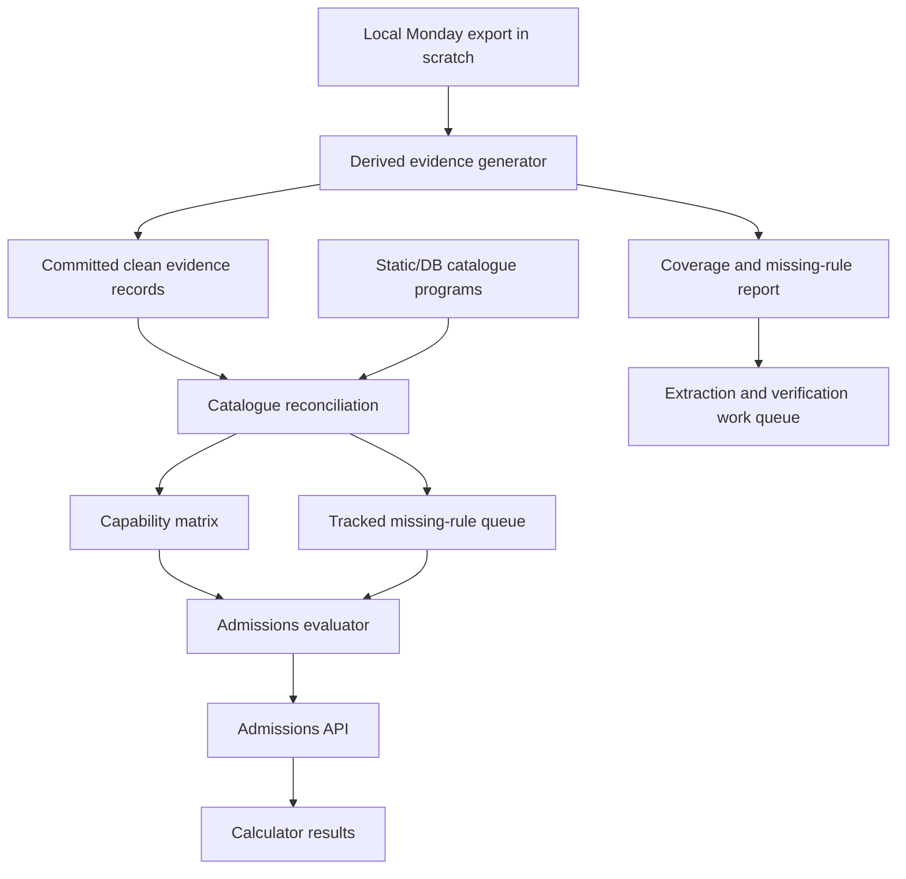
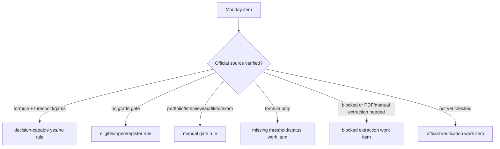

# Full Monday Admissions Decision Coverage

## Goal Capsule

- **Objective:** Ingest all 212 Monday institution items into the catalogue, extract their admissions criteria (e.g. no bagrut needed, interview needed, portfolio needed) from columns/updates, and wire them to the admissions evaluator so they are active in calculator results. Leaving any Monday institution unmapped or unwired is a strict **NO-GO** blocker. This is the heart of the product.
- **Primary authority:** Official institution URLs and official source material win. Monday item updates are the retrieval map: they contain URLs, formulas, schemas, screenshots, PDFs, blockers, and prior reverse-engineering notes that make official verification faster.
- **Current baseline:** PR #71 added decisive labels for mapped rules and a repeatable local Monday export at `scratch/monday-admissions-updates.json`. That export covers board `18416803950`, 212 items, 212 items with updates, 229 updates, and no update-thread truncation.
- **Current implementation checkpoint:** PR #71 contains the first evidence-coverage implementation slice in commit `9d4ff1c` (`feat(admissions): derive monday evidence coverage`), which completed U1 through U4. Follow-up PR #73 contains the U5 public-result contract slice in commit `701f143` (`feat(admissions): expose tracked missing rule results`). Resume new work at U6 unless PR #73 review feedback requires a follow-up patch or the raw Monday export changes.
- **Execution profile:** Deep, multi-session implementation. This is data extraction, evidence normalization, official-source verification, evaluator behavior, UI copy, and regression coverage.
- **Stop condition:** Do not call this complete while any Monday item lacks a structured evidence record or fails to appear in the active catalogue calculations flow.
- **Tail ownership:** The implementing agent owns plan execution, scripts, derived evidence files, evaluator/test changes, verification, commits, and PR updates. Raw Monday exports remain local and ignored.

---

## Current Implementation Status

### Completed in PR #71 / commit `9d4ff1c`

- **U1 complete:** `scripts/derive-monday-admissions-evidence.mjs` was added with package script `npm run monday:derive-admissions-evidence`. It reads the ignored raw export, emits deterministic generated TypeScript and markdown reports, omits raw update bodies, handles item-number normalization including `HIT .15`, and formats its generated output with Prettier when available.
- **U2 complete:** `src/data/admissions/mondayEvidence.ts`, `src/data/admissions/mondayEvidence.generated.ts`, and `src/data/admissions/mondayEvidence.test.ts` were added. Runtime code now has typed accessors by Monday item id, catalogue institution id, tracked missing rules, and official verification queue.
- **U3 complete:** The generated evidence now includes `catalogueVisibility` and `officialVerificationStatus`, and `docs/admissions-coverage/missing-official-rules.md` is a concrete extraction queue rather than a generic bucket report.
- **U4 complete:** `src/server/admissions/catalogueEvidenceCoverage.ts` and `src/server/admissions/catalogueEvidenceCoverage.test.ts` were added. The real static catalogue is reconciled against Monday evidence and fails future untracked catalogue gaps.
- **PR handoff complete:** PR #71 was updated with the plan path, evidence counts, missing-rule counts, verification commands, and known follow-up extraction batches.

### Completed in follow-up PR #73 / commit `701f143`

- **U5 complete:** The public admissions result contract now exposes `tracked_missing_rule` as a first-class result kind/capability instead of letting Monday-backed missing-rule institutions collapse into generic `unsupported`, `unknown`, or `score_only` style fallbacks.
- **Evaluator evidence wiring complete:** `src/server/admissions/capabilityMatrix.ts` now attaches Monday-derived evidence to capability entries, prefers evidence-backed routing for `tracked_missing_rule`, `open_admission`, and `manual_gate`, and ignores `null` thresholds as decision-ready cutoffs.
- **Public metadata complete:** `src/types/admissionsEvaluation.ts` and `src/server/admissions/evaluator.ts` now return evidence metadata needed for product copy and operator follow-up: `evidenceItemId`, `evidenceItemName`, `missingData`, and `officialUrls`.
- **Coverage updates complete:** Tests now assert the new public behavior for Technion, BGU, Ariel, BIU, Reichman, and MTA rather than preserving the older generic/score-only semantics.
- **Branch/PR handoff complete:** PR #72 is already merged and the old `fix/admissions-result-semantics` branch is historical only. New U5 work lives on clean branch `feat/admissions-tracked-missing-results` in PR #73 so follow-up implementation does not continue on a merged branch.

### Generated Evidence Snapshot

- Raw export source: `scratch/monday-admissions-updates.json` (ignored, not committed).
- Clean generated dataset: `src/data/admissions/mondayEvidence.generated.ts`.
- Human reports:
  - `docs/admissions-coverage/monday-evidence-summary.md`
  - `docs/admissions-coverage/missing-official-rules.md`
- Coverage counts:
  - 212 Monday items represented.
  - 229 Monday updates represented through derived fields.
  - 34 evidence records mapped to current catalogue institution ids.
  - 178 evidence-only records preserved for later catalogue ingestion.
  - 0 items hit the current Monday update limit.
- Public evidence buckets:
  - `decision_capable`: 5
  - `tracked_missing_rule`: 5
  - `open_admission`: 1
  - `requirements_review`: 23
  - `manual_gate`: 43
  - `eligible_with_manual_gate`: 63
  - `eligible_no_formal_grade_gate`: 72
- Official verification queue:
  - `needs_official_threshold`: 4
  - `blocked_needs_alternate_official_source`: 1
  - `needs_structured_requirements`: 22
  - `needs_official_url`: 1
  - Monday-evidence-backed decision/manual/open records: 184

### Current Catalogue Reconciliation State

- The current static catalogue has no untracked admissions evidence gaps under the new reconciliation test.
- The public evaluator now surfaces Monday-backed formula institutions with missing official decision data as `tracked_missing_rule` results instead of generic unsupported/missing buckets.
- Formula-only catalogue-visible institutions are tracked as extraction work instead of final decisions: Technion, BGU, Ariel, and Reichman need official threshold/status evidence.
- Bar-Ilan is tracked as blocked and needs an alternate official source or browser-capable verification path.
- Catalogue-visible structured-requirements institutions include Tel-Hai, Ruppin, Colman, and Ono; these need conversion from requirements prose into structured grade/manual/open rules.
- Current visible catalogue institution ids with no connected Monday item yet are explicitly tracked in the reconciliation inventory: `broshim`, `elevation`, `itc`, `kinneret`, `ono_ce`, and `pardeshana`.
- Do not treat that inventory as product-complete. It exists to prevent hiding gaps while the official evidence is fetched.

### Verification Already Run

- For the U1-U4 evidence slice:
  - `npm run monday:derive-admissions-evidence`
  - `node --check scripts/derive-monday-admissions-evidence.mjs`
  - `npm run monday:derive-admissions-evidence -- --help`
  - `npm exec vitest -- src/data/admissions/mondayEvidence.test.ts src/server/admissions/catalogueEvidenceCoverage.test.ts src/server/admissions/capabilityMatrix.test.ts --run`
  - `npm run typecheck`
  - `npm run guard:pre-pr`
  - Pre-push hook reran `npm run guard:pre-pr`.
  - GitHub checks on PR #71 were green after the push, with the expected skipped jobs remaining skipped.
- For the U5 public-result slice:
  - `npm exec vitest -- src/data/admissions/mondayEvidence.test.ts src/server/admissions/catalogueEvidenceCoverage.test.ts src/server/admissions/capabilityMatrix.test.ts src/server/admissions/evaluator.test.ts --run`
  - `npm run typecheck`
  - `npm run format:check`
  - `npm run guard:pre-pr`
  - The local guard run passed with a known Vite websocket `EPERM` warning during the seed dry-run path; it did not fail the guard.

### Resume Guidance

- Do not reopen U5 unless PR #73 review/CI feedback requires a correction. The next new implementation target is **U6. Official Rule Extraction Batches**.
- Start U6 with catalogue-visible missing-rule institutions first: Technion, BGU, Ariel, Reichman, and BIU/blocker follow-up before widening to lower-priority evidence-only items.
- Continue **U7+** only after each extraction batch upgrades evidence, runtime behavior, and tests together; do not let source extraction drift away from evaluator behavior.
- Do not redo U1 through U4 unless `scratch/monday-admissions-updates.json` changes. If it changes, rerun `npm run monday:derive-admissions-evidence`, inspect the generated diffs, and rerun the evidence and reconciliation tests before touching evaluator behavior.
- Keep raw Monday exports and local scrape artifacts out of git. Commit only clean derived evidence, reports, runtime rules, and tests.
- The workspace had unrelated dirty/untracked local files during the first slice, including duplicate `* 2.*` files and `scratch/` artifacts. Future commits should continue staging only intentional files.

---

## Product Contract

### Summary

The product must help a user understand what they can study across degrees, courses, and certificates in the institutions Toar tracks. The long-term product bar is not "we can calculate scores for a few institutions." The bar is: for every institution item gathered in Monday, extract and verify the rules needed to answer admission eligibility, then make the public evaluator use those rules for every program currently shown in the app.

For numeric academic admission, the answer is yes/no only when we have enough official or reviewed evidence to reproduce the rule server-side. For manual programs, the answer is eligibility to apply/register plus the remaining human-controlled gate. For open/no-grade programs, grades should not block the user. Missing rule data is not a final product state; it is an internal work queue that must name the missing official rule and where to go get it.

### Problem Frame

The existing evaluator already supports exact, estimated, open-admission, manual-gate, requirements-only, blocked, degraded, unsupported, and missing states. That is a useful implementation vocabulary, but it is not the product goal by itself. The current risk is that the system treats partial coverage as acceptable: formula-only sources become "score only", requirements-only sources become "unknown", and non-calculator institutions can fall back to generic missing even when Monday updates already say no grades are required or manual screening is the real gate.

The user-facing product must not hide these gaps, and the implementation must stop repeatedly re-discovering the same Monday update evidence. The next pass must create a clean, committed derived evidence layer, a reconciliation report, tests that fail on silent gaps, and a repeatable extraction workflow that can continue across sessions until every item is covered.

### Requirements

- R1. All 212 Monday board items must have one clean derived evidence record, separate from the raw local export.
- R2. Every derived evidence record must include Monday item id/name/url, official URLs discovered from columns or updates, update count, evidence bucket, confidence, and a next extraction action.
- R3. Official source material overrides Monday notes when they disagree. Monday evidence remains provenance and discovery context.
- R4. The raw Monday export must stay ignored and uncommitted; only clean derived evidence and reports may be committed.
- R5. Public catalogue programs must never silently disappear from admissions evaluation because their institution lacks a calculator.
- R6. Public evaluator results must use plain product buckets: accepted, not accepted/below requirement, eligible to apply/register, manual gate remains, open admission, needs input, degraded official source, or tracked missing official rule.
- R7. `score_only`, `missing_cutoff`, `blocked`, and similar states may exist internally, but they must be treated as extraction work, not a final product win.
- R8. Numeric yes/no decisions require a reproducible rule: formula or direct score source plus the program-specific threshold/status/gates needed to decide.
- R9. Manual/admissions-screening programs must not reject users based on grades unless official evidence says there is a formal grade minimum.
- R10. Certificates and short courses should use eligibility/register language, not academic "accepted" language, unless the program really has an academic admission decision.
- R11. Every remaining missing rule must name the institution/program, missing data type, official URL candidate, Monday evidence source, and recommended next action.
- R12. The implementation must prioritize catalogue-visible programs first, while still extracting all non-catalogue Monday items into structured evidence for later ingestion.
- R13. Tests must fail when a catalogue program returns a generic `missing`, `unsupported`, or `unknown` result without a tracked missing-rule record.
- R14. The derived evidence workflow must be repeatable: rerun Monday export, regenerate summary, compare coverage, and continue extraction without manual archaeology.
- R15. PR handoff must state which institutions/programs became decision-capable, which are eligible/manual/open, and which official rules still need extraction.

### Actors

- A1. **Applicant:** Enters grades and wants to see every relevant course/degree/certificate, with a clear admission/eligibility answer.
- A2. **Toar operator:** Uses Monday updates, official URLs, and internal reports to close missing rule gaps and verify sources.
- A3. **Implementation agent:** Extracts evidence, writes server-side decision rules, and keeps the derived dataset/test suite current.
- A4. **Reviewer:** Needs a durable plan, clean diffs, source provenance, and tests proving no silent coverage regression.

### Key Flows

- F1. **Full evidence extraction:** Raw Monday export is read locally, transformed into a clean derived evidence file, and summarized into an audit report that covers all 212 items.
- F2. **Official verification:** Each item's official URLs are checked or queued for verification. Formula, threshold, manual gate, no-grade policy, or blocker evidence is attached to the derived record.
- F3. **Catalogue reconciliation:** Catalogue programs and linked institutions are matched against derived evidence. Any current product program without a user-facing answer gets a named missing-rule record.
- F4. **Public evaluation:** User enters grades. The evaluator returns yes/no when the rule is known, eligible/manual/open when grades are not the deciding gate, needs-input when the rule needs extra user fields, or a tracked missing-rule result when extraction is not complete.
- F5. **Operator closure loop:** Missing-rule reports drive the next extraction batch. When rules are found, derived evidence, runtime rules, and tests are updated together.

### Acceptance Examples

- AE1. Given the local Monday export has 212 items, when the derived evidence generator runs, then the committed summary contains 212 records and no raw update bodies.
- AE2. Given a Monday item says no Bagrut or psychometric is required, when a linked catalogue program is evaluated, then low grades do not block the user and the result is eligible/open/manual according to remaining gates.
- AE3. Given an art/design/music/acting course requires portfolio/interview/audition, when a user enters low grades, then the result says they can apply/register and lists the manual gate instead of returning below threshold.
- AE4. Given a numeric program has a formula but no threshold/status, when the catalogue reconciliation runs, then it emits a missing-rule record naming the missing threshold/status and official URL to verify.
- AE5. Given a numeric program has formula and reviewed threshold/gates, when the evaluator runs, then it returns accepted or below with no maybe language.
- AE6. Given a current catalogue program has neither a decision rule nor a manual/open/eligible classification, when tests run, then the coverage test fails with the program id and institution id.
- AE7. Given a professional certificate has no formal grade gate, when evaluated, then the result uses eligible/register language rather than academic accepted/rejected language.
- AE8. Given official URL verification fails because of anti-bot, PDF complexity, or missing public data, when evidence is generated, then the item gets a specific blocker and next action rather than generic unknown.

### Scope Boundaries

#### Included

- Clean derived evidence from all 212 Monday items.
- Official URL verification workflow and missing-rule queue.
- Ingesting and mapping all 212 Monday items as visible catalogue institutions and programs.
- Public evaluator behavior that avoids generic missing/unknown for catalogue programs.
- Minimal UI/result copy changes needed to show the agreed buckets clearly.
- Regression tests and reports that keep future coverage honest.

#### Deferred to Follow-Up Work

- Fully automating every protected browser flow in production. Browser-blocked sources still need named extraction work, but the first pass may document the blocker and use alternate official evidence when available.
- A full operator editing UI for derived evidence. This plan can start with generated files and markdown/JSON reports.
- Perfect exact adapters for every university. The product can ship server-side replicated rules, reviewed static data, direct gates, and manual eligibility where official evidence supports them.

#### Out of Scope

- Inventing fake thresholds or fake accept/reject outcomes.
- Treating Monday as higher authority than the official institution source.
- Committing raw Monday update bodies, private board data, or credentials.
- Hiding courses because their rules are not yet fully extracted.

---

## Planning Contract

### Key Technical Decisions

- KTD1. **Create a clean derived evidence layer:** Raw Monday JSON is an input, not a source file. A committed derived dataset/report gives future sessions the evidence map without exposing raw board content or forcing repeated manual reading.
- KTD2. **Separate user buckets from internal work states:** Public results should speak in human terms: yes, no, eligible/register, manual gate, open admission, needs input, degraded source, or tracked missing rule. Internal capability labels can stay more technical.
- KTD3. **Make missing rules actionable:** A missing rule is acceptable only when it names what is missing and where to fetch it. Generic unknown/missing states fail the product contract.
- KTD4. **Reconcile against catalogue-visible programs first:** All 212 Monday items are extracted now, but evaluator correctness starts with the programs the app already returns. Non-catalogue items become structured evidence ready for ingestion.
- KTD5. **Use official URL verification as the upgrade path:** Monday updates often include formulas and schemas, but confidence rises when official URLs or attached official documents confirm them. Verification status belongs in the evidence record.
- KTD6. **Keep code generation deterministic:** Scripts should read `scratch/monday-admissions-updates.json` and produce stable sorted outputs so diffs show real evidence changes.
- KTD7. **Tests enforce coverage, not just examples:** Add tests that enumerate catalogue programs and fail on silent generic gaps, not only tests for a few handpicked institutions.

### High-Level Technical Design

### Assumptions

- `scratch/monday-admissions-updates.json` remains available locally for the first implementation slice; if it is missing, rerun `npm run monday:export-admissions`.
- Some Monday items are not yet catalogue-visible. They still need evidence records, but they do not immediately require evaluator rules until the corresponding program is ingested.
- The existing dirty worktree contains many unrelated duplicate `* 2.*` files and local artifacts. Implementation must stage only intentional files.
- The current branch is acceptable for continuing PR #71 unless a later handoff creates a new branch.

### Sequencing Strategy

The work should land in batches. The first batch creates the durable evidence/reporting and no-silent-gap tests. Later batches close missing official rules by institution group, starting with catalogue-visible programs and high-impact categories.

---

## Implementation Units

### U1. Derived Evidence Schema and Generator

- **Goal:** Convert the raw local Monday export into a clean, committed evidence dataset and summary report that cover all 212 items.
- **Requirements:** R1, R2, R4, R11, R14, AE1, AE8
- **Dependencies:** None
- **Files:** `scripts/derive-monday-admissions-evidence.mjs`, `src/data/admissions/mondayEvidence.generated.ts`, `docs/admissions-coverage/monday-evidence-summary.md`, `package.json`
- **Approach:** Read `scratch/monday-admissions-updates.json`, normalize each item into a small record, sort records by item number/name/id, and omit raw update bodies. Preserve derived tags, official/source URLs, capability candidate, limitations, and next action. Emit a markdown summary with counts by bucket and a missing-rule queue.
- **Execution note:** Characterization-first: generate from the current export and inspect counts before wiring runtime behavior.
- **Patterns to follow:** Reuse evidence classification vocabulary from `scripts/export-monday-admissions-updates.mjs`. Keep generated TS deterministic and small enough for code review.
- **Test scenarios:**
  - Given the current export, when the generator runs, then it writes exactly 212 derived records.
  - Given an item has raw update HTML/body text, when derived output is written, then the raw body is absent.
  - Given an item has official URLs in columns or updates, when derived output is written, then URLs are deduplicated and sorted.
  - Given a formula-only item lacks threshold/status evidence, when report is written, then it appears in the missing-rule queue.
  - Given the export is missing or has the wrong schema, when the generator runs, then it fails with a clear message.
- **Verification:** Generated dataset and markdown report can be regenerated without unrelated diffs; counts match the Monday export summary.

### U2. Evidence Types and Runtime Read API

- **Goal:** Add typed accessors for derived Monday evidence so runtime/admissions code can consume clean records without reading raw JSON or markdown.
- **Requirements:** R1, R2, R5, R11, R12, R14
- **Dependencies:** U1
- **Files:** `src/data/admissions/mondayEvidence.ts`, `src/data/admissions/mondayEvidence.generated.ts`, `src/data/admissions/mondayEvidence.test.ts`
- **Approach:** Define closed unions for evidence buckets, official verification status, rule completeness, and public product bucket. Provide lookup helpers by institution id, item id, normalized institution name, and official URL domain where possible.
- **Patterns to follow:** Mirror the typed data-file style in `src/data/admissions/hybridSlice.ts` and existing TypeScript tests around static data.
- **Test scenarios:**
  - Given a known calculator institution such as `tau`, when looked up by institution id, then evidence is returned.
  - Given a non-catalogue Monday item, when looked up by item id, then evidence is still available.
  - Given an unknown institution id, when looked up, then the helper returns undefined rather than guessing.
  - Given generated evidence contains an unsupported bucket string, when type tests compile, then the build fails.
- **Verification:** Typecheck and tests prove runtime code can use evidence without depending on raw export shape.

### U3. Official URL Verification Queue

- **Goal:** Make missing official checks concrete by deriving a queue of URL verification and missing-rule tasks from the evidence file.
- **Requirements:** R3, R8, R11, R14, R15, AE4, AE8
- **Dependencies:** U1, U2
- **Files:** `scripts/derive-monday-admissions-evidence.mjs`, `docs/admissions-coverage/missing-official-rules.md`, `src/data/admissions/mondayEvidence.generated.ts`
- **Approach:** Classify each item into verification statuses such as `verified_official_rule`, `needs_official_threshold`, `needs_formula_extraction`, `needs_manual_gate_confirmation`, `browser_blocked`, `pdf_or_document_review`, and `not_catalogue_visible_yet`. Include official URL candidates and the exact missing data field.
- **Patterns to follow:** Keep this as generated review artifact first; do not wire crawler/browser automation into the public evaluator.
- **Test scenarios:**
  - Given formula-only evidence without threshold/status, when the queue is generated, then the missing field is `threshold_or_status`.
  - Given no-grade/manual evidence, when the queue is generated, then the missing field is not numeric threshold unless the notes mention a formal grade gate.
  - Given an item has no official URL candidate, when the queue is generated, then it is flagged as `needs_official_url`.
  - Given an item is not in the current catalogue, when the queue is generated, then it remains in evidence but does not block catalogue runtime completion.
- **Verification:** The missing-rule queue is a usable worklist for the next extraction session and is referenced in PR handoff.

### U4. Catalogue-to-Evidence Reconciliation

- **Goal:** Compare current catalogue programs/institutions against derived Monday evidence and fail on silent coverage gaps.
- **Requirements:** R5, R6, R11, R12, R13, AE2, AE3, AE4, AE6
- **Dependencies:** U2, U3
- **Files:** `src/server/admissions/catalogueEvidenceCoverage.ts`, `src/server/admissions/catalogueEvidenceCoverage.test.ts`, `src/server/admissions/capabilityMatrix.ts`, `src/server/admissions/capabilityMatrix.test.ts`
- **Approach:** Build a reconciliation function that walks catalogue programs and linked institutions, resolves derived evidence, and returns either `covered`, `manual_or_eligible`, `open`, `needs_input`, `decision_rule_available`, or `tracked_missing_rule`. Tests should enumerate the real static catalogue.
- **Patterns to follow:** Use the existing capability matrix as the runtime classifier and keep reconciliation as an auditable support layer rather than duplicating all evaluator logic.
- **Test scenarios:**
  - Given all static catalogue programs, when reconciliation runs, then no program-institution pair returns untracked generic missing.
  - Given an art/design program with manual requirements, when reconciled, then it is manual/eligible, not missing.
  - Given a numeric calculator program with formula but no threshold, when reconciled, then it creates a tracked missing-rule item.
  - Given a non-catalogue Monday evidence record, when reconciled, then it does not fail catalogue coverage but appears in the evidence-only count.
  - Given future catalogue data adds an institution with no evidence, when tests run, then the missing institution id is reported.
- **Verification:** A single test gives a reviewer the list of current catalogue admissions coverage gaps.

### U5. Public Result Bucket Contract

- **Goal:** Align evaluator output with the agreed non-technical product buckets and remove generic maybe/unknown behavior from catalogue-visible results.
- **Requirements:** R5, R6, R7, R8, R9, R10, R13, AE2, AE3, AE5, AE7
- **Dependencies:** U4
- **Files:** `src/types/admissionsEvaluation.ts`, `src/server/admissions/evaluator.ts`, `src/server/admissions/evaluator.test.ts`, `src/server/admissions/capabilityMatrix.ts`, `src/server/admissions/capabilityMatrix.test.ts`
- **Approach:** Add or refine a tracked missing-rule result kind if needed, but keep it visibly different from a final answer. Manual/no-formal-grade programs should produce eligible/apply/register outcomes. Requirements-only with structured facts should evaluate those facts where possible instead of returning generic unknown.
- **Patterns to follow:** Preserve PR #71 decisive mapped-result behavior. Reuse `eligible_to_apply` and avoid introducing duplicated "maybe" copy.
- **Test scenarios:**
  - Given manual-only gates and low grades, when evaluated, then decision is `eligible_to_apply`.
  - Given no formal grade gate and no manual gate, when evaluated, then decision is accepted/eligible according to program type copy.
  - Given a certificate with no grade gate, when evaluated, then copy says eligible/register rather than academic accepted.
  - Given numeric facts pass and manual gates remain, when evaluated, then the result says eligible/accepted-with-manual gate according to program type and lists the gate.
  - Given a missing threshold is tracked, when evaluated, then the result points to the missing official rule and does not say maybe.
  - Given a formula and reviewed threshold exist, when evaluated, then the result is accepted or below.
- **Verification:** Evaluator tests cover yes, no, eligible/register, manual gate, needs input, degraded source, and tracked missing-rule results.

### U6. Official Rule Extraction Batches

- **Goal:** Use the derived evidence and official URLs to close missing rules in prioritized batches rather than leaving the queue theoretical.
- **Requirements:** R3, R7, R8, R11, R12, R15, AE4, AE5, AE8
- **Dependencies:** U3, U4, U5
- **Files:** `src/data/admissions/mondayEvidence.generated.ts`, `docs/admissions-coverage/missing-official-rules.md`, `src/utils/sekhemCalculators.ts`, `src/utils/__tests__/sekhemCalculators.test.ts`, `src/data/degrees/academicPrograms.ts`, `src/data/degrees/vocationalPrograms.ts`
- **Approach:** Work through missing rules by priority: catalogue-visible numeric programs first, then catalogue-visible manual/no-grade programs, then non-catalogue evidence. For each item, verify official URL, extract formula/threshold/gate or classify manual/open/no-formal-grade, update derived evidence, and add tests.
- **Patterns to follow:** For official pages/PDFs, prefer explicit source parsing or quoted structured data over fragile prose inference. For anti-bot sources, document blocker and find alternate official admissions pages/PDFs before declaring impossible.
- **Test scenarios:**
  - Given a batch closes a threshold gap, when evaluator tests run, then the program changes from tracked missing-rule to accepted/below behavior.
  - Given a batch confirms no formal grade gate, when evaluator tests run, then low grades do not block eligibility.
  - Given a batch confirms manual gate plus numeric prerequisite, when evaluator tests run, then numeric failure blocks but numeric pass still lists manual gate.
  - Given official verification contradicts Monday notes, when evidence is updated, then official source value wins and the report records the correction.
- **Verification:** Each batch has a small diff: evidence update, runtime rule/data update, and tests proving the changed public behavior.

### U7. Internal Data Health and Operator Reports

- **Goal:** Surface all coverage and missing-rule states where operators can inspect and continue the work.
- **Requirements:** R11, R13, R14, R15, AE4, AE6, AE8
- **Dependencies:** U3, U4, U5
- **Files:** `src/server/data-health/queries.ts`, `src/server/data-health/queries.test.ts`, `src/app/internal/data-health/DataHealthDashboard.tsx`, `src/app/internal/data-health/DataHealthDashboard.test.tsx`, `docs/admissions-coverage/monday-evidence-summary.md`, `docs/admissions-coverage/missing-official-rules.md`
- **Approach:** Use generated docs immediately, then wire high-value counts into `/internal/data-health`: total Monday items, catalogue-matched items, decision-capable, manual/eligible/open, tracked missing rules, blocked official sources, and non-catalogue evidence.
- **Patterns to follow:** Follow the existing data-health query/test style and keep expensive work out of public requests.
- **Test scenarios:**
  - Given fixture evidence with missing rules, when data-health summarizes, then missing-rule counts and examples are present.
  - Given all catalogue-visible programs are covered or tracked, when data-health summarizes, then the no-silent-gap status is healthy.
  - Given a generated report changes bucket counts, when tests run, then expected summary fields update deliberately.
- **Verification:** Operators can identify the next missing official rules without reading raw Monday exports or source code.

### U8. Minimal Public UI Copy Alignment

- **Goal:** Ensure the public calculator renders the agreed product buckets without technical labels or maybe language.
- **Requirements:** R6, R7, R9, R10, AE2, AE3, AE5, AE7
- **Dependencies:** U5
- **Files:** `src/components/CalculatorResults.tsx`, `src/components/CalculatorResults.test.tsx`, `src/lib/admissionsEvaluationClient.ts`, `src/types/admissionsEvaluation.ts`
- **Approach:** Keep UI changes minimal. Map evaluator result kinds to clear Hebrew labels for yes, no, eligible/register, manual gate remains, open admission, needs input, degraded, and tracked missing official rule. Avoid a redesign in this pass.
- **Patterns to follow:** Preserve current RTL layout and card structure. The UI consumes API results and should not re-run admissions rules.
- **Test scenarios:**
  - Given accepted/below results, when rendered, then no maybe/estimated badge undermines the decision.
  - Given eligible/manual result, when rendered, then manual steps are visible.
  - Given certificate/register result, when rendered, then academic accepted wording is avoided.
  - Given tracked missing-rule result, when rendered, then it is visibly not a final answer and includes the official-source next action.
- **Verification:** Component tests prove the labels and source copy for all public buckets.

### U10. Extract Admissions Criteria and Flags

- **Goal:** Go over all 212 Monday items, scan updates/columns, and extract criteria (`interviewNeeded`, `portfolioNeeded`, `noBagrutNeeded`, `noPsychometricNeeded`, `openAdmission`) into the derived evidence.
- **Files:** `scripts/derive-monday-admissions-evidence.mjs`, `src/data/admissions/mondayEvidence.ts`, `src/data/admissions/mondayEvidence.generated.ts`
- **Approach:** Parse item text using regular expressions for gates (e.g. interview, portfolio) and eligibility (no bagrut/psychometric needed). Add these fields to the TypeScript interfaces and output them.

### U11. Dynamically Seed and Wire all 212 Institutions

- **Goal:** Ingest all 212 institutions and link them to their offered programs (CS, EE, Psychology, etc.) dynamically during seed run.
- **Files:** `src/db/seeds/catalogueSeed.ts`, `src/server/admissions/evaluator.ts`, `src/server/admissions/capabilityMatrix.ts`
- **Approach:** Update seeding to insert all 212 records as institutions. Parse their names/updates to automatically map and link them to academic/vocational programs. Generate respective admissions facts dynamically using the extracted boolean flags. Make sure the evaluator renders precise Hebrew copy for these dynamic rules.

### U9. Production and PR Verification

- **Goal:** Verify that the plan's product contract works locally, in CI, and in deployed preview/production paths before handoff.
- **Requirements:** R13, R14, R15, AE1, AE5, AE6
- **Dependencies:** U1 through U8
- **Files:** `scripts/pre-pr-guard.mjs`, `e2e/smoke.spec.ts`, `e2e/admissions-evaluation.spec.ts`, `.github/workflows/ci.yml`, `package.json`
- **Approach:** Add targeted tests where needed and use existing guard/CI first. For admissions evaluator changes, run focused unit tests and the pre-PR guard. For UI/API behavior, run local dev server and targeted Playwright according to `AGENTS.md` when routes/results are touched.
- **Patterns to follow:** Use the repository's pre-PR guard. Do not bypass the hook. Record skipped checks and why.
- **Test scenarios:**
  - Given current static catalogue, when coverage tests run, then no silent generic gaps remain.
  - Given the generated evidence summary, when CI runs, then generated files are deterministic.
  - Given the landing calculator flow, when tested locally, then representative yes/no/manual/missing-rule buckets render.
  - Given preview deployment is protected by SSO, when direct browser access is unavailable, then local Playwright plus Vercel/GitHub status are recorded honestly.
- **Verification:** PR description includes local tests, generated evidence counts, missing-rule counts, guard result, CI status, and any owed production verification.

---

## Verification Contract

| Gate                     | Command or check                                                                                                                  | Done signal                                                                                                          |
| ------------------------ | --------------------------------------------------------------------------------------------------------------------------------- | -------------------------------------------------------------------------------------------------------------------- |
| Evidence generation      | `npm run monday:derive-admissions-evidence`                                                                                       | Clean derived evidence and reports regenerate with stable counts and no raw update bodies.                           |
| Evidence unit tests      | `npm exec vitest -- src/data/admissions/mondayEvidence.test.ts --run`                                                             | Evidence helpers and generated records pass.                                                                         |
| Catalogue coverage tests | `npm exec vitest -- src/server/admissions/catalogueEvidenceCoverage.test.ts src/server/admissions/capabilityMatrix.test.ts --run` | Catalogue programs have no untracked generic gaps.                                                                   |
| Evaluator tests          | `npm exec vitest -- src/server/admissions/evaluator.test.ts src/components/CalculatorResults.test.tsx --run`                      | Public buckets render and serialize correctly.                                                                       |
| Typecheck                | `npx tsc --noEmit`                                                                                                                | Evidence, evaluator, API, and UI types compile.                                                                      |
| Pre-PR guard             | `npm run guard:pre-pr`                                                                                                            | Migration checks, seed dry-run, and targeted regression tests pass before push.                                      |
| Browser verification     | Local Playwright flow from `AGENTS.md` for admissions changes                                                                     | Representative grades produce yes/no/manual/missing-rule buckets without UI overlap.                                 |
| PR checks                | GitHub checks on the PR branch                                                                                                    | Build, lint/typecheck/security, unit coverage, and Playwright smoke pass or are reported with exact skipped reasons. |

---

## Definition of Done

- The repo contains a committed clean derived evidence dataset/report for all 212 Monday items.
- All 212 institutions are ingested into the database catalogue and dynamically linked to programs.
- The evaluator supports dynamic eligibility/manual criteria from Monday evidence, displaying them in Hebrew on the results screen.
- The raw local Monday export remains ignored and uncommitted.
- Every derived record has official URL candidates or a `needs_official_url` action.
- Every current catalogue program-institution pair resolves to a final user bucket or a tracked missing-rule record; no silent generic `missing`, `unsupported`, or `unknown` is accepted.
- Manual/no-grade/open programs do not reject users based on grades unless official evidence says a grade gate exists.
- Numeric yes/no results are produced only when formula/source and threshold/status/gates are available.
- Missing-rule reports name exact missing data and official URL candidates for follow-up extraction.
- Tests fail when future catalogue changes add an institution/program without evidence coverage.
- UI copy avoids maybe language and uses eligible/register/manual wording for non-academic or manual-gate flows.
- The first PR/slice includes plan link, evidence counts, missing-rule counts, validation commands, and known follow-up extraction batches.

---

## Sources & Research

- `scripts/export-monday-admissions-updates.mjs` exports board `18416803950` item columns and updates into the ignored local raw JSON.
- `scratch/monday-admissions-updates.json` currently reports 212 items, 229 updates, and no item at the 100-update cap.
- `docs/plans/2026-06-28-001-feat-wire-admissions-calculator-coverage-plan.md` covers the narrower calculator-related institution baseline and remains useful for 13 known calculator/source institutions.
- `src/server/admissions/capabilityMatrix.ts` is the current pair-level capability classifier.
- `src/server/admissions/evaluator.ts` is the current server-side admissions evaluator used by `POST /api/admissions/evaluate`.
- `src/components/CalculatorResults.tsx` renders public result copy and analytics counts.
- `src/data/degrees/vocationalPrograms.ts` contains many manual/no-grade certificate and vocational programs that must not be treated as missing simply because they lack calculators.
- `src/server/ingestion/admissionsSourceRegistry.ts` and `src/server/ingestion/mondaySourceContracts.ts` contain the current source target and Monday contract boundaries.
- `docs/solutions/architecture-patterns/treat-admissions-source-freshness-as-operational-evidence-behind-a-review-boundary.md` explains why evidence must stay reviewable before canonical publication.
- User alignment from the June 29 grilling session: do not hide courses; official source wins; Monday updates are the map; extract all 212 items; create clean committed summaries; implementation may span sessions but must actively pursue every institution rule.
