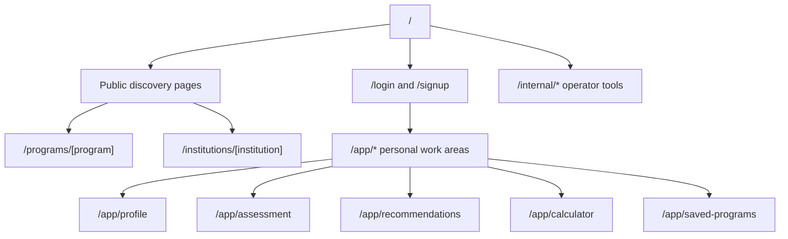
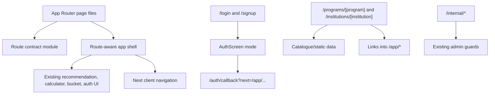
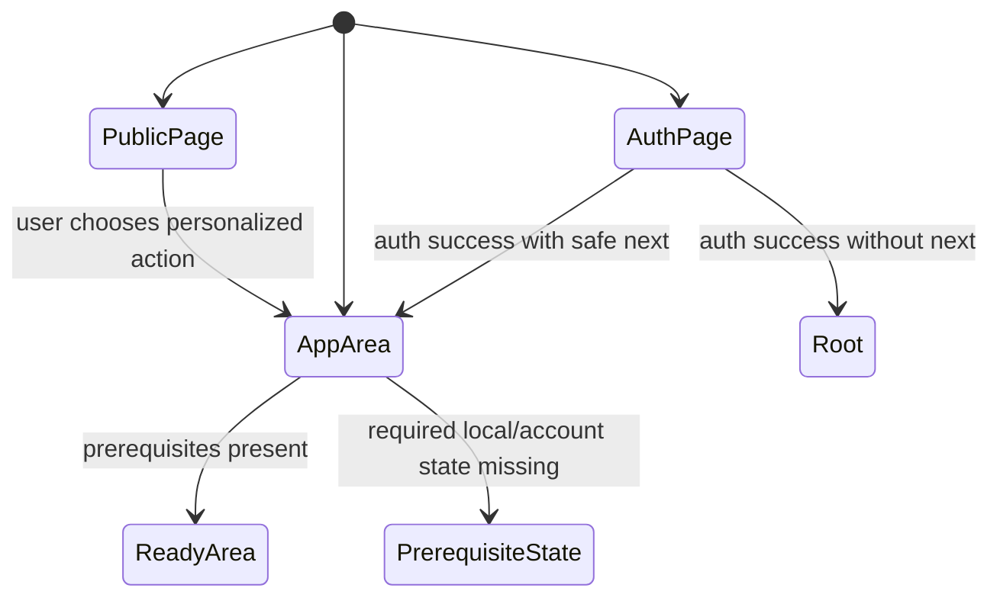

# Durable URL Model - Plan

## Goal Capsule

- **Objective:** Give the website stable URLs for public pages, auth pages, app work areas, and internal tools so users can use browser back/refresh normally and share specific areas with collaborators.
- **Product authority:** The confirmed product rule is "C where the state is durable": meaningful places and saved resources get URLs, while unsaved transient UI state does not become permanent routing yet.
- **Open blockers:** None.
- **Execution profile:** Code change in the Next.js App Router application.
- **Tail ownership:** Implementation must leave the plan traceable through tests that exercise route entry, auth return, and public-page rendering.

---

## Product Contract

### Summary

Create a full URL model that makes the app behave like a mature web app: stable URLs for public discovery pages, authentication, personal app work areas, and internal tools.
The first product contract favors durable places and durable resources over routing every temporary screen state.

### Problem Frame

The current public product experience behaves like a single-page flow where many areas are selected by in-app state.
That makes common browser behavior feel fragile: going back can leave or reset the app, refreshing can lose place, and sharing a specific screen with a co-founder is awkward.

The desired experience is closer to modern web apps where users can navigate directly to meaningful areas, recover their place after refresh, and send a link that communicates product context.
The URL model should improve that without prematurely committing the product to saved recommendation runs, saved calculator result snapshots, or public exposure of personal academic data.

### Key Decisions

- **Durable URLs over a single step machine.** Browser back, refresh, direct entry, and sharing should operate on meaningful app areas instead of only mutating hidden screen state.
- **Separate public, auth, personal app, and internal areas.** Public pages can be shared broadly; personal app pages can rely on the user's own session; internal pages remain operator-only and outside public navigation.
- **Use C-like routing only for durable state.** Stable places and saved resources get URLs now; unsaved form progress and generated one-off result states wait until the app has persistence and privacy rules for them.
- **Keep exact personal result sharing deferred.** Links to a specific recommendations run or calculator result should not exist until the product decides how those snapshots are saved, secured, expired, and shared.

### Actors

- A1. **Prospective student:** Uses public and personal app pages to explore programs, complete assessment flows, calculate admission chances, and save programs.
- A2. **Co-founder or collaborator:** Receives links to inspect specific app areas, public program pages, or flows under discussion.
- A3. **Operator:** Uses protected internal pages that remain separate from public product navigation.

### Requirements

**URL families**

- R1. The product must define stable URL families for public pages, auth pages, personal app work areas, and internal tools.
- R2. Public pages must be suitable for broad sharing and future discovery use, including program and institution pages when those surfaces exist.
- R3. Auth pages must have direct URLs for login and signup and support returning users to the intended in-app destination after authentication.
- R4. Personal app work areas must live under a clearly separated app area and include profile, assessment, recommendations, calculator, and saved programs.
- R5. Internal operator pages must remain outside public navigation and keep their existing protected-route expectation.

**Navigation behavior**

- R6. Browser back and forward must move between meaningful areas instead of unexpectedly exiting or resetting the app.
- R7. Refreshing a durable area URL must restore that area or show a controlled prerequisite state when required user data is missing.
- R8. Directly opening a durable area URL must not require the user to start from the landing page first.
- R9. Links shared with collaborators must communicate the intended area without depending on a hidden local step state.

**State and privacy boundaries**

- R10. Unsaved transient state, such as half-filled forms or in-progress quiz answers, must not receive permanent URLs in this slice.
- R11. Exact personal recommendation or calculator result URLs must be deferred until the app stores those snapshots and defines their privacy model.
- R12. A signed-out visitor must still be able to use public pages and anonymous exploration paths that do not require account-owned data.
- R13. A signed-in user's personal app URLs must not expose private academic inputs or saved programs to another user by link alone.

### Key Flows

- F1. **Direct login link**
  - **Trigger:** A user or collaborator opens a login URL directly.
  - **Actors:** A1, A2
  - **Steps:** The auth page loads, the user authenticates, and the app returns to the requested destination when one was provided.
  - **Covered by:** R3, R8

- F2. **Share an app area with a co-founder**
  - **Trigger:** The user wants to discuss a specific product area.
  - **Actors:** A1, A2
  - **Steps:** The user copies a durable area URL, the collaborator opens it, and the app shows that area or a controlled prerequisite state.
  - **Covered by:** R4, R7, R9, R13

- F3. **Back and refresh during app use**
  - **Trigger:** The user navigates between profile, assessment, recommendations, calculator, and saved programs.
  - **Actors:** A1
  - **Steps:** Browser back returns to the previous meaningful area, forward restores the next area, and refresh keeps the user on the current durable area.
  - **Covered by:** R6, R7, R8

- F4. **Public program discovery**
  - **Trigger:** A user or collaborator opens a public program or institution link.
  - **Actors:** A1, A2
  - **Steps:** The public page loads without requiring account-owned data and can link into the personal app flow when the user wants personalized results.
  - **Covered by:** R2, R12

### Acceptance Examples

- AE1. **Covers R3, R8.** Given a user opens `/login`, when they authenticate successfully with a valid return destination, then they land on that destination rather than always returning to the homepage.
- AE2. **Covers R6, R7.** Given a user moves from recommendations to calculator to saved programs, when they press browser back twice, then they return through calculator and recommendations rather than exiting the app.
- AE3. **Covers R7, R9.** Given a collaborator opens a shared personal app area URL without the required local or account state, when the page loads, then it shows a controlled prerequisite state instead of a blank or misleading screen.
- AE4. **Covers R10, R11.** Given a user is halfway through an unsaved assessment or viewing unsaved calculated results, when they copy the URL, then the link identifies the durable area but does not promise to reproduce the unsaved state.
- AE5. **Covers R2, R12.** Given a visitor opens a public program or institution URL, when no user session exists, then the public content is available and personalized actions can route into the app flow.
- AE6. **Covers R5.** Given a non-operator opens an internal URL, when the route handles the request, then internal data is not exposed.

### Success Criteria

- Browser back, forward, and refresh behave predictably across the main user-facing work areas.
- A user can send a co-founder a link to a meaningful app area without adding manual instructions about which buttons to click from the landing page.
- Public program or institution pages can be linked independently from personal app state.
- The routing model does not create accidental public links to private academic inputs, saved programs, or generated result snapshots.

### Scope Boundaries

- Stable personal work areas are in scope: profile, assessment, recommendations, calculator, and saved programs.
- Public program and institution pages are in scope for the full map, but they may be sequenced after the app-navigation slice if planning chooses a smaller first implementation.
- Permanent URLs for unsaved form progress, in-progress quiz answers, and one-off generated result states are out of scope for this slice.
- Shareable result snapshots are deferred until the product supports saved runs and an explicit privacy/share model.
- Redesigning the visual interface is out of scope except where navigation labels or route-entry states need small copy changes.

### Dependencies / Assumptions

- The existing internal route family remains protected and outside public navigation.
- The existing auth callback route remains part of auth infrastructure, not a user-facing login page.
- Planning may split the work into app-route migration first and public discovery pages second, as long as the full URL model remains coherent.

### Sources / Research

- `src/app/page.tsx` currently defines product screens through an `AppStep` state model and uses dev-only query parameters for step shortcuts.
- `src/components/AuthScreen.tsx` currently models login and signup as modes inside one auth screen.
- `src/app/auth/callback/route.ts` already provides a real route for OAuth callback handling.
- `src/app/internal/data-health/page.tsx` already shows the protected internal route pattern.

---

## Planning Contract

### Product Contract Preservation

Product Contract unchanged.

### Key Technical Decisions

- KTD1. **Centralize route names and next-path validation.** Add a small route contract module that maps durable app areas to URL paths and rejects unsafe return paths before they reach auth, OAuth, or client navigation.
- KTD2. **Extract the current single-page experience into a route-aware client shell.** Keep the existing flow logic in one client component first, then let App Router pages pass the initial durable area instead of duplicating the recommendation and calculator state machines across pages.
- KTD3. **Use App Router pages for durable entry points.** Add real `page.tsx` files for `/login`, `/signup`, and `/app/*` areas so refresh and direct entry have route-level meaning; use client navigation through Next's `Link` and `useRouter` APIs rather than manual history mutation.
- KTD4. **Represent missing prerequisites as controlled states.** Direct entry to recommendations without an assessment, calculator without a selected program, or saved programs without catalogue readiness should render a useful next action instead of silently falling back to the landing page.
- KTD5. **Keep public catalogue pages data-driven and session-free.** Public program and institution pages should read catalogue/static data and link into the app flow without requiring user profile state or exposing saved program data.
- KTD6. **Leave internal route protection untouched.** Existing `/internal/*` pages already express the correct route family and authorization boundary, so implementation should verify they still work rather than refactor them.
- KTD7. **Prefer real pages over rewrites or proxy aliases.** Durable user-visible URLs should map to App Router page files so `usePathname`, browser history, and direct refresh agree without rewrite-induced hydration mismatch risk.

### High-Level Technical Design

The route contract is the boundary between URL semantics and the current client flow.
The app shell may still own transient state such as pending assessment answers, selected calculator program, and unsaved calculator results; route pages only promise durable areas.

### System-Wide Impact

This change moves routing from mostly hidden client state to first-class App Router pages.
It affects browser history behavior, auth redirects, analytics route interpretation, public catalogue discoverability, and tests that currently assume one `src/app/page.tsx` entry point.

### Risks & Dependencies

| Risk | Impact | Mitigation |
|---|---|---|
| Route extraction rewrites too much of `src/app/page.tsx` at once | Recommendation and calculator behavior can regress while solving navigation | Extract a route-aware shell first and keep the existing step handlers recognizable |
| Direct app-route entry lacks prerequisite state | Shared links can render blank or misleading screens | Add explicit prerequisite states and tests for missing assessment, missing catalogue, and signed-out access |
| Auth `next` accepts unsafe paths | Login or OAuth can become an open redirect vector | Reuse one safe relative-path validator for auth UI, OAuth callback, and tests, including encoded and normalized path cases |
| Public pages accidentally depend on personal profile data | Shared pages can break for signed-out visitors or leak user context | Keep public catalogue pages server/static-data driven and test no-auth rendering |

### Sources & Research

- `node_modules/next/dist/docs/01-app/01-getting-started/03-layouts-and-pages.md` confirms file-system routes and `params` as a promise in App Router page components.
- `node_modules/next/dist/docs/01-app/01-getting-started/04-linking-and-navigating.md` confirms `Link`-based client transitions and prefetch behavior.
- `node_modules/next/dist/docs/01-app/03-api-reference/04-functions/use-router.md` recommends `Link` by default and `useRouter` for programmatic client navigation.
- `node_modules/next/dist/docs/01-app/03-api-reference/04-functions/use-pathname.md` notes that pathname reads belong in client components and should be isolated when route state affects UI.
- `docs/plans/2026-06-24-001-feat-google-oauth-sign-in-plan.md` established the existing OAuth callback and safe relative-return path posture.

---

## Implementation Units

### U1. Route Contract and Safe Return Paths

- **Goal:** Create the shared route vocabulary used by pages, auth return destinations, and client navigation.
- **Requirements:** R1, R3, R4, R8, R13; supports F1, F2, AE1
- **Dependencies:** None
- **Files:** `src/lib/routes.ts`, `src/lib/routes.test.ts`
- **Approach:** Define public paths, app-area paths, auth paths, and a safe-next-path helper in one place. The helper should decode and normalize candidate paths before allow-listing app-local relative destinations, then reject absolute URLs, protocol-relative paths, JavaScript-like values, malformed strings, encoded hostile values, traversal-shaped paths, and internal operator paths unless explicitly allowed by the call site.
- **Patterns to follow:** Mirror the safe relative destination posture already present in `src/app/auth/callback/route.ts`; keep the module framework-light so it can be imported by route handlers and client components.
- **Test scenarios:**
  - Happy path: known app-area keys resolve to `/app/profile`, `/app/assessment`, `/app/recommendations`, `/app/calculator`, and `/app/saved-programs`.
  - Happy path: `/app/saved-programs` is accepted as a safe auth return path.
  - Edge case: `/` is accepted as a safe fallback destination.
  - Error path: `https://evil.example`, `//evil.example`, `javascript:alert(1)`, `%2F%2Fevil.example`, traversal-shaped values, empty strings, and malformed values resolve to the default safe path.
  - Error path: `/internal/data-health` is not accepted as a public auth return target by default.
- **Verification:** Route-contract tests prove path generation and return-path validation before auth and app pages consume the module.

### U2. Route-Aware App Shell and App Area Pages

- **Goal:** Replace the hidden-only `AppStep` entry model with real `/app/*` pages that mount the existing user flow at durable areas.
- **Requirements:** R4, R6, R7, R8, R9, R10, R13; covers F2, F3, AE2, AE3, AE4
- **Dependencies:** U1
- **Files:** `src/app/page.tsx`, `src/app/app/page.tsx`, `src/app/app/profile/page.tsx`, `src/app/app/assessment/page.tsx`, `src/app/app/recommendations/page.tsx`, `src/app/app/calculator/page.tsx`, `src/app/app/saved-programs/page.tsx`, `src/components/AppExperience.tsx`, `src/components/AppExperience.test.tsx`, `src/components/NavBar.tsx`, `src/components/NavBar.test.tsx`
- **Approach:** Extract the current `Home` client logic into `AppExperience` and pass an initial durable area from each route page. Replace internal navigation that changes durable areas with `Link` or `useRouter.push` so browser history reflects the area change. Keep unsaved sub-state inside the shell, and add prerequisite states when a route cannot render its primary surface because the user has not completed prior inputs.
- **Execution note:** Start with characterization coverage for current landing-to-degree-picker and catalogue-error behavior before moving `src/app/page.tsx` logic into `AppExperience`.
- **Patterns to follow:** Preserve the catalogue-loading and error handling already tested in `src/app/page.test.tsx`; use App Router page files per the local Next.js docs; keep client routing calls sanitized through U1.
- **Test scenarios:**
  - Happy path: `/app` redirects or routes to the chosen default personal work area without exposing a blank shell.
  - Covers AE2. Given the app shell navigates from recommendations to calculator to saved programs, when navigation handlers run, then durable route pushes target `/app/calculator` and `/app/saved-programs`.
  - Covers AE3. Given `/app/recommendations` loads without an assessment profile, when the shell renders, then it shows a controlled prompt to start or resume the assessment instead of blank output.
  - Covers AE3. Given `/app/calculator` loads without a selected program, when the shell renders, then it shows a controlled program-selection or calculator-start state.
  - Covers AE4. Given a user is midway through unsaved assessment progress, when the route changes, then the durable URL does not encode unfinished answers or generated result state.
  - Edge case: catalogue loading and catalogue error states still block recommendations, calculator, and saved programs with the existing controlled messages.
  - Integration: root `/` still renders the landing experience and existing landing CTAs route into durable app paths.
- **Verification:** App shell and navigation tests cover route entry, missing prerequisites, and retained catalogue error behavior.

### U3. Login, Signup, and Auth Return Routing

- **Goal:** Add direct auth pages and carry safe return destinations through password, signup, and Google OAuth flows.
- **Requirements:** R3, R6, R8, R13; covers F1, AE1
- **Dependencies:** U1, U2
- **Files:** `src/app/login/page.tsx`, `src/app/login/page.test.tsx`, `src/app/signup/page.tsx`, `src/app/signup/page.test.tsx`, `src/app/auth/callback/route.ts`, `src/app/auth/callback/route.test.ts`, `src/components/AuthScreen.tsx`, `src/components/AuthScreen.test.tsx`, `src/context/AuthContext.tsx`, `src/context/AuthContext.test.ts`
- **Approach:** Let auth pages select login or signup mode through props instead of relying on a local toggle as the only entry path. Read a safe `next` destination from the route, pass it to auth actions where needed, and make the callback route use U1 validation. Keep email/password success, signup-confirmation handoff, and Google OAuth under the existing Supabase auth boundary.
- **Patterns to follow:** Extend the current `AuthScreen` feedback and disabled-state patterns; preserve the Google OAuth callback path from `src/app/auth/callback/route.ts`; keep open-redirect tests close to the route handler.
- **Test scenarios:**
  - Covers AE1. Given `/login?next=/app/saved-programs`, when password login succeeds, then the success callback routes to `/app/saved-programs`.
  - Happy path: `/signup` opens `AuthScreen` in signup mode without requiring the user to toggle from login first.
  - Happy path: Google sign-in starts with an app callback URL that includes a safe encoded `next` path when one was provided.
  - Edge case: switching between login and signup modes still clears stale feedback.
  - Error path: unsafe `next` values fall back to `/` in both the auth page and callback route.
  - Error path: unconfigured Supabase auth still disables auth actions and shows the existing unavailable state.
- **Verification:** Auth screen, auth context, and callback route tests prove direct auth entry, return routing, and open-redirect protection.

### U4. Public Program and Institution Pages

- **Goal:** Add shareable public catalogue pages that do not depend on account-owned profile state.
- **Requirements:** R2, R8, R9, R12; covers F4, AE5
- **Dependencies:** U1
- **Files:** `src/app/programs/[programId]/page.tsx`, `src/app/programs/[programId]/page.test.tsx`, `src/app/institutions/[institutionId]/page.tsx`, `src/app/institutions/[institutionId]/page.test.tsx`, `src/lib/publicCataloguePages.ts`, `src/lib/publicCataloguePages.test.ts`
- **Approach:** Build small server-rendered pages from catalogue/static data keyed by existing program and institution IDs. Each page should show enough context to be useful when shared and include links into relevant app areas for personalized assessment, calculator, or saved-program actions.
- **Patterns to follow:** Use Next.js dynamic segment `params` as an awaited promise; reuse catalogue/static serializers rather than duplicating data definitions; render `notFound` for unknown IDs.
- **Test scenarios:**
  - Covers AE5. Given a known program ID, when the program page renders without a user session, then it displays the program name and public calls to action.
  - Covers AE5. Given a known institution ID, when the institution page renders without a user session, then it displays the institution name and public context.
  - Edge case: unknown program or institution IDs call `notFound` rather than rendering a misleading empty page.
  - Integration: public page links target safe app routes such as `/app/calculator` or `/app/assessment`.
  - Privacy path: public pages do not render saved-program state, academic scores, or account-specific profile fields.
- **Verification:** Page and helper tests prove public no-auth rendering, not-found behavior, and links into app routes.

### U5. Regression, Browser, and Documentation Coverage

- **Goal:** Prove the new URL model works at the product-flow level and document the route contract for future changes.
- **Requirements:** R1-R13; covers F1-F4 and AE1-AE6
- **Dependencies:** U1, U2, U3, U4
- **Files:** `tests/e2e/durable-url-model.spec.ts`, `playwright.config.ts`, `README.md`, `docs/plans/2026-07-01-001-feat-durable-url-model-plan.md`
- **Approach:** Add focused browser coverage for direct route entry, back/forward navigation across durable app areas, login `next` behavior where it can be exercised without real credentials, and public page rendering. Update docs with the supported URL families and the rule that unsaved transient state is not encoded in permanent URLs.
- **Patterns to follow:** Keep Playwright tests scoped to visible route behavior; do not require live authenticated credentials for public or anonymous route checks.
- **Test scenarios:**
  - Covers AE2. Given the user navigates through durable app areas, when browser back is used, then the URL and visible area move together.
  - Covers AE3. Given `/app/recommendations` is opened directly without prerequisite state, then a controlled prerequisite state is visible.
  - Covers AE5. Given `/programs/<known-id>` and `/institutions/<known-id>` are opened, then public content renders without login.
  - Covers AE6. Given `/internal/data-health` is opened by an unauthenticated visitor, then operational data is not shown.
  - Documentation: README names the supported URL families and the deferred shareable-result snapshot boundary.
- **Verification:** E2E tests cover the browser-level route promises and docs describe the route map accurately.

---

## Verification Contract

| Gate | Applies to | Done signal |
|---|---|---|
| `npm run test -- src/lib/routes.test.ts src/components/AppExperience.test.tsx src/components/AuthScreen.test.tsx src/context/AuthContext.test.ts src/app/login/page.test.tsx src/app/signup/page.test.tsx src/app/auth/callback/route.test.ts src/lib/publicCataloguePages.test.ts` | U1-U4 | Unit and component coverage for route mapping, app entry, auth return, and public-page helpers passes |
| `npm run test -- src/app/page.test.tsx src/app/programs/[programId]/page.test.tsx src/app/institutions/[institutionId]/page.test.tsx` | U2, U4 | Route page tests pass and preserve existing catalogue-error behavior |
| `npm run test:e2e -- tests/e2e/durable-url-model.spec.ts` | U5 | Browser-level direct-entry, back/forward, public-page, and internal-protection checks pass |
| `npm run typecheck` | All units | TypeScript accepts the new route pages, shared route contract, and extracted app shell |
| `npm run lint` | All units | Route and component changes satisfy repo lint rules |
| `npm run build` | All units | Next.js builds the new App Router page structure |

Because this touches user-facing routing and auth return behavior, run `npm run guard:pre-pr` before pushing or opening a PR.

---

## Definition of Done

- All U1-U5 implementation units are complete or explicitly deferred in a follow-up plan before shipping.
- The Product Contract's R1-R13 requirements are each covered by tests, e2e checks, or an explicit non-code verification note.
- Browser back, forward, refresh, and direct entry work for the stable app routes in the first shipped slice.
- `/login`, `/signup`, and OAuth callback return behavior only accept safe local destinations.
- Public program and institution pages render without a user session and do not expose account-owned state.
- Existing `/internal/*` protected-route behavior remains fail-closed.
- Abandoned extraction attempts, duplicate route mappings, and temporary compatibility shims are removed before the PR is marked ready.
