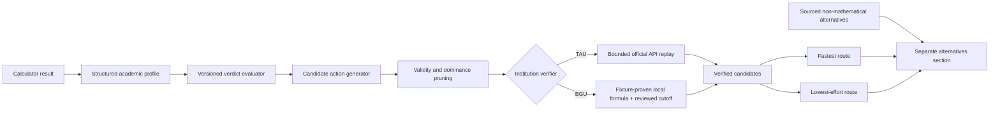

# Verified Admission Route Simulator - Plan

## Goal Capsule

- **Objective:** Turn a negative admissions verdict into one or two mathematically verified routes representing the fastest and lowest-effort objectives.
- **Product authority:** Official institution rules and calculators remain authoritative; Toar explains and simulates their effect without claiming admission guarantees.
- **MVP boundary:** TAU proves the official-API path and BGU proves the locally evaluated formula path.
- **Expansion boundary:** Add institutions only when Toar can deterministically recalculate the relevant admission decision from structured user inputs and reviewed rules.
- **Open blockers:** BGU Computer Science cutoff/gate evidence must pass U6, and the initial standard-estimate seed needs product/editorial approval before route ranking is exposed.

---

## Product Contract

### Summary

After an applicant receives a below-threshold verdict, Toar will calculate the quickest and lowest-effort verified routes to the target program. The MVP covers TAU and BGU, then expands through a capability-gated institution rollout.

### Problem Frame

A negative verdict currently tells applicants that they are short, but not what to do next. Applicants repeatedly compare psychometric retakes against Bagrut improvements by hand and struggle to understand which option is faster or requires less work.

A raw gap is not enough because Bagrut improvements have different leverage. Raising an existing grade, expanding a subject from two to five units, or adding a five-unit subject can change the weighted average differently, and institutions apply those changes through different formulas and gates.

### Key Decisions

- **Two answers instead of one blended ranking.** “Fastest” and “lowest effort” are separate routes because the route that takes the fewest calendar weeks may demand substantially more work.
- **Verified recommendations only.** A route may be ranked only when Toar can apply every proposed change to the applicant record and reproduce an eligible institution decision.
- **Transparent standard estimates.** The MVP uses visible, product-owned time and effort assumptions. Applicants cannot adjust those assumptions initially.
- **Structured Bagrut record as a prerequisite.** Bagrut route simulation requires subjects, units, and grades rather than only a weighted average.
- **API and formula pilots.** TAU validates bounded optimization against an official calculator API; BGU validates the same product behavior against a locally evaluated formula.
- **Non-mathematical alternatives stay separate.** Exceptions committees, preparatory programs, transfer paths, and special tracks may be shown as sourced alternatives but never presented as a verified fastest or lowest-effort route.

### Actors

- A1. **Applicant:** Supplies academic inputs, chooses a target program, and compares improvement routes.
- A2. **Admissions evaluation system:** Produces the current verdict and verifies each simulated profile against reviewed institution rules.
- A3. **Content reviewer:** Maintains the standard effort estimates and sourced non-mathematical alternatives.

### Requirements

**Applicant inputs and eligibility**

- R1. The simulator must preserve the verdict's target institution, program, and admissions cycle, then recalculate the baseline and routes under the current reviewed rule version; the opening verdict remains historical context only.
- R2. The simulator must require all academic inputs needed to verify candidate routes, including a subject-level Bagrut record when Bagrut actions are considered.
- R3. An applicant who has only a Bagrut average must be invited to complete the existing detailed Bagrut flow before Bagrut routes are generated.
- R4. Signed-in applicants may reuse and persist their structured academic profile, while anonymous applicants may complete a session-scoped simulation without saving it.

**Verified route generation**

- R5. Candidate actions must include psychometric improvement, improving an existing Bagrut grade, expanding an eligible subject’s units, and adding an eligible five-unit subject when institution rules permit them.
- R6. A route may contain one action or a mathematically necessary combination of actions.
- R7. Every recommended route must be replayed through the authoritative evaluation path and end in an eligible verdict with all minimum gates satisfied.
- R8. The simulator must reject impossible or invalid academic changes, including scores outside valid ranges, invalid unit transitions, duplicated subjects, and routes that still fail a minimum requirement.
- R9. The simulator must produce a distinct fastest route and lowest-effort route; when one route wins both dimensions, the interface must say so rather than fabricate a second route.
- R10. Each route must show the proposed changes, before-and-after values, resulting admission score or status, margin above the reviewed threshold, estimated duration, estimated effort, and the assumptions used.
- R11. Rankings must be deterministic for the same profile, target, rule version, and estimate version.

**Trust and uncertainty**

- R12. The interface must distinguish an institution-verified outcome from a Toar formula-verified outcome and link to the supporting official source.
- R13. If the authoritative calculator is unavailable or returns an unrecognized result, Toar must withhold API-dependent recommendations rather than silently substitute an estimate.
- R14. Sourced exceptions, committees, preparatory programs, transfer routes, and similar alternatives must appear in a separate informational section with no speed or effort guarantee.
- R15. The simulator must explain that eligibility simulation is guidance and does not constitute an admission offer.

**Phased coverage**

- R16. The MVP must support representative below-threshold TAU and BGU programs, including at least one case where psychometric improvement wins and one where a Bagrut action wins.
- R17. Post-MVP expansion must be capability-gated by institution adapter coverage, structured rules, replayable verification, official-source evidence, and regression fixtures.
- R18. Unsupported institutions must retain the current verdict and next-action experience without exposing an unverified route ranking.

### Key Flows

- F1. Below-threshold applicant requests routes
  - **Trigger:** A verdict for a supported target is below the reviewed admission bar.
  - **Actors:** A1, A2
  - **Steps:** The applicant opens route simulation; Toar checks required inputs; the applicant completes missing subject-level Bagrut data; Toar generates and verifies candidates; the applicant receives fastest and lowest-effort routes.
  - **Outcome:** The applicant can compare the actionable, reproducible winner or winners for both objectives.
  - **Covered by:** R1-R13
- F2. Official API cannot verify a TAU route
  - **Trigger:** TAU’s calculator is unavailable or produces an unrecognized response during route verification.
  - **Actors:** A1, A2
  - **Steps:** Toar stops API-backed ranking, explains that verification is temporarily unavailable, preserves the original verdict, and offers sourced non-mathematical alternatives where available.
  - **Outcome:** No local approximation is presented as an official result.
  - **Covered by:** R12-R15
- F3. Add an institution after the MVP
  - **Trigger:** A new institution appears ready for route simulation.
  - **Actors:** A2, A3
  - **Steps:** The team supplies structured action constraints, authoritative evaluation, official evidence, and replay fixtures; capability checks pass; route simulation is enabled for that institution.
  - **Outcome:** Coverage expands without weakening verification standards.
  - **Covered by:** R17-R18

### Acceptance Examples

- AE1. **Covers R5-R10.** Given a BGU applicant who is ten admission-index points short, when a psychometric increase is the shortest standard-duration action and a Bagrut subject upgrade has lower standard effort, then the simulator shows those as separate winners and verifies both against the BGU formula.
- AE2. **Covers R3, R5, R7.** Given an applicant with only a weighted Bagrut average, when they request Bagrut routes, then Toar asks for subjects, units, and grades before recommending any Bagrut change.
- AE3. **Covers R9.** Given one verified route that is both fastest and lowest effort, when results render, then Toar labels it as the winner on both dimensions and does not invent a weaker alternative.
- AE4. **Covers R8.** Given a proposed history expansion from two to five units that would still leave an unmet mathematics gate, when candidates are verified, then that route is not recommended as sufficient.
- AE5. **Covers R12-R13.** Given a TAU calculator outage, when the applicant requests routes, then Toar reports temporary verification unavailability and does not rank locally estimated TAU routes.
- AE6. **Covers R14.** Given a sourced exceptions committee path, when verified routes are shown, then the committee appears under informational alternatives and carries no fastest or lowest-effort badge.

### Success Criteria

- Every displayed winner can be replayed from its before-and-after profile to an eligible verdict under the recorded rule version.
- Product QA fixtures demonstrate both ranking dimensions, combined-action routes, invalid actions, minimum gates, and unavailable-authority behavior for TAU and BGU.
- Applicants can understand why each winner won without knowing an institution’s formula.
- Adding a post-MVP institution does not require weakening the verified-route contract.

### Scope Boundaries

**Deferred for later**

- Applicant-adjustable time and effort assumptions.
- Personalized estimates based on prior grades, study availability, cost, or exam history.
- Route saving, reminders, tutoring-provider recommendations, and course purchasing.
- Probabilistic “chance of improvement” forecasts.

**Outside the ranking contract**

- Guaranteeing admission or predicting discretionary committee decisions.
- Ranking preparatory, transfer, exception, or special-population routes without a deterministic institution rule.
- Recommending actions that cannot be represented and replayed mathematically.

### Dependencies and Assumptions

- The current verdict engine remains the single eligibility authority for the product.
- The existing detailed Bagrut flow can be extended to return and persist its structured record, not only its weighted average.
- Reviewed threshold and formula changes come from the weekly admissions update pipeline.
- Standard effort estimates are product guidance and require visible versioning and review ownership.

### Sources and Research

- `src/components/BagrutCalculatorWizard.tsx` already collects subject, unit, and grade inputs but currently returns only a weighted average.
- `src/utils/sekhemCalculators.ts` contains local formula and delta code that is a starting point for the BGU pilot, but it is not sufficient evidence for the selected program's full verdict.
- `scripts/admissions-calculators/2_tau.js` demonstrates the official TAU calculator request path.
- `scripts/admissions-calculators/4_bgu.js` demonstrates the locally evaluated BGU weighted formula path.
- TAU's official calculation guide documents subject bonuses, optimized Bagrut-average rules, and yearly rule variability: https://go.tau.ac.il/he/ba/how-to-calculate
- BGU's official admissions guide documents multiple Sekhem families and program-specific gates: https://www.bgu.ac.il/welcome/contents/pre-registration/summative-scores-calculation/

---

## Planning Contract

### Context and Current-State Findings

- `BagrutCalculatorWizard` already captures subjects, units, and grades, but collapses them into a naive weighted average. The structured record must become the durable source input; the current average must not be treated as sufficient for optimization.
- `src/app/api/admissions/evaluate/route.ts` and `src/server/admissions/evaluator.ts` are the existing verdict boundary. Route verification must call the same version-aware evaluation service rather than reproduce eligibility logic in the UI or optimizer.
- TAU has an official GraphQL-backed exact adapter, so candidate generation can happen locally but every displayed finalist must be replayed against the official response. An outage suppresses winners.
- The BGU adapter currently reproduces only a score and explicitly lacks cutoff/status evidence. The BGU pilot therefore starts with one formula family only after official-calculator golden fixtures and reviewed cutoff evidence prove the full verdict.
- The existing TAU and BGU arithmetic is not sufficiently faithful for subject-level advice. TAU applies subject-specific bonuses and an optimized Bagrut average; BGU uses multiple Sekhem families and program gates. Formula fidelity is a release prerequisite, not follow-up polish.

### Key Technical Decisions

1. **Create one versioned evaluation boundary.** Every baseline verdict and simulated profile is evaluated by the same server-side service with explicit institution, program, cycle, rule version, and input hash. This prevents a recommendation from disagreeing with the calculator or later alert reevaluation.
2. **Separate candidate generation from candidate verification.** A pure optimizer generates and prunes plausible academic changes; institution adapters verify finalists. TAU uses bounded official API verification. BGU uses a locally executable, fixture-proven formula and reviewed cutoff.
3. **Model academic actions explicitly.** Psychometric changes, grade improvements, unit expansions, added subjects, and combinations are typed domain actions with validation constraints. The optimizer does not mutate anonymous objects or infer impossible transitions.
4. **Rank verified outcomes with versioned estimates.** Duration and effort are transparent data records with stable tie-breakers. They are not mixed into one opaque score and are not user-adjustable in the MVP.
5. **Persist complete profiles only for signed-in users.** Anonymous calculations remain session-scoped. Saved subject records are private academic data and are accessed only through authenticated server routes with ownership checks and database policies.
6. **Gate coverage by capability, not institution label.** TAU and BGU support is enabled per program/formula family only when required inputs, evaluator fidelity, source evidence, and regression fixtures exist. Other programs keep the current result experience.
7. **Own the shared evaluator capability model here.** This plan defines program-level input, score, gate, cutoff, and replay capabilities. The weekly plan contributes source-publication capability, and alerting consumes their composed support decision instead of defining a third registry.

### High-Level Technical Design

This diagram is a boundary sketch, not an implementation prescription. The invariant is that ranking receives only candidates that the target program's authoritative evaluator has marked eligible under the recorded rule version.

### Shared Result Experience Contract

| Result state                                   | Primary action                       | Secondary action                     | Recovery/context                                                                    |
| ---------------------------------------------- | ------------------------------------ | ------------------------------------ | ----------------------------------------------------------------------------------- |
| Supported, below threshold, profile incomplete | Complete academic profile            | Existing next action                 | Preserve target and verdict; return focus to the simulator trigger after completion |
| Supported, below threshold, profile complete   | Find the fastest/lowest-effort route | Monitor reviewed eligibility changes | Keep the existing next action and sourced alternatives below these actions          |
| Verification loading                           | Wait/cancel                          | None                                 | Announce progress through a polite live region and retain the verdict               |
| Authority unavailable                          | Retry verification                   | Existing next action                 | Explain that no route or alert can be verified yet; do not imply “no route exists”  |
| No mathematically verified route               | Review sourced alternatives          | Existing next action                 | Explain the supported search boundary and retain assumptions/provenance             |
| Unsupported target                             | Existing next action                 | Monitoring-unavailable explanation   | Show neither verified-route controls nor an activatable bell                        |

Route simulation is the primary response to the applicant's current shortfall. Monitoring is secondary and answers a different question: whether reviewed institution rules later change. Dual route cards stack in reading order on narrow layouts, all asynchronous state changes are announced, trigger/wizard/dialog focus is restored predictably, and interactive controls meet touch-target and pressed/state-label requirements in RTL.

### Evaluation Version Semantics

- Formula-backed targets persist immutable executable rule snapshots plus the evaluator/interpreter version digest, so later code changes cannot silently alter historical replay.
- API-backed TAU cannot be asked to execute a historical version. Each accepted response therefore becomes an immutable evaluation snapshot keyed by normalized input digest, target, cycle, reviewed rule version, rule fingerprint, evaluation digest, score/cutoff/gates, and retrieval time.
- The TAU rule fingerprint contains only rule state: target/cycle mapping, cutoff, gates, effective metadata, and reviewed source-content identity. It excludes applicant inputs, applicant scores, retrieval time, and transport metadata. A separate evaluation digest binds the profile-input digest to its returned score/status.
- A live TAU result is accepted for the active version only when its program mapping and returned cutoff/source fingerprint match the reviewed snapshot contract. Drift makes authority unavailable until the weekly review publishes a new version.
- Route simulation always uses the current reviewed version. Alerting later compares the stored ineligible baseline snapshot with a new evaluation under the published version while holding the profile digest constant; it does not call TAU to recreate the old result.

### Standard Estimate and Search Contract

The estimate seed is a reviewed product data artifact, not hard-coded optimizer logic. Before U4 can expose winners, it must contain every supported action/subtype, change-magnitude band, standard duration in weeks, effort points on a documented 1–5 scale, eligibility constraints, effective date, evidence/editorial rationale, and owner. Combined routes sum effort; duration sums by default and may use `max` only where the seed explicitly marks actions as safely parallel. Stable tie-breaks are: primary objective, then the other objective, then fewer actions, larger eligibility margin, and lexical action ID. Changing any value creates a new estimate version and golden-fixture review.

The MVP searches at most two academic actions per route and at most one newly added subject. It derives minimum score/grade deltas with monotonic search where proven, caps local candidates at 2,000, Pareto finalists at 12, TAU official replays at 8, local search at 1.5 seconds, and the end-to-end request at 10 seconds. Benchmarks may lower these caps before launch but cannot raise them without review. Exhausting a cap returns `search_incomplete`; the UI says no complete ranking was proven and must not present that state as “no route exists.”

### Suite Execution Order

1. U1–U3 establish structured profiles, immutable evaluation semantics, and the shared evaluator capability model.
2. U4 establishes the reviewed estimate seed, bounded optimizer, and Pareto-complete search before any external finalist verifier is exercised.
3. U5 proves the TAU vertical slice. U6 is the blocking BGU evidence gate: BGU Computer Science must have authoritative formula/gate/cutoff sources plus matching eligible and below-threshold fixtures.
4. U7/U8 expose the API and result experience only after the corresponding target capability passes. Weekly-plan manifest/release work may proceed in parallel, but BGU candidate publication stays disabled until U6 passes.
5. Alert-plan persistence/auth UI may proceed after U1–U3; its change processor cannot enable until weekly publication exists, and BGU alerts cannot enable until U6 passes.
6. If U6 fails, TAU may ship as an explicitly named pilot, but none of the three two-institution MVPs is complete and the contracts are not silently redefined.

### System-Wide Impact

- **Profile data:** The profile contract, serializers, migration path, and database schema gain subject-level Bagrut data and a reproducibility hash/version. Existing average-only profiles remain readable but are incomplete for Bagrut optimization.
- **Admissions evaluation:** Evaluator results gain explicit rule/evaluator versions and a replay-safe normalized input. Existing exact, estimated, manual-gate, and degraded states remain visible.
- **External calls:** TAU verification sends only calculator-required academic fields over encrypted transport, never user identifiers or email. Cache keys use a non-reversible keyed digest and cached values omit raw profiles. Requests need bounds, timeouts, an upstream circuit breaker, and no live-network dependency in automated tests.
- **UI:** The calculator result gains a supported-program CTA, missing-input flow, loading/error states, two route cards, assumptions, and a separate sourced-alternatives area. RTL, keyboard navigation, and screen-reader labels are part of the flow.
- **Privacy:** Academic subjects and grades never enter analytics payloads, Slack, email, or application logs. Analytics records only coarse action type, support state, and completion events.
- **Downstream coupling:** Weekly publication owns rule versions, and alerts consume the same evaluator. This plan must land its versioned boundary before alert reevaluation is enabled.

### Rollout Strategy

1. Ship the structured profile and versioned evaluator behind internal capability flags with no route UI.
2. Prove TAU Computer Science using mocked contract tests plus a controlled live official-calculator check; this is a TAU vertical-slice milestone, not the complete MVP.
3. Prove BGU Computer Science's quantitative/Sekhem family only after score, gates, and cutoff fixtures match the official calculator. Do not enable all BGU programs from university-level weights. Completing this establishes the two-institution MVP.
4. Enable the two route cards for the verified TAU and BGU target set, measure completion and withheld-verification rates, and retain the existing next action for unsupported targets.
5. Add institutions/program families through the capability registry after each adapter passes the same evidence and regression contract.

### Risks and Mitigations

- **Incorrectly optimistic advice:** Require full replay with every minimum gate and a positive margin; keep unsupported or degraded results out of ranking.
- **Combinatorial candidate growth:** Apply institution-valid bounds, monotonic search where proven, dominance pruning, candidate caps, and finalist-only external verification.
- **Official API instability:** Use timeouts and short-lived replay caching; display verification unavailable instead of falling back to an estimate.
- **Misleading effort assumptions:** Version and display assumptions, identify their editorial owner, and avoid personalized claims.
- **Sensitive profile exposure:** Enforce authenticated ownership in route handlers and database policies, minimize logs, and test cross-user denial.
- **Rule drift:** Pin every result to a reviewed rule version and make stale versions ineligible for new recommendations.
- **External-calculator disclosure:** Document for applicants that required academic inputs are sent to TAU for verification, and record reviewed assumptions about TAU retention/secondary use before launch.

### Resolved During Planning

- The pilot targets are TAU Computer Science and BGU Computer Science using its documented quantitative/Sekhem path; each remains gated until its official mapping and fixtures pass.
- BGU means one explicitly proven formula family in the MVP, not university-wide support.
- TAU and BGU formulas will be corrected against official behavior before route recommendations are enabled.
- Fastest and lowest effort remain separate objective functions; users cannot tune estimates initially.
- Exceptions, committees, preparatory programs, and transfer paths are sourced informational alternatives only.

## Implementation Units

### U1. Persist a replayable structured academic profile

- **Requirements:** R2-R4, R8; F1; AE2
- **Goal:** Preserve the subject-level inputs required to reproduce Bagrut calculations without breaking existing average-only profiles.
- **Files:** `src/db/schema.ts`, a new migration under `src/db/migrations/`, `src/server/user/profileSchema.ts`, `src/server/user/profile.ts`, `src/server/user/serializers.ts`, `src/server/user/migration.ts`, `src/types/index.ts`, `src/app/api/profile/route.ts`, and focused profile tests.
- **Approach:** Add a versioned structured Bagrut record with normalized subject identifiers, units, grades, sector/context fields, and a deterministic profile hash. Keep the current weighted average as derived/backward-compatible data. Extend runtime-role grants, private-table policies, and authenticated owner checks. Mark migrated average-only records as incomplete rather than inventing subject data.
- **Test scenarios:** Round-trip a complete record; read a legacy average-only profile; reject invalid grade/unit ranges and duplicate subjects; deny one user access to another user's record; confirm logs and serialized errors omit grades.
- **Verification:** A saved profile can be replayed into the same normalized hash, legacy users can still calculate, and incomplete profiles are explicitly identified.

### U2. Replace naive Bagrut arithmetic with versioned institution policies

- **Requirements:** R5-R8, R11-R12, R16-R18; AE1, AE4
- **Goal:** Establish trustworthy TAU and BGU academic-score calculations before optimization begins.
- **Files:** New pure domain modules under `src/server/admissions/`, `src/components/BagrutCalculatorWizard.tsx`, `src/utils/sekhemCalculators.ts`, institution fixtures under `src/server/admissions/__fixtures__/`, and unit/contract tests.
- **Approach:** Extract Bagrut normalization from the wizard. Encode TAU subject bonuses, optimized-average constraints, and applicable minimum gates as reviewed versioned data/policies. Select one BGU formula family and encode only its documented score and gates. Use official-calculator examples as golden fixtures; retain a generic estimate solely where current product behavior requires it, never for verified routes.
- **Test scenarios:** TAU subject bonus and optimal-subject omission; required-unit floor; exact-sciences gate/bonus where applicable; selected BGU formula-family examples; invalid subject transitions; fixture mismatch fails capability enablement.
- **Verification:** Golden fixtures match reviewed official outputs within an explicitly documented precision rule, and no TAU/BGU route capability is active on the old university-weight shortcut.

### U3. Make admissions evaluation versioned and replayable

- **Requirements:** R1, R7, R11-R13, R17-R18; F1-F3; AE5
- **Goal:** Give calculator, optimizer, and alerts one eligibility authority.
- **Files:** `src/server/admissions/evaluator.ts`, `src/app/api/admissions/evaluate/route.ts`, `src/types/admissionsEvaluation.ts`, `src/server/ingestion/admissionsSourceRegistry.ts`, and evaluator tests.
- **Approach:** Normalize evaluator input/output around target, cycle, rule/evaluator version, source class, gates, score, cutoff, margin, reproducibility hash, rule fingerprint, evaluation digest, and immutable evaluation snapshot. Formula targets retain executable historical snapshots and interpreter digests; TAU snapshots retain the reviewed rule identity and applicant-specific result separately without claiming historical API replay. Add a capability lookup per program/formula family. Reject stale, drifted, or unknown versions and preserve degraded/manual states for non-optimizer consumers.
- **Test scenarios:** Replay identical formula input deterministically across a pinned interpreter; prove two TAU applicants share a rule fingerprint but have different evaluation digests; cutoff/mapping change alters the rule fingerprint; compare a stored TAU baseline snapshot with a current reviewed response; reject drift; distinguish all evaluator states; prove calculator and optimizer share the verdict.
- **Verification:** The same normalized input and version produce the same result across direct calculation and route replay, with explicit source provenance.

### U4. Implement bounded candidate generation and dual ranking

- **Requirements:** R5-R11; F1; AE1, AE3-AE4
- **Goal:** Find the smallest verified psychometric and Bagrut changes without unbounded search or opaque scoring.
- **Files:** New optimizer/action/estimate modules under `src/server/admissions/routes/`, versioned estimate data, and optimizer property/unit tests.
- **Approach:** Populate and review the estimate seed before ranking. Generate institution-valid single actions first, then use admissible duration/effort lower bounds to explore every supported two-action combination that could beat either current winner. Validate transitions before evaluation, prune only candidates proven dominated on both dimensions, and apply the documented tie-break order. Enforce the numerical candidate/finalist/call/time budgets and distinguish proven no-route from `search_incomplete`.
- **Test scenarios:** Psychometric wins fastest while Bagrut wins effort; one route wins both; a combination beats an already-successful single action; combined effort/duration aggregation; every tie-break stage; estimate-version change; a tempting action fails a gate; proven no route; each budget exhausts into `search_incomplete`; repeated input is deterministic.
- **Verification:** Every returned winner has an eligible replay result, no invalid action reaches ranking, and performance stays within an agreed request budget on worst-case fixtures.

### U5. Add the TAU official-finalist verifier

- **Requirements:** R7, R12-R13, R16; F2; AE5
- **Goal:** Use local generation for speed while requiring official TAU verification for displayed winners.
- **Files:** `src/server/ingestion/adapters/tauAdmissions.ts`, TAU route-verification adapter modules, cache/timeout support, and contract tests with captured fixtures.
- **Approach:** Verify only a bounded finalist set against TAU's official calculator. Transmit the minimum academic fields without user identity, use a non-reversible keyed cache digest, preserve official response provenance, and fail closed on timeout, parse drift, inconsistent response, rate limit, or open circuit breaker. Keep live checks outside deterministic CI.
- **Test scenarios:** Official eligible response; below-threshold finalist; outbound payload contains no user identity; timeout; malformed response; inconsistent cutoff; duplicate finalist cache hit without raw-profile cache data; open circuit breaker; all finalists unavailable.
- **Verification:** No TAU winner is rendered without a successful official replay, and outage behavior preserves the baseline verdict while withholding ranking.

### U6. Prove and enable one BGU formula family

- **Requirements:** R7, R12, R16-R18; F3; AE1
- **Goal:** Demonstrate the local-formula path without overstating BGU coverage.
- **Files:** `src/server/ingestion/adapters/bguAdmissions.ts`, BGU policy/cutoff data, capability registry entries, fixture tooling, and BGU contract tests.
- **Approach:** Use BGU Computer Science and its documented quantitative/Sekhem path as the selected pilot. Compare local scores and verdicts against reviewed official calculator fixtures. If status/cutoff evidence cannot be made reproducible, keep BGU disabled and record the evidence gap rather than substituting the score-only adapter.
- **Test scenarios:** Matching eligible and below-threshold fixtures; gate failure; cutoff version change; score drift outside tolerance; unsupported BGU program remains disabled.
- **Verification:** Capability is enabled only when score, gates, cutoff, and source evidence jointly prove the verdict.

### U7. Expose route simulation through a bounded server API

- **Requirements:** R1-R4, R7-R13, R18; F1-F2
- **Goal:** Provide a typed, privacy-preserving interface for route requests.
- **Files:** A route handler under `src/app/api/admissions/`, shared request/result types, client hook/service, mandatory abuse-control support, and API tests.
- **Approach:** Accept target and either session profile input or an authenticated saved-profile reference. Validate size and values; enforce per-IP plus session/user quotas, concurrent-request and finalist caps, and `Retry-After` responses; resolve the current reviewed rule version server-side; call the optimizer; and return structured outcomes. Never trust a client-supplied verdict or rule version as authority.
- **Test scenarios:** Anonymous complete request; signed-in saved profile; incomplete profile; tampered version; unsupported target; authority outage; oversized/invalid payload; cross-user profile reference; quota exhausted; concurrent cap; circuit breaker; `Retry-After` response.
- **Verification:** The API cannot be used to read another user's academic data or to rank against unreviewed/stale rules.

### U8. Build the result and profile-completion experience

- **Requirements:** R3-R4, R9-R10, R12-R15, R18; F1-F2; AE2-AE3, AE5-AE6
- **Goal:** Turn the verified output into a clear next step without implying guaranteed admission.
- **Files:** `src/components/CalculatorResults.tsx`, `src/components/BagrutCalculatorWizard.tsx`, `src/components/AcademicProfileForm.tsx`, supporting UI components/content, RTL/accessibility tests, and `e2e/admissions-calculator.spec.ts`.
- **Approach:** Show the simulator only for below-threshold supported targets. Guide missing structured inputs, then render separate fastest and lowest-effort cards with before/after changes, margin, provenance, estimates, and assumptions. Collapse to one card when it wins both. Define recovery copy and actions for loading, incomplete profile, authority unavailable, no verified route, and unsupported target; always retain the baseline verdict. Put sourced non-mathematical alternatives in a visually separate section and preserve current next actions for unsupported targets.
- **Test scenarios:** Complete anonymous flow; signed-in saved flow; missing Bagrut detail; same winner in both dimensions; API unavailable; no mathematically verified route; keyboard and screen-reader traversal; mobile RTL layout.
- **Verification:** Browser tests prove the complete TAU and BGU pilot flows and confirm no unsupported target receives a verified badge.

### U9. Add capability rollout, observability, and operator documentation

- **Requirements:** R11-R18; F3
- **Goal:** Make future institution expansion measurable and fail-closed.
- **Files:** Capability registry/reporting, internal data-health integration, analytics event definitions, operational docs, and regression tests.
- **Approach:** Own the shared evaluator capability registry and report route support by program for structured inputs, score, gates, cutoff, fixtures, and authoritative replay mode. Compose it with source-publication capability owned by the weekly plan. Track generated/verified/withheld/no-route outcomes without academic values. Document adapter onboarding and live proof.
- **Test scenarios:** Missing capability blocks exposure; stale rule version withdraws support; health report identifies the exact missing capability; analytics payload contains no grades or scores.
- **Verification:** An operator can explain why any target is enabled or disabled, and adding an institution requires evidence rather than a UI allowlist edit.

## Verification Contract

### Automated Verification

- Unit/property tests cover profile normalization, institution Bagrut policies, action validation, search bounds, deterministic ranking, and privacy-safe serialization.
- Contract tests replay captured TAU and BGU official-calculator fixtures without network access. A separate manual/live proof checks current external behavior before enabling or updating a capability.
- API integration tests cover anonymous and authenticated inputs, ownership denial, invalid/stale rule versions, unsupported targets, and upstream failures.
- Playwright covers the landing calculator through below-threshold result, structured-profile completion, dual-route display, unavailable verification, and unsupported fallback in mobile and desktop RTL layouts.
- Repository quality checks include formatting, linting, type checking, migration checks, catalogue seed dry-run, targeted admissions regressions, and the project pre-PR guard.

### Production Verification

- Confirm the migration, runtime-role grants, private-table policies, and representative owner/foreign-user queries in the production Supabase project.
- Confirm the Vercel preview uses the intended project and environment, then exercise the affected calculator flow and `/internal/data-health`.
- Run controlled live TAU and BGU proofs from the approved operational path and compare them with committed golden fixtures before capability activation.
- Verify production logs and analytics contain route status metadata but no subject grades or full academic profile.

### Rollback and Failure Expectations

- Capability flags can disable one program/formula family without disabling the baseline calculator.
- A rule or fixture mismatch withdraws route ranking and leaves the existing verdict/next action intact.
- Structured profile migrations are additive; rollback must not discard user academic records.

## Definition of Done

- R1-R18 and AE1-AE6 are traced to passing unit, integration, contract, or browser scenarios.
- The selected TAU target shows only officially replayed winners, including fail-closed outage behavior.
- A TAU-only vertical slice may ship for validation, but this plan and the two-institution MVP remain incomplete until the selected BGU target has proven score, gates, cutoff, and verdict fixtures.
- Signed-in users can save a structured private profile, and anonymous users can simulate without persistence.
- Fastest and lowest-effort routes are deterministic, transparent, and visually separate; unsupported alternatives are not ranked.
- The capability registry, data-health output, operator docs, and privacy-safe observability are complete.
- Database, Vercel preview, browser, and pre-PR production-safety checks have concrete evidence in the implementation PR.
