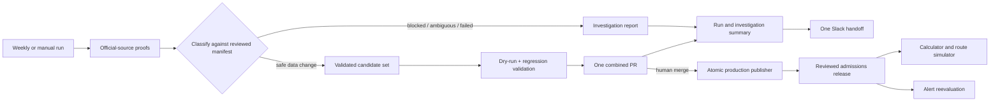

# Weekly Reviewed Admissions Updates - Plan

## Goal Capsule

- **Objective:** Check official admissions sources every week and convert safe, explainable changes into one human-reviewed PR before they affect applicants.
- **Product authority:** Official institution sources provide evidence; the merged repository state is Toar’s reviewed canonical admissions configuration.
- **MVP boundary:** Exercise the full workflow for TAU’s API-backed path and BGU’s formula-backed path.
- **Expansion boundary:** Roll out by machine-verifiable source capability until all supported institutions are checked weekly, while preserving a visible manual-investigation lane for blocked sources.
- **Open blockers:** BGU Computer Science publishable cutoff/gate evidence depends on route-plan U6; GitHub App and admissions-review Slack credentials are production provisioning gates.

---

## Product Contract

### Summary

Toar will extend its existing weekly freshness checks into a reviewed update pipeline: detect official-source changes, generate one combined admissions PR, notify reviewers in Slack, and publish only after merge. TAU and BGU form the MVP before institution-wide rollout.

### Problem Frame

Most institution records are connected to official sources, but the product currently depends on static reviewed data and operational freshness evidence. Admission bars can move during a registration cycle, and formula or requirement changes can silently make verdicts stale.

The repository already runs scheduled freshness checks and records changed, blocked, failed, and fresh states. The missing product boundary is a complete path from a trustworthy detected change to an inspectable code review and then to canonical published data.

### Key Decisions

- **One combined PR per weekly run.** Reviewers get one coherent admissions update rather than a stream of unrelated automated branches.
- **PR merge is the sole human approval boundary.** Detection never mutates canonical applicant-facing data directly; successful post-merge publication and production verification form the applicant-facing publication boundary.
- **Partial success is allowed.** Safe changes enter the PR; ambiguous, failed, or blocked sources are excluded and reported for investigation.
- **Slack is the human handoff.** The review message links directly to the PR and summarizes included changes and excluded failures.
- **Formula and API pilots.** TAU validates source and threshold changes around an external calculator; BGU validates source, threshold, and data-driven formula changes owned by Toar.
- **No-change runs remain visible.** A weekly run with no reviewable changes produces an auditable result and Slack summary but no empty PR.

### Actors

- A1. **Scheduled update runner:** Checks official sources, normalizes evidence, classifies changes, and prepares a candidate update set.
- A2. **Admissions reviewer:** Reviews the combined PR, evidence, tests, and excluded-source report before merging or requesting changes.
- A3. **Slack channel:** Receives the weekly handoff and failure summary.
- A4. **Deployment pipeline:** Publishes merged reviewed admissions data and exposes the approved change event to downstream consumers.

### Requirements

**Weekly detection**

- R1. The workflow must run weekly on a stable schedule and support an equivalent manual run for a selected institution or the full registry.
- R2. Each source check must record institution, program or rule scope, official URL, retrieval time, source fingerprint, normalized fingerprint, result classification, and failure detail when applicable.
- R3. The runner must compare against the latest reviewed canonical value and distinguish fresh, reviewable change, ambiguous change, blocked access, retrieval failure, and parser failure.
- R4. A failed source must not erase, replace, or mark unreviewed data as canonical.
- R5. Repeated runs against unchanged source content must not create duplicate candidate changes.

**Combined review PR**

- R6. A run with one or more safe reviewable changes must create or update exactly one combined PR for that weekly run.
- R7. The PR must contain only deterministic canonical-data or data-driven rule changes that automation can connect to official evidence.
- R8. Each included change must show before and after values, official source, evidence excerpt or normalized payload, affected programs, detection time, and relevant validation results.
- R9. Ambiguous, blocked, failed, or code-behavior changes that automation cannot safely express must be excluded from the PR and listed in its investigation report.
- R10. The PR must be idempotent so rerunning the same weekly execution updates the existing branch and PR rather than opening duplicates.
- R11. The PR must pass catalogue, evaluator, schema, seed, and targeted regression checks appropriate to the changed records before it is considered reviewable.
- R12. No canonical admissions value may change until a human merges the PR.

**Slack handoff and operations**

- R13. Every completed weekly run must create exactly one logical Slack summary delivery, attempting it immediately and retaining a failed attempt for idempotent retry.
- R14. A change-bearing Slack message must link to the combined PR and summarize included institutions, affected programs, change count, excluded-source count, and check status.
- R15. A no-change Slack message must state that no PR was created and summarize fresh, blocked, and failed source counts.
- R16. A failed or partial run must identify each excluded source, its reason, and the operational place where investigation evidence is available.
- R17. Missing Slack delivery must not change publication state and must remain visible as an operational failure that can be retried.

**Publication and downstream events**

- R18. Merging and deploying the combined PR must establish a new reviewed admissions-data version with traceability back to the run and official evidence.
- R19. The deployed system must emit or expose an idempotent approved-change set containing the affected institution-program pairs and before-and-after rule versions.
- R20. Route simulation and acceptance-change notifications must consume only reviewed deployed versions, never raw detections or open-PR candidates.

**Phased coverage**

- R21. The MVP must complete the workflow for a representative TAU target and one proven BGU formula family, including a reviewable change, no-change run, blocked source, parser failure, and rerun of the same execution.
- R22. Post-MVP rollout must add sources by declared capability and maintain an explicit blocked/manual lane for institutions that cannot yet be machine-verified.
- R23. Coverage reporting must distinguish configured, successfully checked, reviewable, blocked, and unsupported institutions rather than presenting one misleading total.

### Key Flows

- F1. Weekly run finds safe changes
  - **Trigger:** The scheduled workflow checks TAU and BGU sources and detects normalized changes.
  - **Actors:** A1, A2, A3
  - **Steps:** The runner classifies each result; safe changes are combined; validations run; one PR is created; Slack links reviewers to the PR and summarizes exclusions.
  - **Outcome:** Reviewers have one evidence-backed update surface and canonical data remains unchanged until merge.
  - **Covered by:** R1-R17
- F2. Weekly run has partial failures
  - **Trigger:** Some sources change safely while others are blocked, ambiguous, or fail parsing.
  - **Actors:** A1, A2, A3
  - **Steps:** Safe changes enter the combined PR; unsafe sources are excluded; existing canonical data remains active; the PR and Slack message list investigation items.
  - **Outcome:** One bad source does not prevent independent safe updates or corrupt reviewed data.
  - **Covered by:** R4, R7-R9, R14, R16
- F3. Reviewed update reaches production
  - **Trigger:** A reviewer merges the combined PR and deployment succeeds.
  - **Actors:** A2, A4
  - **Steps:** The deployment establishes the new reviewed version; affected pairs are published as an idempotent approved-change set; route and notification consumers may process it.
  - **Outcome:** Applicant-facing behavior changes only from reviewed deployed data.
  - **Covered by:** R12, R18-R20

### Acceptance Examples

- AE1. **Covers R6-R12.** Given three safe threshold changes across TAU and BGU in one run, when the workflow completes, then one PR contains all three changes and canonical production data remains unchanged until merge.
- AE2. **Covers R4, R9, R16.** Given a safe BGU threshold change and an ambiguous TAU response, when the run completes, then the BGU change enters the PR, TAU is excluded, and both Slack and the PR report explain the TAU investigation item.
- AE3. **Covers R5, R10.** Given the same run is retried with unchanged source fingerprints, when automation resumes, then it updates or reuses the existing PR and does not duplicate commits, review items, or PRs.
- AE4. **Covers R13-R15.** Given every source is unchanged, when the weekly run completes, then no PR is opened and Slack receives a no-change summary with status counts.
- AE5. **Covers R17.** Given the PR is created but Slack delivery fails, when the workflow ends, then the PR remains valid, publication remains blocked on human merge, and Slack failure is recorded for retry.
- AE6. **Covers R18-R20.** Given a reviewed threshold decrease is merged and deployed, when downstream consumers run, then they process the approved change version exactly once and never read the earlier open-PR candidate.

### Success Criteria

- TAU and BGU complete end-to-end weekly runs without direct mutation of production admissions data.
- Every included change is traceable from official evidence through PR review to a deployed reviewed version.
- Blocked and failed sources remain visible without preventing unrelated safe changes.
- The pipeline can expand institution by institution without creating per-institution PR noise.

### Scope Boundaries

**Deferred for later**

- Fully autonomous merge or publication of admissions changes.
- Automatic code generation for novel parser behavior or previously unknown formula structures.
- Multiple reviewer approval policies beyond the repository’s normal branch protections.
- Real-time polling more frequent than the weekly schedule.

**Outside the publication contract**

- Treating scraper output, source text changes, or parser guesses as canonical admissions facts without review.
- Removing a still-reviewed canonical value because its source is temporarily unavailable.
- Hiding blocked institutions inside an aggregate “healthy” coverage number.

### Dependencies and Assumptions

- Existing freshness state, check history, review-item persistence, and the Sunday workflow are extended rather than replaced.
- GitHub credentials may create a branch and PR while repository branch protection retains human merge authority.
- Slack bot credentials and a dedicated admissions-review channel are available.
- Admissions rules become sufficiently data-driven that safe coefficient, threshold, and gate changes can be reviewed as data; novel behavior remains a manual engineering task.
- The production deployment can expose a reviewed data version and approved change set to notification processing.
- The route-simulator plan owns the evaluator capability model; its U6 BGU evidence gate must pass before this plan publishes BGU formula or cutoff changes.

### Sources and Research

- `.github/workflows/admissions-freshness.yml` already schedules weekly checks and supports manual dispatch.
- `src/server/ingestion/admissionsSourceFreshnessRunner.ts` already runs and persists admissions source proof checks.
- `src/db/schema.ts` already models freshness states, check history, and review items.
- `src/server/automation/readyPrSlack.ts` and `.github/workflows/ready-pr-slack.yml` provide an existing repository pattern for Slack PR handoff.
- `docs/plans/2026-06-26-001-feat-production-admissions-freshness-plan.md` documents the existing freshness and review boundary.
- GitHub documents the permissions required to create pull requests and the workflow behavior of `GITHUB_TOKEN`-created events: https://docs.github.com/en/rest/pulls/pulls and https://docs.github.com/en/actions/how-tos/write-workflows/choose-when-workflows-run/trigger-a-workflow

---

## Planning Contract

### Context and Current-State Findings

- `.github/workflows/admissions-freshness.yml` already runs each Sunday and supports manual dispatch, while the ingestion runner records proofs, current freshness state, history, and review items.
- The current approval action marks a review item approved and the source fresh; it does not update canonical thresholds/formulas. It cannot remain a second publication authority once PR review is introduced.
- Main-branch CI validates the catalogue seed but does not apply it to production. A merged data PR therefore needs an explicit, atomic publication workflow and release record before downstream alerts can consume it.
- `catalogueSeed` rebuilds managed admission records and uses a seed-style `v1` requirement version. It is unsuitable as append-only admissions release history.
- TAU can provide exact score/cutoff evidence through its official adapter. BGU currently provides score-only evidence; BGU changes are reviewable only when the selected formula family has independent reviewed cutoff and rule evidence.

### Key Technical Decisions

1. **Use the narrow reviewed manifest as the canonical source for release-managed rules.** Automation edits machine-readable threshold, coefficient, gate, source, and effective-cycle records instead of arbitrary TypeScript. Catalogue seed/bootstrap paths must consume or preserve this manifest and cannot overwrite a newer active release. Unknown behavioral changes are excluded for manual engineering.
2. **Keep one human publication authority.** The combined PR is the review surface and merge is approval. The existing internal review UI becomes an investigation/evidence surface and cannot separately publish canonical values.
3. **Separate detection, review, and publication states.** A source proof can produce a candidate; a PR can contain reviewed intent; only a successful post-merge publication transaction creates an applicant-facing rule version and approved change set.
4. **Publish append-only release metadata.** Admissions releases and change items reference source evidence, repository commit, cycle, and before/after rule versions. Seed verification remains a guard but is not the event ledger.
5. **Prefer a GitHub App installation token for automation.** The workflow needs branch and PR write access while allowing ordinary CI/review behavior and preserving protected human merge authority. Credentials stay least-privileged and scoped to this repository.
6. **Allow partial runs but never partial publication.** Safe independent candidates may share the PR while blocked/ambiguous candidates are reported. Once merged, the included manifest is validated and applied atomically.
7. **Make downstream consumption idempotent.** Route support and alerts read only published release/change records, never freshness rows, open PR branches, or Slack delivery state.
8. **Own source-publication capability, not evaluator support.** This plan extends the source registry with field-level detect/publish capability and feeds it into the evaluator capability model owned by the route-simulator plan.
9. **Version API-backed evidence as snapshots.** TAU does not expose historical rule selection. Publication stores the reviewed source fingerprint and immutable evaluation/cutoff evidence needed to bind later live responses to an active version; source drift fails closed until a new PR is reviewed.

### High-Level Technical Design

The source checker proposes facts; it does not publish them. The publisher trusts only the merged, validated manifest and records one immutable change set for downstream consumers.

### Execution Topology

- The existing weekly GitHub Actions workflow establishes one stable run identity, fans source checks into deterministic shards of at most 20 registry targets with at most 10 concurrent shards, and persists every shard result. A finalizer runs at a 45-minute aggregation deadline, marks missing shards timed out/failed, and creates or updates the single combined PR and Slack summary from the persisted run.
- A dedicated main-branch GitHub Actions publication workflow runs for merged admissions-manifest changes. It validates the exact merge commit, applies the release transaction directly through the database service, waits for the production deployment/data-health version to match, and only then marks the release processable.
- The publication workflow invokes the alert plan's reusable processing workflow with the release ID. A scheduled reconciliation workflow handles missed invocations and pending publication attempts idempotently.
- Before publishing an API-backed target such as TAU, the publisher requires the prior target transition's batch to be complete or every unresolved subscription to be explicitly quarantined. If neither is true, the target change is withheld as `alert_backpressure` and appears in the PR/Slack investigation report; other targets may publish. Quarantine prevents one applicant from blocking the target but never fabricates an unavailable historical verdict.
- No public HTTP mutation endpoint is introduced for source checking or publication. Workflows use production environment protection, concurrency keyed by run/release digest, encrypted environment-scoped secrets, bounded retries, and Slack operational failure reporting.

### System-Wide Impact

- **Repository data:** Canonical admissions configuration gains a schema-validated reviewed manifest and a reviewer-safe evidence index containing proof IDs, digests, normalized excerpts, and artifact links—not duplicate raw responses. Generated PR diffs are deterministic and reviewer-readable.
- **Database:** New append-only release/change records coexist with current catalogue tables. Publication updates active records and inserts the release ledger in one transaction with explicit runtime and operational grants.
- **Automation:** The weekly workflow needs write credentials, deterministic branch/PR identity, failure-safe concurrency, artifact retention, and a dedicated Slack handoff. Main-branch publication gets its own retryable workflow/job.
- **Internal review:** Existing review items remain useful for blocked-source investigation and evidence, but approval controls must be removed or relabeled so they cannot imply publication.
- **Production health:** The existing operations-only `/internal/data-health` boundary should expose active release ID, manifest/DB consistency, last successful publication, pending/failed publication, and per-capability source coverage with no public caching or sensitive raw evidence.
- **Consumers:** Evaluator, route simulator, and alerts resolve a reviewed active rule version. They must tolerate a detected change or merged PR whose production publication has not yet succeeded.

### Rollout Strategy

1. Add the manifest schema, release ledger, and dry-run publication checks without changing active admissions data.
2. Run TAU and the selected BGU formula family in shadow mode; compare candidates with human-reviewed expected diffs.
3. Enable combined PR creation and Slack handoff while keeping publication manual/dry-run for at least one cycle of test fixtures and a controlled no-op PR.
4. Enable automatic post-merge publication for data-only changes after CI, deployment, migration, and health gates pass.
5. Expand sources by declared capability; keep blocked/manual institutions visible until their parser and evidence contracts are proven.

### Risks and Mitigations

- **Automated bad data in a plausible diff:** Restrict editable fields, require source provenance and before/after values, run evaluator/golden fixtures, and preserve human merge review.
- **Two competing approval paths:** Remove publication semantics from internal review resolution and point investigation records to the PR/run.
- **Merge succeeds but publication fails:** Record a failed/pending release, keep the previous active version, alert operators, and make retry idempotent by commit/manifest digest.
- **Seed destroys version history:** Publish through a dedicated transaction and append-only release tables; do not use full catalogue reseeding as the release mechanism.
- **Duplicate PRs or Slack noise:** Use a stable weekly execution key, concurrency control, existing-PR lookup, and one run summary.
- **Credential or content injection risk:** Use a least-privileged GitHub App, validate every generated path/value against a schema, and never execute source text or place unescaped evidence into workflow commands.
- **False all-institution coverage:** Report configured, exact, partial, blocked, failed, and unsupported counts separately.
- **One disputed candidate blocks the batch:** Let a reviewer exclude that candidate, regenerate the same run branch/PR and evidence report, and rerun affected validations before the remaining manifest merges atomically.

### Resolved During Planning

- One combined PR means one PR per weekly execution, not one PR per institution or change.
- PR merge is the sole human approval boundary; Slack is notification only.
- Safe changes are data-only. Parser changes and novel formula behavior remain normal engineering work.
- The pilot targets are TAU Computer Science and BGU Computer Science using its proven quantitative/Sekhem formula family.
- BGU participates only for the proven formula family; score-only evidence cannot update a cutoff or verdict.
- Publication is complete only after the merged manifest has been applied atomically and verified in production.

## Implementation Units

### U1. Define the reviewed admissions manifest and candidate contract

- **Requirements:** R2-R12, R18-R20; F1-F3; AE1-AE4
- **Goal:** Give automation a narrow, deterministic format for reviewable admissions changes.
- **Files:** A schema and canonical data area under `src/data/admissions/`, parser/validator modules under `src/server/admissions/`, generated evidence/report fixtures, and unit tests.
- **Approach:** Model institution/program scope, cycle, rule kind, before/after values, source proof IDs/digests, reviewer-safe excerpts/artifact links, effective dates, and capability requirements. Full raw proof metadata stays in persisted history. Make catalogue seed/bootstrap read the reviewed manifest for release-managed thresholds, gates, and formula metadata; migrate and reconcile existing programme/seed values, and preserve active release versions. Canonical ordering makes reruns byte-stable. Reject unknown fields, source-free values, overlaps, non-finite numbers, and code-bearing content.
- **Test scenarios:** Threshold, coefficient, and gate changes; migration of existing release-managed values; seed after publication cannot revert the active version; no-op normalization; duplicate/overlap; unsupported behavior; malicious evidence; deterministic serialization.
- **Verification:** The same proofs and baseline produce the same manifest diff, automation cannot modify non-allowlisted paths, and catalogue seeding cannot become a competing rule authority.

### U2. Convert source proofs into safe candidate changes

- **Requirements:** R1-R5, R7-R10, R21-R23; F1-F2; AE2-AE5
- **Goal:** Extend the existing freshness runner from evidence collection to explicit, capability-aware proposals.
- **Files:** `src/server/ingestion/admissionsSourceFreshnessRunner.ts`, `src/server/ingestion/sourceFreshness.ts`, `src/server/ingestion/admissionsSourceRegistry.ts`, TAU/BGU adapters, candidate-classification modules, and tests.
- **Approach:** Compare normalized official outputs with the reviewed manifest, not the latest unreviewed observation. For TAU, compute a rule-only fingerprint that excludes applicant inputs/scores, timestamps, and transport metadata; keep applicant evaluation digests separate. Emit safe candidates only when adapter capability proves the changed field. Preserve fresh, ambiguous, blocked, retrieval-failed, timed-out, and parser-failed records with evidence pointers. Add a selected-target manual mode without changing production state.
- **Test scenarios:** Two TAU applicants share a rule fingerprint; cutoff/mapping drift changes it; BGU score drift with no cutoff evidence is excluded; safe plus failed/timed-out shards; repeated unchanged run; parser shape drift; source recovers after failure.
- **Verification:** Partial failures never delete canonical data, and every included candidate names the capability that authorizes it.

### U3. Add append-only admissions releases and change items

- **Requirements:** R12, R18-R20; F3; AE1, AE6
- **Goal:** Preserve reviewed publication history and provide a durable downstream event boundary.
- **Files:** `src/db/schema.ts`, new migrations, database repository/service modules, migration/grant tests, and representative query fixtures.
- **Approach:** Add release, target-transition, field-level release-item, and publication-attempt records keyed by repository commit and manifest digest. A target transition groups all items for one institution/program and carries one before-version/after-version pair; downstream consumers never process a partial field item as applicant-facing state. Store source evidence and API-backed snapshots without duplicating raw bodies. Apply explicit grants and deny direct public access.
- **Test scenarios:** One release with multiple items for one target creates one transition; multiple targets create independent transitions; duplicate digest retry; failed transaction leaves prior version active; concurrent publishers; unauthorized role access; lookup by affected program.
- **Verification:** A publication transaction can atomically activate all included changes and append one queryable change set, with no partial target updates.

### U4. Generate or update one combined PR and Slack handoff

- **Requirements:** R6-R17; F1-F2; AE1-AE5
- **Goal:** Turn a weekly candidate set into one reviewable, idempotent human handoff.
- **Files:** `.github/workflows/admissions-freshness.yml`, automation scripts/modules, Slack message composition based on `src/server/automation/readyPrSlack.ts`, workflow tests/fixtures, and operator docs.
- **Approach:** Use a stable run key and branch name, look up an existing run PR, apply only allowlisted generated changes, run dry-run validations, then create or update one PR. A reviewer can exclude a disputed candidate through structured run metadata, which regenerates the same PR and reruns affected checks while retaining the evidence as an investigation item. Use a stable PR hierarchy: run status/blocking checks; included changes grouped by institution/program with before/after/source/tests; then a visually distinct excluded-investigation section with reason, owner, and evidence link. A no-change run creates only the logical Slack summary. Slack failure is retryable and never changes review/publication state.
- **Test scenarios:** Three changes create one PR; reviewer exclusion regenerates the same PR with two included changes; rerun updates it; no-change creates none; partial failures appear in exclusions; validation failure creates no reviewable diff; Slack fails and the same logical summary retries; concurrent schedule/manual execution.
- **Verification:** Each execution has at most one open PR and one logical Slack summary delivery, and the PR links all included/excluded evidence without leaking credentials or applicant data.

### U5. Make the PR the only approval surface

- **Requirements:** R8-R12, R16, R18; F1-F3
- **Goal:** Remove ambiguous internal approval semantics while retaining investigation history.
- **Files:** `src/server/ingestion/reviewResolution.ts`, internal review routes/components, review-item schema/state adapters as needed, and tests.
- **Approach:** Replace publication-like actions with a closed investigation lifecycle: `needs_investigation` may transition to `needs_source_work`, `linked_to_pr`, `resolved_no_change`, or `superseded`; `linked_to_pr` reflects open/merged/closed PR state and becomes `resolved_published` only after production publication. Acknowledgement records operator attention but is not a terminal fact decision. Legacy approved items migrate to non-publishing investigation history. The merged commit plus publisher state remains the only canonical approval evidence.
- **Test scenarios:** Reviewer opens evidence from PR; blocked item can be acknowledged without changing canonical rule; legacy approved item does not publish; merged PR links back to investigation records.
- **Verification:** No API or internal UI action outside GitHub merge and trusted publisher can activate an admissions rule.

### U6. Enforce generated-PR validation and repository safety gates

- **Requirements:** R7-R12, R21; AE1-AE2
- **Goal:** Make an automated data PR fail visibly before human review when it can break admissions behavior.
- **Files:** CI workflow configuration, `scripts/pre-pr-guard.mjs`, catalogue/admissions regression commands, manifest diff validator, and fixtures.
- **Approach:** Add manifest schema/diff checks, migration compatibility, seed dry-run plus seed-after-publication non-reversion checks, evaluator regressions for affected targets, and golden-fixture verification to existing reusable CI and pre-PR guard paths. Use captured responses in CI; live source availability is reported separately and cannot make deterministic tests flaky.
- **Test scenarios:** Valid threshold diff; malformed manifest; changed output with missing fixture update; seed/migration incompatibility; unrelated file modification on automation branch; live source unavailable while captured contract tests pass.
- **Verification:** A generated PR cannot become reviewable unless deterministic repository, database, and affected-evaluator checks pass.

### U7. Publish merged changes atomically and expose production health

- **Requirements:** R12, R18-R20; F3; AE1, AE6
- **Goal:** Turn a reviewed merge into one production rule version and idempotent approved change set.
- **Files:** A main-branch GitHub Actions publication workflow/script, database publisher service, `/internal/data-health` integration, deployment verification helpers, and integration tests.
- **Approach:** Resolve the exact merged commit, validate its manifest, wait for required build/deployment and database checks, then apply all included changes and release records in one transaction from the protected GitHub environment. Use commit+digest idempotency and release-scoped concurrency. Mark the release processable only after production reads the expected version, then invoke alert processing with the release ID. On failure, retain the prior active version and send an operational alert with retry instructions.
- **Test scenarios:** Successful multi-change publish; duplicate retry; database failure; production health mismatch; deployment failure; manifest changed after review; alert consumer sees only processable releases.
- **Verification:** Production exposes the new active release only after all changes are committed atomically, and a failed attempt cannot trigger applicant alerts.

### U8. Expand capability reporting and institution rollout operations

- **Requirements:** R1-R5, R21-R23; F2-F3
- **Goal:** Scale weekly checks without hiding weak or blocked coverage.
- **Files:** `.github/workflows/admissions-freshness.yml`, sharding/finalizer modules, capability registry/reporting, internal data-health/dashboard views, operational documentation, and coverage regression tests.
- **Approach:** Own source and field publication capabilities per institution/program family and feed them into the route plan's evaluator capability model. Report the 212-institution inventory by configured/exact/partial/blocked/failed/unsupported states. Implement bounded matrix sharding, stable run identity, persisted shard completion, aggregation deadline, and a finalizer that preserves one PR while reporting timed-out shards. Document onboarding, parser drift, credentials, reruns, and rollback.
- **Test scenarios:** TAU exact; BGU partial until cutoff proof; blocked source; parser regression; 212-source fixture across shards; one shard times out but finalization completes; rerun reuses run/PR identity; totals reconcile.
- **Verification:** Operators can identify every institution not safely covered and the exact next capability required, while applicant-facing data remains on the last reviewed version.

## Verification Contract

### Automated Verification

- Unit tests cover manifest validation, deterministic serialization, proof classification, candidate safety, PR/run identity, Slack payloads, and publication idempotency.
- Integration tests exercise safe-plus-failed runs, no-change runs, reruns, PR evidence generation, atomic database publication, and approved change-set queries.
- Captured TAU/BGU contracts run without network access; controlled live proofs remain an operational pre-enable check.
- Existing quality, migration, catalogue seed, evaluator regression, build, Playwright, and pre-PR guard workflows remain reusable rather than creating a one-off verification workflow.

### Production Verification

- Verify the GitHub App installation has only required repository permissions, branch protection still requires human merge, and generated PRs trigger the normal CI suite.
- Verify Slack success and failure behavior in the dedicated review channel without exposing secrets or source payloads beyond the review-safe summary.
- Verify Supabase migrations, grants, transaction behavior, active release queries, and duplicate publication retries with representative production-safe checks.
- Verify the Vercel production deployment belongs to this project and `/internal/data-health` reports the same active manifest digest and release ID as the database.
- Run one controlled TAU/BGU changed fixture, no-change run, partial failure, merged publication, and rollback exercise before broad rollout.

### Rollback and Failure Expectations

- A publisher failure leaves the previous active rule version untouched and marks the attempt retryable.
- A bad reviewed release is reversed by a new reviewed manifest change; history is append-only rather than rewritten.
- The source-check workflow may be disabled independently while the last reviewed canonical version continues serving applicants.

## Definition of Done

- R1-R23 and AE1-AE6 are traced to deterministic tests or controlled operational exercises.
- One weekly execution creates at most one combined PR, and no-change executions create none.
- Slack links the PR when present and reports all excluded sources; Slack delivery cannot publish data.
- Internal review actions cannot activate admissions rules.
- A merged manifest is applied atomically as a versioned release, verified in production, and exposed as one idempotent approved change set.
- TAU and one proven BGU formula family complete changed, unchanged, blocked/failure, rerun, and publication scenarios.
- Coverage reporting reconciles the complete institution inventory by honest capability state.
- GitHub, Supabase, Vercel, browser/data-health, and project pre-PR checks have concrete evidence in the implementation PR.
