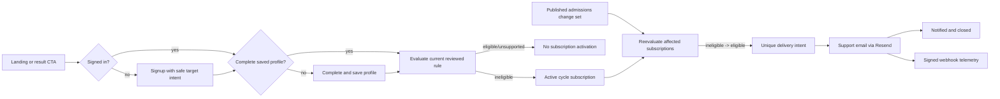

# Admission Change Alerts - Plan

## Goal Capsule

- **Objective:** Email a saved-profile applicant once when a reviewed admissions change makes a subscribed target newly eligible.
- **Product authority:** Alerts are derived from the same reviewed verdict engine used by the calculator after an approved admissions update reaches production.
- **MVP boundary:** Support subscriptions and alerts for TAU and BGU targets.
- **Expansion boundary:** Expand with the verified institution coverage of the admissions decision and weekly update pipelines.
- **Open blockers:** Route-plan structured profile/evaluator work and weekly-plan publication must land first; BGU waits for route-plan U6; Resend sender, sending keys, and webhook secrets require environment-specific provisioning.

---

## Product Contract

### Summary

Signed-in applicants with saved academic profiles can subscribe to a specific institution-program target after a below-threshold verdict. When a reviewed production change makes that profile newly eligible, Toar submits one support email for provider acceptance and closes the subscription after acceptance; inbox receipt is not guaranteed.

### Problem Frame

Admission thresholds sometimes fall after applicants first check their chances. Institutions generally do not notify previously rejected prospects, so applicants repeat manual checks or miss a new opportunity entirely.

Toar already has the applicant’s verdict context and can monitor reviewed source changes. Combining those capabilities creates a useful retention loop, but only if alerts are tied to approved data and a real eligibility transition rather than every source movement.

### Key Decisions

- **Notify on newly eligible, not every change.** The event that matters is a reviewed threshold or rule change moving this saved profile from below to eligible.
- **Saved signed-in profile required.** Subscription activation is available only when Toar can reproduce the applicant’s verdict later.
- **Email-only MVP.** Support emails are the first delivery channel.
- **One successful alert.** After the newly eligible email is accepted for delivery, the subscription closes automatically.
- **Admissions-cycle reset.** Active subscriptions expire every October 1 and must be deliberately renewed for the new cycle.
- **Conversion teaser without a false promise.** Anonymous visitors see the value proposition on the landing page, but the CTA goes directly to signup and preserves the intended target for continuation afterward.
- **Reviewed changes only.** Open PRs, raw scrapes, and ambiguous detections can never trigger applicant email.

### Actors

- A1. **Anonymous visitor:** Encounters the landing-page alert proposition and may start signup.
- A2. **Signed-in applicant:** Saves an academic profile and subscribes to an institution-program target.
- A3. **Approved-change processor:** Re-evaluates affected active subscriptions after reviewed admissions data reaches production.
- A4. **Email delivery service:** Delivers support emails and returns delivery outcomes.
- A5. **Support operator:** Investigates failed delivery or processing runs without seeing unnecessary academic detail in Slack or logs.

### Requirements

**Acquisition and activation**

- R1. The landing page must explain that Toar checks official admission thresholds weekly for supported institution-program targets and can email an applicant if a saved supported target becomes reachable.
- R2. A target-specific anonymous alert CTA must go directly to signup and preserve the intended institution-program target through authentication; a generic landing CTA goes directly to signup and then a supported-target picker because no target exists yet.
- R3. Only a signed-in applicant with a saved, sufficiently complete academic profile may activate a subscription.
- R4. The primary activation control must appear on a below-threshold supported result as an accessible bell or button with clear “notify me” meaning.
- R5. Activation must show the exact institution, program, current below-threshold verdict, admissions cycle, email destination, and one-time alert behavior before confirmation.
- R6. An already eligible applicant must not create a newly-eligible subscription for that target.

**Subscription lifecycle**

- R7. A subscription must be unique per user, institution, program, and admissions cycle.
- R8. Activation must record the reviewed rule version and reproducible baseline verdict used to establish that the applicant is below threshold.
- R9. Applicants must be able to view and cancel active subscriptions from their account. The email's one-click unsubscribe disables the admission-alert email category and cancels all remaining active subscriptions until the applicant explicitly opts in again.
- R10. Active subscriptions must expire on October 1; expiration must not send an eligibility-change alert and renewal must require an explicit applicant action.
- R11. A subscription must close after its first successful newly-eligible email handoff and must not reactivate automatically if the threshold later rises.
- R12. Repeated activation attempts for the same active target and cycle must return the existing subscription rather than create duplicates.

**Eligibility transition processing**

- R13. Processing may start only from an idempotent approved-change set produced after reviewed admissions data is deployed.
- R14. The processor must evaluate only active subscriptions affected by the changed institution-program rules.
- R15. The processor must compare the reproducible baseline verdict with a verdict calculated from the same saved profile under the new reviewed rule version. After a definitive still-ineligible result, it must atomically advance the active baseline to that after-version while retaining audit history; ambiguous/unavailable results must not advance it.
- R16. An email may be queued only when the baseline is below threshold, the new verdict is eligible, and the result is mathematically verified by the product’s supported evaluator.
- R17. Threshold changes that leave the applicant below, changes that make eligibility worse, ambiguous results, missing profile inputs, or unsupported evaluators must not send a newly-eligible email.
- R18. Processing and email queuing must be idempotent across retries, deployments, and repeated approved-change events.
- R19. Updating the applicant’s own profile must refresh subscription reproducibility, but it must not be misrepresented as an institution-driven eligibility change.

**Email and trust**

- R20. The email must identify the target, say that reviewed admission requirements changed, show the newly eligible result and effective check time, link back to the calculator, and state that Toar does not guarantee admission.
- R21. The email must avoid exposing detailed grades or psychometric subscores and must include an unsubscribe path.
- R22. The subscription may close only after the delivery provider accepts the message; transient delivery failures must remain retryable without duplicate sends.
- R23. Operational Slack messages and logs must use identifiers and aggregate counts rather than applicant grades or full academic profiles.

**Phased coverage**

- R24. The MVP must support a representative TAU target and one proven BGU formula family across activation, reviewed-change processing, one-time email, cancellation, retry, and October expiration.
- R25. Post-MVP coverage must be enabled only for institution-program pairs that have reviewed weekly change events and deterministic eligibility evaluation.
- R26. Unsupported result cards may explain that monitoring is not yet available but must not offer an activation control that cannot be honored.

### Key Flows

- F1. Anonymous visitor converts to a subscription
  - **Trigger:** A visitor selects the landing-page alert CTA or alert CTA on an unsaved result.
  - **Actors:** A1, A2
  - **Steps:** Toar stores a validated target when one exists; sends the visitor directly to signup; after authentication, a generic landing visitor selects a supported target while a target-specific visitor resumes it; Toar restores the same-browser anonymous academic draft with save consent or asks for missing profile data; reproduces the below-threshold verdict; and asks for subscription confirmation.
  - **Outcome:** A valid active subscription exists without losing the visitor’s target.
  - **Covered by:** R1-R8
- F2. Reviewed threshold reduction creates eligibility
  - **Trigger:** A deployed approved-change set includes a subscribed TAU or BGU target.
  - **Actors:** A3, A4
  - **Steps:** The processor loads affected active subscriptions; recalculates each saved profile under the new reviewed version; records the transition; queues one email; closes the subscription after provider acceptance.
  - **Outcome:** The delivery provider accepts at most one support email for each newly eligible subscription.
  - **Covered by:** R11, R13-R23
- F3. Reviewed change does not create eligibility
  - **Trigger:** A subscribed target changes but the applicant remains below threshold or cannot be verified.
  - **Actors:** A3
  - **Steps:** The processor records the latest check and reason; sends no email; keeps a still-valid subscription active for later reviewed changes.
  - **Outcome:** Applicants are not spammed by irrelevant movements.
  - **Covered by:** R14-R18
- F4. Admissions cycle resets
  - **Trigger:** October 1 arrives in the product’s admissions-cycle timezone.
  - **Actors:** A2, A3
  - **Steps:** Remaining active subscriptions expire; no eligibility-change email is sent; the account and future result cards invite deliberate renewal for the new cycle.
  - **Outcome:** Old-cycle assumptions do not silently carry into the new admissions year.
  - **Covered by:** R10

### Acceptance Examples

- AE1. **Covers R13-R18.** Given a user was below the reviewed BGU threshold and a merged update lowers it enough to make the saved profile eligible, when the approved change is processed, then exactly one email is queued and the subscription closes after provider acceptance.
- AE2. **Covers R17.** Given a TAU threshold falls but the user remains two points short, when the approved change is processed, then no email is sent and the subscription stays active.
- AE3. **Covers R2-R5.** Given an anonymous visitor selects “notify me” for TAU computer science, when signup completes, then Toar returns them to the preserved target, requires a saved complete profile, reproduces the below verdict, and asks for confirmation.
- AE4. **Covers R12, R18.** Given a user activates twice and the approved event is retried twice, when processing completes, then one subscription and at most one accepted email delivery exist.
- AE5. **Covers R10.** Given an active subscription remains below threshold through September 30, when October 1 begins in the configured admissions timezone, then the subscription expires without an eligibility email and requires explicit renewal.
- AE6. **Covers R19.** Given a user raises their saved psychometric score and becomes eligible without an institution rule change, when the profile is saved, then Toar does not send an email claiming that admission requirements changed.
- AE7. **Covers R22.** Given the email request times out with acceptance unknown, when processing resumes, then Toar records `acceptance_unknown`, reconciles through the same idempotency key and verified provider events within the provider window, and requires manual resolution rather than an automatic resend after that window.

### Success Criteria

- Every alert is traceable to one saved profile version, one reviewed before-and-after rule transition, and one approved change event.
- No alert is sent from an open PR, raw source change, failed evaluator, or incomplete profile.
- Retry and duplicate-event tests prove at-most-one provider-accepted email per subscription.
- Landing-page and result-card flows make the signup requirement clear while preserving the intended target.

### Scope Boundaries

**Deferred for later**

- SMS, WhatsApp, push, and in-app notification channels.
- Alerts for every threshold movement or general institution news.
- Multiple alerts for the same target within one admissions cycle.
- User-configurable check frequency or custom reset dates.
- Automatic renewal across admissions cycles.

**Outside the alert contract**

- Emailing from unreviewed scraper output or an open admissions PR.
- Promising admission, enrollment, or seat availability.
- Sending detailed academic records through email, Slack, or operational logs.

### Dependencies and Assumptions

- The weekly reviewed admissions update plan supplies deployed approved-change sets.
- The verdict engine can reproduce eligibility from a saved profile and a specified reviewed rule version.
- The saved profile is extended to retain the structured inputs required by supported evaluators.
- The authentication flow can preserve a safe post-signup target intent.
- The product has a verified support-email sender identity and a provider that supports idempotent delivery requests and unsubscribe handling.
- Route-plan U1-U3 are prerequisites for profile/baseline work, route-plan U6 gates BGU, and weekly-plan U3/U7 are prerequisites for approved-change processing.

### Sources and Research

- `src/app/api/profile/route.ts` and the existing profile UI provide the saved-profile boundary that subscription activation depends on.
- `src/types/index.ts` currently represents the weighted Bagrut average and must be expanded for reproducible subject-level evaluation.
- The weekly update Product Contract is `docs/plans/2026-07-14-002-feat-weekly-reviewed-admissions-updates-plan.md`.
- The route simulator Product Contract is `docs/plans/2026-07-14-001-feat-verified-admission-route-simulator-plan.md`.
- Supabase's RLS guidance grounds owner policies for private subscription data: https://supabase.com/docs/guides/database/postgres/row-level-security
- Resend's official docs define its time-bounded request idempotency and at-least-once, signed webhook behavior: https://resend.com/docs/dashboard/emails/idempotency-keys and https://resend.com/docs/webhooks/verify-webhooks-requests

---

## Planning Contract

### Context and Current-State Findings

- Authentication and saved profiles already have server route boundaries, but the saved profile currently lacks the subject-level Bagrut record needed to reproduce all supported verdicts.
- `saved_programs` is not an alert subscription: it lacks admissions cycle, baseline verdict/rule version, lifecycle state, and delivery semantics. Alerts need a separate model rather than overloading bookmarks.
- The alert trigger must be a published admissions release from the weekly pipeline. Rechecking on raw scraper differences, open PRs, profile edits, or a clock schedule would violate the reviewed-change contract.
- The current safe `next` handling is path-oriented. Alert acquisition needs a small whitelisted target intent that survives OAuth and email-confirmation signup without becoming an open redirect or trusting arbitrary query data.
- Resend supports idempotency keys, but provider idempotency is time-limited. Durable at-most-once product behavior must come from database uniqueness and an outbox state machine; webhooks are at-least-once and must be signature-verified and deduplicated.

### Key Technical Decisions

1. **Subscribe to a target and cycle, not a generic university.** The unique product identity is user + institution + program + admissions cycle. October starts a new cycle and old subscriptions become inactive without automatic renewal.
2. **Capture a reproducible baseline.** Activation stores the current reviewed rule version, normalized profile version/hash, and ineligible baseline result. A subscription cannot activate from an incomplete or already-eligible profile.
3. **Trigger only from approved target transitions.** The processor consumes one target-scoped release transition that groups every changed field for an institution/program, reevaluates affected subscriptions across its before/after versions, and never treats a partial field item as applicant-facing state.
4. **Use a transactional outbox with database uniqueness.** Eligibility transition and delivery intent are recorded atomically. One unique successful-delivery key per subscription/cycle prevents duplicates across retries beyond the provider's idempotency window.
5. **Close after provider acceptance, retain delivery telemetry.** The user promise is one notification. Provider acceptance marks the subscription notified/closed; verified webhooks update delivery status for support and operations but do not cause another send.
6. **Keep provider integration behind a small adapter.** Resend is the initial transport through the verified support sender. Templates, outbox logic, and subscription lifecycle remain provider-neutral.
7. **Treat landing exposure as acquisition, not anonymous activation.** Anonymous CTAs go directly to signup with a validated target intent. Subscription creation occurs only after authentication and profile completeness checks.
8. **Minimize academic data everywhere.** Reevaluation happens server-side. Email says the selected program may now be within reach and links back to a fresh calculation; it does not include grades, subject records, or a promise of admission.
9. **Consume the shared support decision.** Alerting activates only when evaluator capabilities owned by the route plan and source-publication capabilities owned by the weekly plan jointly support before/after replay. It does not define a third capability registry.

### High-Level Technical Design

The processor compares reviewed versions while holding the saved profile constant. A profile edit may update or invalidate a subscription baseline, but it cannot be labeled as an institution-change alert.

### Execution Topology

- The weekly plan's protected publication workflow calls a reusable GitHub Actions alert-processing workflow with the processable release ID. The workflow imports the shared server modules and claims database work directly; it does not expose a public processor endpoint.
- A protected scheduled GitHub Actions maintenance workflow runs every 15 minutes to drain durable target-transition work in batches of 100 subscriptions, reconcile missed releases and `acceptance_unknown`/retryable outbox rows, and perform October expiration. Target/version cursors serialize releases and checkpoint progress. A failing subscription is quarantined rather than blocking the target cursor. If upstream TAU drift makes an intermediate after-version historically unverifiable, the next processable transition records the skipped versions and compares the oldest confirmed ineligible baseline directly with the current reviewed version; it may alert only when the current result is eligible and never claims what happened during the gap. TAU starts at global concurrency 2 and 30 requests/minute, configurable only downward until an official sustainable limit is documented. The pilot envelope is at most 1,000 impacted TAU subscriptions, one evaluation each, per target transition; within that envelope, measure P95 from processable release to provider acceptance and require under 60 minutes for non-retry deliveries. Above the envelope, health reports backlog and no latency claim is shown.
- Production `DATABASE_URL`, Resend sending key, and sender identity live in GitHub production-environment secrets; the webhook secret lives in Vercel's production environment. Production and non-production credentials remain separate. Workflow concurrency is keyed by release or maintenance window, and logs use internal IDs only.
- The signed Resend webhook remains the only provider-initiated HTTP mutation surface. It verifies the raw body before parsing and cannot invoke evaluation or sending.

### State Lifecycle

- `active`: reproducible ineligible baseline exists for the current cycle.
- `needs_profile_refresh`: saved inputs changed or became insufficient; no institution-change email may send until the user reconfirms a fresh ineligible baseline.
- `pending_delivery`: a reviewed release produced a unique ineligible-to-eligible transition and an outbox item exists.
- `acceptance_unknown`: a send timed out without a definitive provider response; automatic reconciliation/retry is allowed only with the same idempotency key inside the provider window, and manual resolution is required afterward.
- `notified`: the provider accepted the single send; this fulfills the MVP's one-send promise but does not assert inbox delivery. No further sends occur for this subscription/cycle.
- `cancelled`: user opted out before notification.
- `expired`: the admissions cycle ended on October 1.
- `delivery_failed`: retryable/terminal delivery state is retained operationally; it never creates a second logical alert.

`needs_profile_refresh` is visible on the account and affected result card. It explains that monitoring paused because academic information changed, links to profile review, recalculates the current verdict, shows a fresh confirmation summary, and returns to `active` only after explicit confirmation. A terminal `delivery_failed` state directs the user to reverify the account email or support; a retry reuses the same logical delivery after the verified address changes.

Cancellation/category unsubscribe atomically suppresses every delivery not yet accepted by the provider. A worker rechecks subscription and category-consent state when claiming and immediately before submission. If submission is already in flight or `acceptance_unknown`, the UI says cancellation prevents future alerts but the current email may still arrive; reconciliation never initiates a new send after cancellation.

For cancelled `acceptance_unknown` rows, reconciliation is observation-only through verified provider events or provider status lookup. It may mark a prior acceptance/delivery outcome, but it cannot submit the message again; unresolved rows remain a manual support state.

### Data Lifecycle

- Raw webhook bodies and academic inputs are not retained in delivery telemetry. Provider event IDs used for deduplication expire after 30 days.
- Subscription and delivery metadata is retained for support through 12 months after the admissions cycle ends, then deleted or anonymized; only a non-identifying transition/delivery digest may remain for idempotency audit.
- Account deletion immediately removes the saved academic profile, recipient address, active subscriptions, and revocable tokens. Any retained audit tombstone contains no user ID, email, grades, or reversible profile hash.
- These defaults are configurable only through reviewed server-side policy and must receive privacy/legal confirmation before production launch.

### System-Wide Impact

- **Database:** New subscription, outbox/delivery, and webhook-event tables need owner policies, explicit runtime/operations grants, uniqueness constraints, and retention rules. Academic profile version/hash becomes part of baseline reproducibility.
- **Authentication:** OAuth and email signup paths must preserve only a validated program intent. Activation resolves the authenticated user's verified account email server-side.
- **Admissions:** The release processor and route simulator use the same versioned evaluator. Only program families with before/after replay capability can offer alerts.
- **Email:** Support sender verification, React Email templates, category-level unsubscribe, Resend idempotency keys, signed webhook handling, and suppression/failure observability are required. Production and non-production use separate restricted API keys, sender identities, and webhook secrets stored only in environment-scoped secret storage with a documented rotation/revocation owner.
- **UI:** Landing teaser, target picker, calculator bell/button, signup return, profile completion, `needs_profile_refresh`, active/cancelled/notified/delivery-failed states, and accessible hover/focus copy must work in Hebrew RTL and mobile layouts.
- **Privacy/operations:** Email addresses and academic inputs are absent from Slack and analytics. Logs use internal IDs and coarse state. Support can inspect provider delivery status without seeing the full academic record.

### Rollout Strategy

1. Add schema, lifecycle, profile reproducibility, and authenticated APIs with email sending disabled.
2. Enable CTA/signup/profile flows for internal accounts and create dry-run transition records from test releases.
3. Enable real support-email delivery for the TAU pilot after a controlled reviewed rule change proves the full path.
4. Add the selected BGU formula family only when its route/evaluator capability proves before/after verdicts and cutoffs.
5. Expand by the shared capability registry; unsupported institutions may show general signup value but cannot create a target alert subscription.

### Risks and Mitigations

- **False-positive eligibility email:** Require a published release, fixed profile hash, before/after replay, every minimum gate, and supported capability; phrase the email as recalculation guidance rather than admission.
- **Duplicate email:** Enforce database unique transition/delivery keys, transactional outbox claims, provider idempotency, and webhook deduplication.
- **Missed email after transient failure:** Use retryable outbox states with bounded backoff and operator visibility; do not close until provider acceptance.
- **Profile edits masquerade as admissions changes:** Move subscriptions to `needs_profile_refresh` and require a new baseline; never trigger from a profile save event.
- **Cycle boundary ambiguity:** Compute the October 1 cycle boundary in one domain function using the product timezone, exclude old cycles in every query, and run a scheduled cleanup as defense in depth.
- **Open redirect or forged target:** Use server-validated institution/program IDs and the existing safe internal-route allowlist; never preserve an arbitrary URL.
- **Sensitive data leakage:** Keep grades out of email, provider metadata, logs, Slack, and analytics; verify ownership on every mutation.
- **Permanent recipient failure:** Keep the same logical delivery pending/failed, show account-email reverification or support recovery, and permit retry only after the verified account address changes; never create a second transition.

### Resolved During Planning

- The alert is available only to signed-in users with a complete saved profile.
- Anonymous landing/result CTAs go directly to signup and preserve the intended target safely.
- Delivery is email-only from the verified support sender for the first release.
- A subscription sends once, closes after provider acceptance, and resets by expiring every October.
- Profile-driven eligibility changes do not qualify; only reviewed institution changes do.
- The pilot targets are TAU Computer Science and BGU Computer Science after its quantitative/Sekhem evaluator is proven.

## Implementation Units

### U1. Add subscription, outbox, and webhook persistence

- **Requirements:** R7-R12, R18, R22-R23; F2-F4; AE1, AE4-AE5, AE7
- **Goal:** Establish durable owner-scoped lifecycle and at-most-once delivery invariants.
- **Files:** `src/db/schema.ts`, new migrations, alert repositories/services under `src/server/admission-alerts/`, migration/grant tests, and database integration fixtures.
- **Approach:** Add subscriptions keyed by user/target/cycle, versioned baseline history, state timestamps, cancellation/expiration fields, and an owner-scoped email preference. Add durable target-transition work/cursor records, outbox/delivery rows unique per target transition plus subscription, a second successful-acceptance constraint per subscription plus cycle, and webhook-event dedupe. Use explicit private policies, lifecycle/retention indexes, grants, and transaction-safe uniqueness.
- **Test scenarios:** Multiple field items create one target transition/outbox identity; duplicate active subscription; ordered baseline advancement; two workers claim one row; cross-user denial; cancellation suppresses unaccepted delivery; in-flight cancellation messaging; expired row excluded; duplicate webhook.
- **Verification:** Database constraints—not application timing—prevent a second logical delivery for the same subscription/cycle transition.

### U2. Complete profile reproducibility for alert baselines

- **Requirements:** R2-R8, R12, R19; F1-F3; AE1-AE3, AE6
- **Goal:** Ensure every active subscription can replay both old and new admissions rules against the same academic inputs.
- **Files:** Structured profile work shared with the route plan, `src/server/user/profileSchema.ts`, `src/server/user/profile.ts`, profile API/UI, evaluator integration, and tests.
- **Approach:** Depend on the route plan's normalized subject-level profile and deterministic hash/version. Define completeness per target capability. When a relevant saved input changes, mark affected active subscriptions `needs_profile_refresh`; surface the paused state in account/result views, guide profile review and recalculation, and require explicit reconfirmation of a new ineligible baseline.
- **Test scenarios:** Complete profile activates; average-only profile requires completion; profile edit changes hash and shows recoverable paused state; reconfirmation reactivates; irrelevant metadata edit does not; profile deletion/corruption prevents processing.
- **Verification:** Every active row references a retrievable normalized profile version/hash and reproducible ineligible verdict.

### U3. Build authenticated subscription APIs and lifecycle rules

- **Requirements:** R1-R14, R16-R20; F1-F3; AE1-AE3, AE6-AE7
- **Goal:** Let users create, inspect, cancel, and refresh only their own valid subscriptions.
- **Files:** Route handlers under `src/app/api/admission-alerts/`, auth/validation helpers, shared response types, server services, and API tests.
- **Approach:** Resolve user identity and verified account email server-side. Validate target against the composed capability decision and current cycle, load the saved profile, evaluate the current reviewed rule, and create an active baseline only when ineligible. Return explicit already-eligible, incomplete, unsupported, duplicate, cancelled, suppressed, and expired states. Category opt-in must be explicit after a prior one-click unsubscribe; cancellation and unsubscribe are idempotent.
- **Test scenarios:** Valid activation; anonymous denial; incomplete profile; already eligible; unsupported target; duplicate activation; category suppressed until explicit opt-in; foreign-user read/cancel; cancel after pending delivery; stale cycle.
- **Verification:** No client can choose another recipient, forge eligibility, subscribe to an unsupported evaluator, or access another user's state.

### U4. Preserve safe alert intent through signup and profile completion

- **Requirements:** R1-R5; F1; AE3
- **Goal:** Make the landing/result teaser convert into a valid subscription without an unsafe redirect or lost target.
- **Files:** `src/lib/routes.ts`, `src/context/AuthContext.tsx`, `src/app/signup/page.tsx`, `src/components/AuthRouteScreen.tsx`, landing/calculator CTA components, profile flow, and auth/navigation tests.
- **Approach:** Encode only validated institution/program identifiers—or a fixed target-selection intent—in a whitelisted internal next path. Preserve it through OAuth and email confirmation, then route targetless landing users to a supported-target picker and target-specific users to profile/subscription continuation. Reuse the existing same-browser anonymous profile draft, ask for consent before server persistence, and require re-entry when the draft expired or the user returns on another device. Hover/focus copy consistently says Toar will notify the user if reviewed requirements make the target mathematically eligible.
- **Test scenarios:** Generic landing CTA directly to signup then target picker; result bell to signup; OAuth return; email-confirmation return; same-browser draft restore and save consent; expired/cross-device draft re-entry; malformed/unknown target; signed-in incomplete profile; completed profile returns to confirmation; focus restoration, live announcements, touch targets, and mobile RTL behavior.
- **Verification:** Both authentication methods preserve valid intent and reject arbitrary external or unrecognized destinations.

### U5. Process approved changes and detect true transitions

- **Requirements:** R13-R19, R23-R25; F2-F3; AE1-AE2, AE4, AE6
- **Goal:** Create delivery intent only when a reviewed institution change makes the fixed saved profile newly eligible.
- **Files:** Release-consumer/processor modules under `src/server/admission-alerts/`, a reusable protected GitHub Actions processing workflow and script, evaluator adapters, and integration tests.
- **Approach:** Claim target transitions in before/after order through a durable per-target cursor and process batches of 100. Verify the baseline version/profile digest, then evaluate under the after-version. A definitive still-ineligible result advances the baseline with history; eligible inserts one outbox intent. Ambiguous/unavailable results retry within the transition budget, then quarantine only that subscription so the target cursor advances. If later TAU drift makes the skipped after-version impossible, record the version gap and compare the oldest confirmed baseline with the current reviewed version, sending only for current eligibility. Formula targets replay exact versions; TAU never claims historical API replay. Respect the global budget and checkpoint every batch.
- **Test scenarios:** Multiple field items evaluate once; threshold decrease alerts; definitive no-alert advances baseline; ambiguous result retries then quarantines without blocking peers; two TAU releases with an unreplayable gap coalesce baseline-to-current and record skipped versions; out-of-order releases serialize; profile changed; gate fails; duplicate processing; 250 subscriptions checkpoint across three batches; rate budget; workflow timeout resumes.
- **Verification:** Raw freshness rows, open PRs, profile saves, and failed publications cannot produce an outbox row.

### U6. Send one support email through a transactional outbox

- **Requirements:** R11, R13, R16, R18, R20-R23; F2; AE1, AE4, AE7
- **Goal:** Deliver the promised single email reliably without embedding academic details.
- **Files:** `package.json`, the lockfile, a provider-neutral mail adapter, Resend implementation, React Email template, outbox worker/workflow, environment validation, and tests.
- **Approach:** Claim pending rows through the protected workflow and recheck subscription plus category consent both at claim and immediately before submission. Suppress unaccepted rows after cancellation. Build the Hebrew RTL email and send from the environment-specific support identity with a stable idempotency key. Mark notified/closed after acceptance. A timeout enters `acceptance_unknown`; reconcile inside the provider window and require manual resolution afterward. Retain permanent recipient failure under the same logical delivery.
- **Test scenarios:** Successful acceptance; timeout enters `acceptance_unknown`; same-key reconciliation inside the window; unresolved timeout after the window requires manual action; provider duplicate response; transient rate limit; permanent invalid recipient and verified-address recovery; two workers; template contains no grades and includes manage-alerts/support links.
- **Verification:** One accepted send closes the subscription; no automatic path can send after an unresolved idempotency window, and every retry keeps the same logical/provider identity.

### U7. Verify webhooks and expose delivery/cancellation status

- **Requirements:** R9, R11, R18, R21-R23; F2; AE4, AE7
- **Goal:** Make delivery supportable and cancellation trustworthy under duplicate/out-of-order provider events.
- **Files:** Raw-body webhook route, signature verification/configuration, webhook event service, alert status UI/API, and tests.
- **Approach:** Verify Resend/Svix signatures against the raw body, deduplicate by event ID, and update post-acceptance delivery telemetry monotonically for support without reopening or resending a closed subscription. The email's opaque random token is stored only as a hash, is category-scoped and cycle-bounded, and disables admission-alert email plus remaining active subscriptions; explicit later opt-in is required. Provider events never carry profile data.
- **Test scenarios:** Valid delivered/bounced/complained events; invalid signature; duplicate event; out-of-order delivered then sent; unknown delivery; repeated cancel; cancel link tampering.
- **Verification:** Forged or replayed webhooks cannot mutate state, and webhook ordering cannot create another send.

### U8. Enforce the October admissions-cycle reset

- **Requirements:** R10, R24; F4; AE5
- **Goal:** Expire prior-cycle subscriptions predictably without depending on one cron execution.
- **Files:** Cycle domain utility, protected scheduled/manual GitHub Actions maintenance workflow, subscription queries, UI copy, and timezone boundary tests.
- **Approach:** Derive cycle IDs and October 1 expiration in one Asia/Jerusalem-aware utility. Every active query excludes old cycles immediately; the protected scheduled GitHub Actions maintenance workflow marks them expired and reports counts. Do not auto-renew or send a reset email in the MVP.
- **Test scenarios:** September 30/October 1 boundary; daylight-saving dates; missed cron; manual rerun; already notified/cancelled rows; new-cycle resubscription.
- **Verification:** A stale-cycle subscription can never be processed even if the maintenance job has not yet updated its stored status.

### U9. Add privacy-safe observability and capability-gated rollout

- **Requirements:** R7-R8, R12-R26; F1-F4
- **Goal:** Operate alerts safely across TAU/BGU and expand without false coverage claims.
- **Files:** Shared capability-model consumption, internal data-health/dashboard reporting, analytics definitions, alert runbooks, and end-to-end tests.
- **Approach:** Consume the composed evaluator and source-publication support decision; do not define another registry. Report active/paused/pending/notified/failed/expired counts, processor lag, provider outcomes, and unsupported reasons through the existing operations-only, no-public-cache data-health boundary using internal IDs only. Add operator retry/suppression, credential rotation, and sender-domain procedures.
- **Test scenarios:** TAU supported; BGU formula family supported only after proof; unsupported institution CTA does not activate; logs/analytics exclude email and grades; stuck outbox appears in health; support can trace a delivery by internal ID.
- **Verification:** Operators can explain and recover every delivery state without accessing full academic records, and target coverage cannot exceed evaluator capability.

## Verification Contract

### Automated Verification

- Database tests cover owner isolation, unique active subscriptions, unique transition/delivery identity, concurrent outbox claims, webhook dedupe, and cycle indexing.
- Evaluator integration tests cover true before/after institution transitions, profile-version mismatch, minimum gates, unsupported/degraded adapters, and duplicate release consumption.
- API/auth tests cover safe intent, OAuth/email confirmation return, complete-profile requirement, account-email resolution, cancellation, and cross-user denial.
- Email tests render Hebrew RTL output, verify content/privacy rules, provider idempotency identity, retry classification, and webhook signature/order handling without live sends.
- Playwright covers landing teaser to signup, saved-profile completion, subscription activation, bell state, cancellation, and a simulated approved-change notification state on desktop/mobile.
- Repository quality, migration, evaluator regression, build, and project pre-PR guard checks run before publication-related code is pushed.

### Production Verification

- Verify Supabase schema, indexes, owner/private policies, runtime/operations grants, representative cross-user denial, and outbox concurrency behavior.
- Verify Resend sender domain/support address, environment variables, idempotent test delivery, signed webhook secret, duplicate webhook handling, bounce/complaint telemetry, and that no academic values reach provider metadata.
- Verify the Vercel preview belongs to this project and exercise signup return, calculator subscription, cancel flow, and `/internal/data-health`.
- Process one controlled TAU release transition end to end, then one BGU transition after its formula capability is proven; verify one accepted email and no duplicate after replay/retry.
- Test the October boundary with a controlled clock/fixture and manually rerun expiration reporting.

### Rollback and Failure Expectations

- Alert CTAs and processing can be disabled per target without affecting the calculator or existing saved profiles.
- Pausing the worker preserves pending outbox rows; it does not discard or recreate them.
- A provider outage cannot reopen notified subscriptions or trigger from an unreviewed admissions state.
- Schema changes are additive, and disabling the feature retains subscription/delivery history for support and audit.

## Definition of Done

- R1-R26 and AE1-AE7 are traced to database, API, evaluator, email, or browser verification.
- Only signed-in users with complete saved profiles can activate a target+cycle subscription; anonymous CTAs safely return through signup.
- Only a published reviewed institution change can create an ineligible-to-eligible transition, with the profile held constant.
- Exactly one logical email is accepted per subscription/cycle, after which the subscription closes; retry and webhook duplication cannot create another send.
- October 1 excludes and expires prior-cycle subscriptions, with no automatic renewal.
- Emails, logs, Slack, analytics, and provider metadata contain no subject-level grades or full profile data.
- TAU and the single proven BGU formula family complete controlled end-to-end transitions before broader capability-gated rollout.
- Supabase, Resend, Vercel preview, browser, data-health, and pre-PR verification evidence is recorded in the implementation PR.
