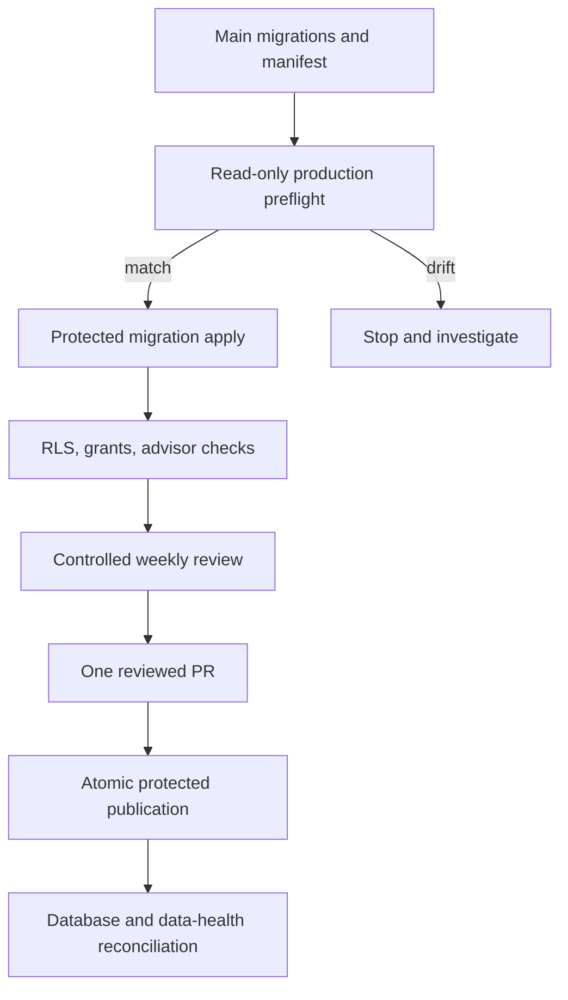

# Production Admissions Schema and Weekly Operations Completion - Plan

## Goal Capsule

- **Objective:** Make the reviewed admissions schema and weekly update pipeline operational in production, with secure database access and repeatable evidence that reviewed changes publish safely.
- **Product authority:** Official institution evidence enters one reviewed PR; only a merged and production-verified release becomes canonical.
- **Completion boundary:** TAU and BGU must both complete changed, unchanged, blocked/failure, rerun, publication, and rollback scenarios.
- **Authority order:** This completion plan narrows the remaining work from `docs/plans/2026-07-14-002-feat-weekly-reviewed-admissions-updates-plan.md`; that plan remains authoritative for product behavior not amended here.
- **Stop conditions:** Stop before production mutation if remote migration history, role names, backups, or rollback evidence differ from the expected preflight. Never repair drift by editing already-applied migration history.

---

## Product Contract

### Summary

PR #94 and PR #100 established the schema, publication modules, weekly review ledger, generated-PR validation, and Slack handoff. Production still lacks migrations `0011` through `0016`, and Supabase Security Advisor reports RLS disabled on five exposed tables. This plan closes that deployment gap and proves the weekly pipeline through controlled production-safe runs.

### Problem Frame

Green disposable-database CI did not prove that production had the same schema. The deployed application now references release, profile-version, review-run, transition, subscription, and outbox tables that do not exist remotely. The weekly workflow also requires environment configuration and controlled operational proof before its schedule can be trusted.

### Key Decisions

- KD1. A merged PR is the only human approval boundary; neither the internal dashboard nor a workflow rerun may approve canonical admissions data. Governs R7-R10.
- KD2. Production schema repair uses forward-only migrations and an audited remote preflight. Governs R1-R4.
- KD3. TAU and BGU both remain inside the completion boundary; a TAU-only operational proof does not complete this plan. Governs R11.

### Requirements

**Production schema and security**

- R1. Production must contain every table, enum, index, constraint, and migration represented by repository migrations `0011` through `0016`.
- R2. RLS must be enabled on `admission_alternative_paths`, `admission_facts`, `admissions_source_candidates`, `source_freshness_checks`, and `source_freshness_states`, with no unintended `anon` or `authenticated` access.
- R3. `app_runtime`, `ops_readonly`, publication, and migration credentials must receive only the grants required by their execution surfaces.
- R4. Remote migration preflight must detect missing, divergent, or partially applied state and stop before mutation.
- R5. Production schema verification must cover release, review-run, transition, subscription, outbox, and profile-version tables in addition to the existing catalogue tables.

**Weekly review and publication**

- R6. The weekly workflow must have its GitHub App, admissions cycle, Slack, and protected database configuration validated without exposing secret values.
- R7. A weekly execution with changes must create or update one generated review PR; a no-change execution must create no empty PR.
- R8. Partial failures, blocked sources, reviewer exclusions, and reruns must remain visible and reuse the same weekly identity.
- R9. A merged reviewed manifest must publish atomically and idempotently from the protected production environment.
- R10. `/internal/data-health` must report the same active release digest and repository commit as production database queries.
- R11. Controlled TAU and BGU scenarios must cover changed, unchanged, blocked/failure, rerun, successful publication, and corrective rollback behavior.
- R12. A publication or schema failure must preserve the prior active release and produce an actionable operational failure record.
- R13. Scheduled weekly execution must remain gated by an explicit enablement variable until configuration, schema, dry-run, and change-bearing proofs pass.

### Key Flows

- F1. Production schema recovery
  - **Trigger:** Preflight confirms migrations `0011` through `0016` are absent and earlier history is intact.
  - **Steps:** Capture recovery evidence, apply forward migrations through the protected path, verify roles and RLS, run representative reads and denied writes, then check advisors.
  - **Outcome:** Repository and production schema agree without broadening public access.
  - **Covered by:** R1-R5
- F2. Weekly reviewed publication
  - **Trigger:** A controlled weekly run evaluates TAU and BGU sources.
  - **Steps:** Persist one run, generate at most one PR, merge reviewed data, publish atomically, and reconcile data-health with the active release.
  - **Outcome:** Applicants see only the reviewed production version.
  - **Covered by:** R6-R12

### Acceptance Examples

- AE1. **Covers R1-R5.** Given production ends before migration `0011`, when the protected migration procedure completes, then all new tables exist, the five exposed tables have RLS, anonymous writes fail, and the security advisor has no `rls_disabled_in_public` errors.
- AE2. **Covers R7-R8.** Given a weekly run with no reviewable change and one blocked source, when it completes, then no PR is created and one Slack summary reports the blocked source.
- AE3. **Covers R7-R10.** Given reviewed TAU and BGU candidate changes, when their generated PR merges, then one atomic release becomes active and data-health reports its digest and commit.
- AE4. **Covers R9-R12.** Given publication fails after merge, when the workflow exits, then the prior active release remains authoritative and a retry uses the same release identity.

### Scope Boundaries

- This plan deploys and proves the already-reviewed schema and weekly operations; it does not redesign admission formulas.
- Formula accuracy and per-program proof belong to `docs/plans/2026-07-25-002-fix-formula-backed-admission-calculation-verification-plan.md`.
- Route ranking and email delivery remain separate consumers of the published release.
- Production secret values are never written to plans, logs, PR bodies, Slack, or Monday.

### Dependencies

- The production Supabase project, Vercel project, GitHub Actions environments, and Slack destination must be available to their authorized operators.
- BGU publication proof depends on a verified BGU evaluator from the calculation-verification plan.
- Follow the least-privilege operations pattern in `docs/solutions/architecture-patterns/protect-internal-dashboards-with-a-dedicated-readonly-ops-database-url.md`.

---

## Planning Contract

### Current-State Findings

- `src/db/migrations/0011_private_admission_operations_rls.sql` contains the intended RLS repair for the five exposed tables.
- `src/db/migrations/0012_greedy_meteorite.sql` through `src/db/migrations/0016_admission_review_runs.sql` contain the new profile, release, alert, threshold-invariant, duration, and weekly-run schema.
- `.github/workflows/admissions-freshness.yml` and `.github/workflows/admissions-publication.yml` exist, but production proof and required environment configuration are incomplete.
- `scripts/verify-operational-db.mjs` verifies only the older operational table set and cannot currently detect the audited production gap.

### Key Technical Decisions

- KTD1. Add a read-only production schema preflight and expand operational verification before applying migrations. This implements KD2 and R1-R5.
- KTD2. Preserve merged migration files; any correction discovered by preflight becomes the next forward migration. This implements KD2 and R4.
- KTD3. Run migration, publication, and rollback actions only through protected GitHub environments or an explicitly authorized operator session. This implements R3, R9, and R12.
- KTD4. Make the operational verification job a required gate whenever migrations, reviewed manifests, publication code, calculator configuration, or admissions persistence changes. This implements R5 and R9.
- KTD5. Use release commit plus manifest digest as the idempotency identity across publication, data-health, and retries. This implements R9-R12.
- KTD6. Add an explicit repository-level automation enablement gate; manual dry runs remain available while the schedule is disabled. This implements R6-R8 and R13.

### High-Level Technical Design

### Sequencing

1. Build and test preflight and verification coverage without changing production.
2. Resolve any migration incompatibility as a forward migration.
3. Apply and verify the schema and RLS through the protected path.
4. Configure weekly workflow dependencies and run dry/no-change scenarios.
5. Run changed TAU and BGU publication plus corrective rollback proof.
6. Require the operational gate for future production-sensitive changes.

### Risks and Mitigations

- **Partial migration application:** Preflight exact objects and migration history; use forward repair and rerunnable verification.
- **Credential overreach:** Assert effective roles and representative allowed/denied queries instead of trusting environment-variable presence.
- **False-green CI:** Make remote operational verification a required, explicit production-sensitive gate.
- **Publication/data-health mismatch:** Compare active digest, release ID, and repository commit before marking a release processable.
- **External source drift during proof:** Use controlled fixtures for workflow behavior and a separate current-source check for capability activation.

---

## Implementation Units

### U1. Build production schema and role preflight

- **Goal:** Detect remote drift before any production mutation.
- **Requirements:** R1, R3-R5
- **Files:** `scripts/verify-operational-db.mjs`, a focused production schema verification module under `src/server/admissions/`, `src/server/admissions/*.test.ts`, `docs/admissions-review-operations.md`
- **Approach:** Compare required relations, columns, constraints, migration versions, RLS flags, policies, grants, and effective roles. Return machine-readable results and fail on any unexpected earlier divergence.
- **Test Scenarios:** Fully current schema; migrations `0011`-`0016` absent; one table partially present; wrong role grant; RLS disabled; unexpected migration checksum/history.
- **Verification:** Focused Vitest coverage and a read-only query against a disposable database at each representative state.

### U2. Make migration and security repair forward-safe

- **Goal:** Ensure the production repair can run once, retry safely, and leave least-privilege policies.
- **Requirements:** R1-R4
- **Files:** `src/db/migrations/0011_private_admission_operations_rls.sql`, any required new forward migration, `src/db/migrations/privateAdmissionOperationsRls.test.ts`, `src/db/migrations/admissionReleaseRls.test.ts`, `src/db/migrations/admissionAlertRls.test.ts`, `src/db/migrations/admissionReviewRunRls.test.ts`
- **Approach:** Characterize the existing migrations first. If production preflight reveals incompatibility, add a new migration rather than rewriting merged files.
- **Test Scenarios:** Fresh database; database through `0010`; rerun after success; all runtime roles present; optional roles absent; anonymous read/write denial.
- **Verification:** `npm run db:migrate:check` plus migration tests against disposable Postgres.

### U3. Apply and verify production schema

- **Goal:** Bring production to the reviewed schema with auditable recovery evidence.
- **Requirements:** R1-R5, R12
- **Files:** `docs/admissions-review-operations.md`, `docs/internal-data-health-dashboard.md`, operational verification scripts
- **Approach:** Capture backup/recovery details, run preflight, apply through the authorized protected path, execute representative role queries, and record advisor and table evidence. Stop on any unexpected drift.
- **Test Scenarios:** Successful apply; preflight stop; apply failure before commit; verification failure after apply; safe rerun.
- **Verification:** Production migration history, `to_regclass` checks, role/grant queries, anonymous PostgREST denial, security advisor, and authenticated data-health.

### U4. Gate publication on production readiness

- **Goal:** Prevent future merges or deployments from appearing ready while operational schema checks are skipped.
- **Requirements:** R5, R9-R10, R12
- **Files:** `.github/workflows/ci.yml`, `.github/workflows/admissions-publication.yml`, `scripts/pre-pr-guard.mjs`, `scripts/verify-operational-db.mjs`
- **Approach:** Expand the required table set and make production-sensitive applicability deterministic from changed paths. Publication must verify schema and active-release prerequisites before mutation.
- **Test Scenarios:** Migration change; manifest-only change; alert persistence change; unrelated UI change; missing operational secret; schema mismatch.
- **Verification:** Workflow tests or shell-module tests, guard tests, and a GitHub Actions run showing the operational job executes for an applicable PR.

### U5. Configure and prove weekly review generation

- **Goal:** Operate the stable weekly run, PR, and Slack handoff without publication side effects.
- **Requirements:** R6-R8, R11, R13
- **Files:** `.github/workflows/admissions-freshness.yml`, `scripts/prepare-admissions-review.mjs`, `scripts/notify-admissions-review.mjs`, `docs/admissions-review-operations.md`
- **Approach:** Add the enablement gate, validate configuration presence and permissions, then run controlled no-change, change-bearing, blocked/failure, exclusion, and rerun scenarios with stable identities. Enable the schedule only after the evidence is recorded.
- **Test Scenarios:** No change; multiple safe changes; blocked TAU or BGU source; Slack retry; reviewer exclusion; same-week rerun; concurrent manual and scheduled triggers.
- **Verification:** Focused weekly-review tests plus GitHub run, PR, and Slack evidence without secret disclosure.

### U6. Prove atomic publication and rollback

- **Goal:** Demonstrate that merged reviewed data becomes one production release and can be corrected safely.
- **Requirements:** R9-R12
- **Files:** `.github/workflows/admissions-publication.yml`, `scripts/publish-admissions-release.mjs`, `src/server/admissions/admissionsReleasePublisher.ts`, `src/server/admissions/admissionsReleasePublisher.test.ts`, `src/server/data-health/queries.ts`, `docs/admissions-review-operations.md`
- **Approach:** Publish a controlled TAU/BGU release, reconcile its commit and digest, repeat idempotently, simulate failure, and publish a reviewed corrective release rather than mutating history.
- **Test Scenarios:** Successful multi-target publish; duplicate retry; deployment mismatch; DB failure; prior release preserved; corrective rollback release.
- **Verification:** Publisher tests, production release queries, authenticated data-health, Vercel deployment identity, and one controlled rollback exercise.

---

## Verification Contract

| Gate | Command or evidence | Applies to |
|---|---|---|
| Formatting and types | `npm run format:check` and `npm run typecheck` | All units |
| Migration integrity | `npm run db:migrate:check` and focused migration tests | U1-U4 |
| Repository safety | `npm run guard:pre-pr` | All production-sensitive changes |
| Weekly behavior | Focused weekly review, ledger, Slack, and validation tests | U5 |
| Publication behavior | Focused publisher and data-health tests | U4, U6 |
| Disposable database | Full migration, seed dry-run, and representative role queries | U1-U4 |
| Production database | Migration history, schema objects, grants, RLS, advisor, and representative queries | U3, U6 |
| Deployment | Correct Vercel project and production commit are Ready | U6 |
| Browser | Authenticated `/internal/data-health` shows the active release; landing calculator remains healthy | U3, U6 |

---

## Definition of Done

- Production contains and verifies migrations `0011` through `0016` plus any forward repair migration.
- The five Supabase RLS errors are gone, anonymous writes fail, and runtime/operations roles pass allowed and denied query checks.
- Operational verification is required for applicable production-sensitive changes.
- The weekly workflow is configured and has evidence for no-change, change, blocked/failure, exclusion, rerun, and Slack retry behavior.
- The scheduled workflow remains gated until those proofs pass and is enabled only through authorized repository configuration recorded in the operations evidence.
- TAU and BGU reviewed changes publish atomically, reconcile with data-health and Vercel, and survive an idempotent retry.
- A reviewed corrective release proves rollback without rewriting release history.
- Every implementation unit's tests and the full pre-PR guard pass.
- Experimental or abandoned repair code is removed before completion.
