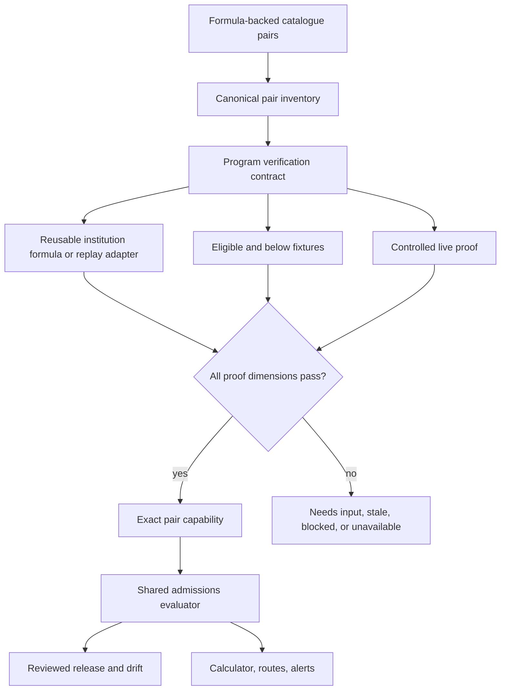

# Formula-Backed Admission Calculation Verification - Plan

## Goal Capsule

- **Objective:** Replace inaccurate or estimated admissions calculations with program-specific results proven against each institution's official calculator and current gates.
- **Product authority:** The official program-level institutional calculator, formula, cutoff, and gates are authoritative; Toar must fail closed when any required proof is unavailable or drifts.
- **Scope:** Every current formula-backed program-institution pair except Ariel University and Bar-Ilan University.
- **Measured baseline:** The 2026-07-25 catalogue expands to 135 in-scope formula-backed pairs: TAU 35, Hebrew University 29, BGU 29, University of Haifa 27, Technion 14, and College of Management 1. Execution must regenerate this inventory rather than freezing the count.
- **Completion boundary:** Every in-scope pair has program-specific eligible and below-threshold fixtures plus a controlled live comparison.
- **Rollout:** A pair may become exact progressively after its own proof passes, but this plan remains incomplete until the regenerated in-scope inventory is fully exact.

---

## Product Contract

### Summary

The current calculator mixes a small exact target map with generic weighted formulas, score-only adapters, static thresholds, and institution-level assumptions. Users have observed incorrect TAU and BGU results. This plan makes exactness a per-program capability backed by direct official proof rather than an institution label or a plausible arithmetic approximation.

### Problem Frame

Admissions formulas vary by institution, program, cycle, applicant inputs, bonus policy, direct track, and gate. A correct score can still produce a wrong verdict when the cutoff or program mapping is wrong. Shared formula code is useful, but every user-facing pair needs its own evidence that the formula family, inputs, mapping, cutoff, and gates reproduce official behavior.

### Key Decisions

- KD1. Every formula-backed pair except Ariel and Bar-Ilan is in scope. (session-settled: user-directed - chosen over all catalogue entries: only entries with calculator formulas require exact calculation proof.) Governs R1-R3.
- KD2. Each pair needs its own official eligible and below-threshold fixtures and controlled live comparison. (session-settled: user-directed - chosen over formula-family-only proof: shared code cannot prove a program mapping, cutoff, or gates.) Governs R4-R8.
- KD3. Exact capability rolls out per pair while global completion waits for full coverage. (session-settled: user-directed - chosen over an all-at-once launch: verified pairs should improve safely without overstating the remaining catalogue.) Governs R9-R12.
- KD4. Ariel University and Bar-Ilan University are explicit exclusions from this plan, not implicitly verified or silently estimated. Governs R1, R3, R12.

### Actors

- A1. Applicant entering academic scores and required subject-level inputs.
- A2. Admissions evidence operator capturing and reviewing official program behavior.
- A3. Engineer implementing formula-family adapters and program contracts.
- A4. Product reviewer deciding whether a pair's proof is sufficient to expose exact status.

### Requirements

**Inventory and exactness**

- R1. Generate a canonical inventory of every formula-backed program-institution pair from the seeded and DB-backed catalogue, excluding only Ariel and Bar-Ilan.
- R2. Normalize legacy multi-institution program records into explicit pair identities so no threshold key is hidden behind a missing `institutionId`.
- R3. The inventory must fail CI when an in-scope pair is added without a capability record or when an excluded institution leaks into completion totals.
- R4. Each pair must bind the official program identifier, calculation source, formula family or replay mode, admission cycle, required inputs, cutoff, gates, and source fingerprint.
- R5. Each pair must have at least one officially eligible and one officially below-threshold golden fixture using sanitized applicant inputs.
- R6. Each pair must pass a controlled live comparison against the current official calculator before activation and after source drift.
- R7. Exact verification compares both score and final verdict; score-only agreement cannot activate exact capability.
- R8. Bagrut normalization, subject bonuses, psychometric subscores, direct tracks, language classifications, and minimum gates must be modeled whenever the official calculator uses them.

**Runtime behavior and rollout**

- R9. Capability is stored per program-institution pair, never inferred from an institution-wide formula label.
- R10. A verified pair may return exact, needs-input, stale, blocked, or authority-unavailable; it must not fall back to an estimated accepted/below verdict.
- R11. Fixture or source drift automatically withdraws exact capability until review republishes a matching version.
- R12. The UI and APIs must distinguish exact pairs, unverified in-scope pairs, and the two excluded institutions without claiming full-catalogue accuracy.
- R13. The weekly reviewed-update pipeline must publish formula, mapping, cutoff, gate, and fixture-fingerprint changes through the same reviewed release boundary.
- R14. Logs, fixtures, cache keys, analytics, and review artifacts must not contain user identifiers or real academic profiles.

### Key Flows

- F1. Pair onboarding
  - **Trigger:** The inventory contains an in-scope pair without exact capability.
  - **Steps:** Map official target, define inputs and rule contract, capture two verdict fixtures, reproduce them locally or by bounded replay, complete a live comparison, then publish capability.
  - **Outcome:** Only that pair becomes exact.
  - **Covered by:** R1-R10, R14
- F2. Drift withdrawal and recovery
  - **Trigger:** A source fingerprint, formula output, cutoff, gate, or mapping changes.
  - **Steps:** Mark the pair stale, withhold exact verdicts, generate a reviewed change, refresh fixtures and live proof, then publish the new version.
  - **Outcome:** No stale exact result reaches applicants.
  - **Covered by:** R10-R13

### Acceptance Examples

- AE1. **Covers R4-R8.** Given a TAU program whose official calculator uses a program mapping and exact-sciences bonus, when its eligible and below fixtures replay, then Toar matches the official score and verdict for both.
- AE2. **Covers R4-R8.** Given a BGU program using a quantitative Sekhem family plus minimum gates, when a profile passes the score but fails a gate, then Toar returns the same below/ineligible verdict as the official calculator.
- AE3. **Covers R1-R3.** Given a new formula-backed Haifa pair is seeded without a capability contract, when coverage verification runs, then CI fails and names that pair.
- AE4. **Covers R9-R12.** Given one HUJI pair is exact and another lacks a reviewed cutoff, when both are evaluated, then only the first returns an exact verdict and the second is visibly unavailable rather than estimated.
- AE5. **Covers R11-R13.** Given an official cutoff changes after activation, when freshness detects a fingerprint mismatch, then exact capability is withdrawn until the reviewed release updates the contract and fixtures.

### Success Criteria

- The regenerated in-scope inventory has 100 percent pair-level capability records.
- Every in-scope pair has two verdict fixtures and current controlled live-proof evidence.
- Exact runtime results never derive from the generic `weighted_scaled` shortcut without a pair-level verified contract.
- Newly added in-scope pairs cannot pass CI as estimated, score-only, or missing.

### Scope Boundaries

- Requirements-only, open-admission, portfolio, interview-only, certificate, vocational, and other non-formula entries are outside this plan.
- Ariel University and Bar-Ilan University are excluded even if their catalogue entries contain formula metadata.
- Exact means reproducing the official program verdict, not predicting discretionary admission or guaranteeing acceptance.
- This plan supplies evaluators to route simulation and alerting; it does not implement route ranking or email delivery.

### Dependencies

- Production schema and weekly release operations come from `docs/plans/2026-07-25-001-fix-production-admissions-schema-and-weekly-operations-plan.md`.
- The current evaluator and source patterns live in `src/server/admissions/evaluator.ts`, `src/server/admissions/capabilityMatrix.ts`, and `src/server/ingestion/adapters/`.
- Existing calculator scripts under `scripts/admissions-calculators/` are research inputs, not proof of correctness.

---

## Planning Contract

### Current-State Findings

- `src/server/admissions/capabilityMatrix.ts` contains exact targets only for `haifa_cs__haifa` and `tau_datascience__tau`.
- `src/data/degreesData.ts` defines institution-wide generic weights for several institutions, including the user-observed inaccurate TAU and BGU paths.
- `src/utils/sekhemCalculators.ts` can produce accepted/below results from those generic configurations, which is not sufficient program-level proof.
- The current 135-pair baseline includes 22 legacy program records whose multiple institution thresholds must be expanded into explicit pair identities.
- `src/server/admissions/calculatorCoverage.ts` reports institution-level support and therefore cannot prove per-program completion.

### Key Technical Decisions

- KTD1. Introduce one canonical generated pair inventory keyed by `programId__institutionId`; both static seed and DB-backed readiness must reconcile to it. This implements KD1 and R1-R3.
- KTD2. Separate reusable formula-family adapters from program-specific verification contracts. Shared arithmetic is allowed, but activation lives only on the pair contract. This implements KD2 and R4-R9.
- KTD3. Store sanitized golden fixtures as reviewed repository artifacts with source fingerprints and cycle metadata; never capture real user profiles. This implements R5-R6 and R14.
- KTD4. Extend structured academic inputs and versioned Bagrut policies before activating any pair whose official formula depends on information the current profile does not hold. This implements R8 and R10.
- KTD5. Treat exact capability as a composed gate: inputs, score/formula, program mapping, gates, cutoff, two fixtures, current source fingerprint, and live proof must all pass. This implements R4-R12.
- KTD6. Generate coverage reports from the same registry consumed by the evaluator, weekly pipeline, route simulator, and data-health. This prevents parallel capability truths and implements R3, R9, and R13.
- KTD7. Persist a generated pair-level verification ledger containing proof dimensions, cycle, activation state, and last live-proof evidence; activation batches update this ledger through review rather than an untracked checklist. This implements R3-R7 and R9-R13.

### High-Level Technical Design

### Sequencing

1. Generate and normalize the pair inventory and lock the completion denominator.
2. Define the pair contract, fixture format, proof harness, and composed capability gate.
3. Complete missing structured inputs and institution policy primitives.
4. Onboard institution families, but require program-specific fixtures and mappings for each pair.
5. Switch runtime evaluation and UI to pair-level exact capability.
6. Integrate drift, data-health, weekly review, and global coverage gates.

### Risks and Mitigations

- **Official calculator blocks automation:** Keep the pair unavailable, acquire authorized browser/network evidence, and do not substitute a generic formula.
- **One formula family has program-specific exceptions:** Put exceptions in the pair contract and prove them with program fixtures.
- **Fixture capture leaks personal data:** Use synthetic boundary inputs and automated artifact scanning.
- **Catalogue denominator drifts:** Regenerate the inventory in CI and make missing/excluded changes explicit.
- **Live sources change without notice:** Fingerprint normalized rule behavior and withdraw capability on mismatch.
- **Rate limits make broad live proof unsafe:** Run bounded, operator-controlled batches; CI uses captured fixtures only.
- **Long-running coverage work loses its denominator:** Regenerate and review the pair ledger on every batch so completed, blocked, drifted, and newly added pairs remain explicit.

---

## Implementation Units

### U1. Generate the canonical formula-backed pair inventory

- **Goal:** Establish the exact, reproducible completion denominator.
- **Requirements:** R1-R3, R12
- **Files:** `src/data/degrees/index.ts`, `src/db/seeds/catalogueSeed.ts`, a new pair-inventory module under `src/data/admissions/`, `src/data/degrees/index.test.ts`, `src/db/seeds/catalogueSeed.test.ts`
- **Approach:** Expand linked institutions and legacy threshold maps into stable pairs, exclude Ariel and Bar-Ilan by explicit policy, and emit institution totals plus missing identity errors.
- **Test Scenarios:** Current 135-pair snapshot; legacy multi-institution record; new in-scope pair; excluded institution; null threshold; duplicate pair; missing institution mapping.
- **Verification:** Inventory and seed tests prove static and DB payloads reconcile.

### U2. Define program verification contracts and proof artifacts

- **Goal:** Give every pair one typed source of verification truth.
- **Requirements:** R4-R7, R9, R14
- **Files:** `src/types/admissionsEvaluation.ts`, `src/server/admissions/capabilityMatrix.ts`, new contract/fixture modules under `src/server/admissions/verification/`, corresponding `*.test.ts` files
- **Approach:** Define pair mapping, cycle, required inputs, adapter, cutoff/gates, fixture references, fingerprints, and proof state. Add schema validation and uniqueness.
- **Test Scenarios:** Complete contract; missing eligible fixture; missing below fixture; score-only contract; duplicate target; stale cycle; mismatched fingerprint; PII-like fixture content.
- **Verification:** Contract parsing and composed capability tests.

### U3. Complete structured inputs and score policies

- **Goal:** Represent every input used by in-scope official calculators.
- **Requirements:** R8, R10, R14
- **Files:** `src/types/index.ts`, `src/types/admissionsEvaluation.ts`, `src/utils/bagrutSubjectRecord.ts`, `src/server/admissions/bagrutPolicies.ts`, profile UI/API files, focused tests
- **Approach:** Inventory required fields across six institutions, version normalization rules, persist replayable subject records, and return `needs_input` rather than guessing.
- **Test Scenarios:** Missing subscore; missing subject units; language classification; direct track; optimized Bagrut; bonus eligibility; profile version mismatch.
- **Verification:** Policy, profile, API, and browser tests for required-input collection.

### U4. Verify every TAU formula-backed pair

- **Goal:** Replace TAU generic weighting with program-specific official replay contracts.
- **Requirements:** R4-R14
- **Files:** `src/server/ingestion/adapters/tauAdmissions.ts`, TAU verification contracts and fixtures, `src/server/admissions/evaluator.ts`, TAU adapter/evaluator tests
- **Approach:** Map all TAU pairs to official program identifiers and score fields, capture two fixtures per pair, model gates/bonuses, and run bounded live proof before activation.
- **Test Scenarios:** Eligible and below per pair; wrong program ID; cutoff drift; exact-sciences bonus; direct track; missing input; official timeout; parser drift.
- **Verification:** Offline contract suite for every TAU pair plus controlled live comparison report.

### U5. Verify every Hebrew University formula-backed pair

- **Goal:** Reproduce HUJI program verdicts without institution-wide estimates.
- **Requirements:** R4-R14
- **Files:** a HUJI adapter under `src/server/ingestion/adapters/`, HUJI contracts and fixtures, evaluator integration, focused tests
- **Approach:** Reproduce the authoritative static JSON/bundled logic and program mapping, then bind each pair's cutoff and gates to direct fixtures and live/source proof.
- **Test Scenarios:** Eligible and below per pair; program mapping drift; static asset version drift; direct track; missing inputs; formula-family exception.
- **Verification:** Full HUJI pair matrix passes offline and the current official asset fingerprint matches.

### U6. Verify every BGU formula-backed pair

- **Goal:** Replace score-only and generic BGU behavior with proven program verdicts.
- **Requirements:** R4-R14
- **Files:** `src/server/ingestion/adapters/bguAdmissions.ts`, `src/server/admissions/bguComputerSciencePolicy.ts`, BGU formula-family modules, contracts, fixtures, and tests
- **Approach:** Model each BGU Sekhem family and program gates, map program identifiers and cutoffs, and require eligible/below fixtures plus live proof for every pair.
- **Test Scenarios:** Each formula family; eligible and below per pair; score passes but gate fails; quantitative subscore; language gate; cutoff drift; missing mapping; blocked official source.
- **Verification:** All BGU pair contracts pass offline and controlled live comparisons match score and verdict.

### U7. Verify every Haifa formula-backed pair

- **Goal:** Expand the existing Haifa exact pattern from Computer Science to all in-scope Haifa pairs.
- **Requirements:** R4-R14
- **Files:** `src/server/ingestion/adapters/haifaAdmissions.ts`, Haifa contracts and fixtures, evaluator integration, focused tests
- **Approach:** Map every official program identifier and required subscore/gate set, using the current exact adapter as the family pattern while keeping proof pair-specific.
- **Test Scenarios:** Eligible and below per pair; subscore boundaries; program identifier mismatch; program exception; source timeout; stale proof.
- **Verification:** Offline matrix and bounded live comparison report for all Haifa pairs.

### U8. Verify Technion and College of Management formula-backed pairs

- **Goal:** Complete the remaining in-scope institutions without treating score-only output as a verdict.
- **Requirements:** R4-R14
- **Files:** `src/server/ingestion/adapters/technionAdmissions.ts`, a College of Management adapter or reviewed local formula module, contracts, fixtures, and tests
- **Approach:** Pair Technion score calculation with program thresholds and gates; prove the College of Management pair from its official calculator/formula and cutoff source.
- **Test Scenarios:** Eligible and below per pair; Technion score match with wrong cutoff; program-specific gate; College of Management mapping; unavailable source; drift.
- **Verification:** Pair-complete offline suites and current live/source proof.

### U9. Enforce capability-gated runtime and global completion

- **Goal:** Make pair verification visible, fail closed, and impossible to bypass.
- **Requirements:** R3, R9-R13
- **Files:** `src/server/admissions/capabilityMatrix.ts`, `src/server/admissions/evaluator.ts`, `src/server/admissions/calculatorCoverage.ts`, the generated verification ledger under `src/data/admissions/`, `src/server/data-health/queries.ts`, `src/components/CalculatorResults.tsx`, API and browser tests, weekly review modules
- **Approach:** Consume the canonical registry everywhere, generate the pair-level ledger, remove exact claims from generic estimates, expose pair-level coverage, withdraw on drift, and fail CI until every in-scope pair has its required proof artifacts.
- **Test Scenarios:** Exact pair; unverified in-scope pair; excluded Ariel/BIU pair; new unregistered pair; drift withdrawal; needs-input; all-pairs completion report; calculator result UI.
- **Verification:** Coverage tests, evaluator/API tests, data-health, Playwright across representative institutions, and the full generated pair matrix.

---

## Verification Contract

| Gate | Command or evidence | Applies to |
|---|---|---|
| Formatting and types | `npm run format:check` and `npm run typecheck` | All units |
| Catalogue denominator | Pair inventory and catalogue seed tests | U1, U9 |
| Contract integrity | Program contract, fixture, and capability tests | U2-U9 |
| Formula correctness | Institution adapter and evaluator tests | U4-U8 |
| Repository safety | `npm run guard:pre-pr` | All units |
| Offline exhaustive proof | Eligible and below fixtures for every regenerated in-scope pair | U4-U9 |
| Live proof | Controlled current-source comparison for every pair before activation | U4-U8 |
| Database | Seed dry-run and DB-backed catalogue/capability reconciliation | U1, U9 |
| Browser | Representative exact, needs-input, stale, and unavailable flows for each institution family | U3, U9 |
| Production | Correct Vercel project, exact capability report, and no estimated verdict for unverified pairs | U9 |

---

## Definition of Done

- The formula-backed pair inventory is generated from the current catalogue and explicitly excludes only Ariel and Bar-Ilan.
- Every regenerated in-scope pair has a unique program verification contract.
- Every in-scope pair has sanitized eligible and below-threshold fixtures and a current controlled live comparison.
- Every in-scope pair matches official score and final verdict, including applicable gates and direct tracks.
- Generic institution weights cannot produce an exact accepted/below verdict without a verified pair contract.
- Pair capability withdraws automatically on mapping, rule, cutoff, gate, fixture, or source-fingerprint drift.
- Calculator API, UI, weekly updates, route simulation, alerts, and data-health consume the same pair registry.
- CI fails on a new unverified in-scope pair and reports global completion against the regenerated denominator.
- The generated verification ledger accounts for every in-scope pair as exact, withheld, stale, blocked, or newly discovered and never treats blocked as complete.
- Full tests, browser verification, production-safe checks, and `npm run guard:pre-pr` pass.
- Experimental adapters, captured raw responses containing unnecessary data, and abandoned formula paths are removed.
