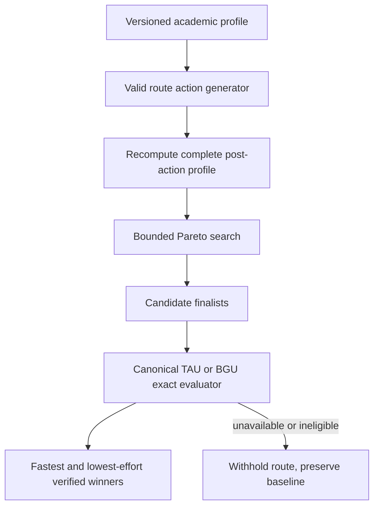

# Verified Admission Route Simulator Completion - Plan

## Goal Capsule

- **Objective:** Complete the route simulator so below-threshold applicants receive fastest and lowest-effort routes that become eligible under the exact TAU Computer Science and BGU Computer Science program evaluators.
- **Product authority:** A route is displayable only when the same verified evaluator used by the baseline calculator proves the post-action profile eligible.
- **Completion boundary:** TAU and BGU must both be implemented and production-proven; the existing TAU-only pilot is not completion.
- **Authority order:** This plan owns remaining completion work and cites `docs/plans/2026-07-14-001-feat-verified-admission-route-simulator-plan.md` for unchanged route behavior.
- **Dependency:** The `tau_cs__tau` and `bgu_cs__bgu` pair contracts must pass `docs/plans/2026-07-25-002-fix-formula-backed-admission-calculation-verification-plan.md`; global completion of that separate plan is not a prerequisite for this two-target simulator.

---

## Product Contract

### Summary

PR #94 implemented structured profiles, a bounded optimizer foundation, TAU official finalist replay, a route API, and result UI. BGU remains disabled, the TAU candidate generator covers only psychometric increases and a narrow exact-sciences bonus path, and production schema/proof is incomplete. This plan finishes the original two-institution promise without redefining it as a TAU pilot.

### Key Decisions

- KD1. TAU and BGU are both required before this plan is complete. (session-settled: user-directed - chosen over a TAU-first completion boundary: the original two-institution intent must be preserved.) Governs R1, R8-R10.
- KD2. Routes consume exact pair evaluators from the calculation-verification plan; route code does not own a parallel formula truth. Governs R2-R5.

### Requirements

**Candidate correctness**

- R1. Support the `tau_cs__tau` and `bgu_cs__bgu` below-threshold targets with verified fastest and lowest-effort routes; no institution-wide support may be inferred from those two pilots.
- R2. Route actions must include psychometric improvement, existing-grade improvement, unit expansion, and one eligible added subject when the target evaluator supports them.
- R3. Applying an action must recompute every affected official input, including Bagrut average, bonuses, gates, and subject-level fields.
- R4. Search must cover valid single actions and supported two-action combinations within documented caps, returning `search_incomplete` rather than a false no-route result.
- R5. Invalid, dominated, gate-failing, or unverifiable candidates must never appear as winners.
- R6. Fastest and lowest-effort winners must use a product-approved reviewed estimate seed and the stable tie-breaks from the original plan.

**Evaluation and experience**

- R7. Every displayed winner must replay through the exact target evaluator and record score, cutoff, gates, margin, rule fingerprint, and source.
- R8. BGU must use a fixture-proven local formula family with reviewed program cutoff and gates; score-only evidence cannot activate it.
- R9. TAU and BGU missing-input, authority-unavailable, stale, no-route, and search-incomplete states must preserve the baseline calculator verdict.
- R10. Browser tests must prove complete profile-to-route flows for both TAU and BGU and prove unsupported pairs never receive a verified badge.
- R11. Analytics and logs may record capability and outcome categories but no grades, subjects, or full academic profiles.
- R12. TAU finalist replay must send only calculator-required academic fields without user identity, use non-reversible keyed cache identities with no raw-profile cache payloads, and expose reviewed applicant disclosure plus retention/secondary-use assumptions before activation.

### Acceptance Examples

- AE1. **Covers R1-R7.** Given a TAU applicant whose shortest verified route is a psychometric increase and lowest-effort route is a Bagrut action, when simulation completes, then both distinct winners replay as eligible through the exact TAU evaluator.
- AE2. **Covers R1-R8.** Given a BGU applicant whose score would pass after a Bagrut improvement but whose mathematics gate still fails, when candidates are verified, then that route is withheld.
- AE3. **Covers R3-R5.** Given a subject-grade action changes the official Bagrut average, when the finalist is replayed, then the recalculated average rather than the original aggregate is sent to the evaluator.
- AE4. **Covers R9-R10.** Given the official TAU or BGU authority is unavailable, when route simulation runs, then the calculator result remains visible and no estimated route winner is shown.

### Scope Boundaries

- This plan completes route support for TAU Computer Science and BGU Computer Science; broader pair rollout follows exact evaluator coverage and explicit route-action capability.
- It does not make admission guarantees or infer routes from generic weighted formulas.
- It does not own formula verification, weekly publication, or alert delivery.

---

## Planning Contract

### Current-State Findings

- `src/server/admissions/routes/capabilityRegistry.ts` enables `tau_cs` and explicitly disables `bgu_cs`.
- `src/server/admissions/routes/tauRouteSimulation.ts` generates seven psychometric increments and at most one exact-sciences bonus candidate.
- TAU finalist replay currently keeps the original `bagrutAverage` while subject actions alter only the structured subject record.
- The optimizer, rate limit, API, profile-completion UI, and focused tests are useful foundations.

### Key Technical Decisions

- KTD1. Compose route capability from the canonical pair evaluator plus a separate route-action capability record. This implements KD2 and R1-R3.
- KTD2. Recompute the full post-action academic profile through the same versioned Bagrut/input policies used by the calculator before finalist verification. This implements R3 and R7.
- KTD3. Use bounded exhaustive search over every supported one- and two-action candidate that could beat either current winner; cap exhaustion returns `search_incomplete`. This implements R2-R6.
- KTD4. Keep TAU official replay and BGU fixture-proven local evaluation behind the same finalist interface and normalized verdict contract. This implements R7-R9.
- KTD5. Enable a target only after its exact evaluator, action-input model, estimate coverage, fixtures, and controlled live proof all pass. This implements R1 and R8-R10.

### High-Level Technical Design

### Sequencing

1. Bind route targets to the canonical exact evaluator capabilities.
2. Complete action application and full profile recomputation.
3. Prove bounded candidate completeness and ranking.
4. Complete TAU and BGU finalist adapters and fixtures.
5. Finish API/UI states and privacy-safe observability.
6. Run controlled production TAU and BGU browser proofs.

### Risks and Mitigations

- **Search misses the true winner:** Use admissible bounds, exhaustive supported two-action coverage, and golden brute-force comparisons.
- **Action changes only part of the official input:** Centralize post-action recomputation and compare evaluator snapshots.
- **BGU score passes but a gate fails:** Normalize score and gate verdict together.
- **External TAU drift:** Withdraw route capability and preserve the baseline result.
- **Effort estimates look authoritative:** Keep reviewed assumptions visible and separate from mathematical eligibility proof.

---

## Implementation Units

### U1. Compose exact evaluator and route-action capabilities

- **Goal:** Prevent route enablement from bypassing pair-level calculation proof.
- **Requirements:** R1-R3, R7-R9
- **Files:** `src/server/admissions/routes/capabilityRegistry.ts`, `src/server/admissions/capabilityMatrix.ts`, shared capability types, focused tests
- **Approach:** Replace hard-coded route truth with a composition of exact pair capability, required profile inputs, supported action types, estimate coverage, and verifier mode.
- **Test Scenarios:** Exact TAU; exact BGU; score-only BGU; stale exact pair; missing action input; unsupported pair.
- **Verification:** Capability contract tests prove no partial dimension can enable a route.

### U2. Recompute complete post-action profiles

- **Goal:** Ensure every action changes the same inputs the official evaluator would receive.
- **Requirements:** R2-R3, R5, R7
- **Files:** `src/server/admissions/routes/actions.ts`, `src/server/admissions/bagrutPolicies.ts`, profile snapshot modules, corresponding tests
- **Approach:** Apply actions immutably, validate academic transitions, recalculate institution-specific Bagrut/input values, and emit a versioned post-action snapshot.
- **Test Scenarios:** Grade improvement; unit expansion; added subject; invalid transition; TAU bonus; BGU gate; original aggregate replaced; two-action recomputation.
- **Verification:** Snapshot tests compare before/after inputs and evaluator digests.

### U3. Complete bounded candidate generation and dual ranking

- **Goal:** Find the true fastest and lowest-effort verified routes within the supported action space.
- **Requirements:** R2, R4-R6
- **Files:** `src/server/admissions/routes/optimizer.ts`, candidate generation modules, `src/data/admissions/routeEstimateSeed.ts`, focused tests
- **Approach:** Generate valid single actions, explore potentially winning two-action combinations, prune only proven dominance, enforce caps, and compare against a brute-force oracle in tests.
- **Test Scenarios:** Different fastest/effort winners; combined route; no route; search incomplete; tie-break; dominated candidate; invalid gate; estimate seed gap.
- **Verification:** Property/golden tests prove Pareto winners match the bounded brute-force oracle.

### U4. Complete TAU and BGU finalist verification

- **Goal:** Prove all displayed winners through exact program evaluators.
- **Requirements:** R1, R7-R9, R12
- **Files:** `src/server/admissions/routes/tauFinalistVerifier.ts`, BGU finalist adapter, `src/server/admissions/routes/tauRouteSimulation.ts`, BGU route simulation module, fixtures and tests
- **Approach:** Send only the minimum recomputed academic fields to TAU replay without user identity, use a keyed non-reversible cache identity whose value omits raw profiles, run BGU local formula/gate evaluation, normalize verdicts, and withhold any candidate lacking current exact proof.
- **Test Scenarios:** Eligible/ineligible TAU; eligible/ineligible BGU; gate failure; cutoff drift; source timeout; circuit open; fixture mismatch; mixed available/unavailable finalists; TAU request/cache privacy.
- **Verification:** Offline fixtures plus controlled current-source proofs for both institutions.

### U5. Complete API and result experience

- **Goal:** Make route results understandable and safe across all states.
- **Requirements:** R9-R12
- **Files:** `src/app/api/admissions/routes/route.ts`, `src/components/CalculatorResults.tsx`, client types, API/component/Playwright tests
- **Approach:** Return normalized status and evidence metadata, preserve the calculator result, collect missing inputs through the profile flow, render at most two verified cards with assumptions, and disclose the bounded TAU calculator data transfer before external replay.
- **Test Scenarios:** TAU winners; BGU winners; missing profile; authority unavailable; search incomplete; unsupported pair; API abuse/rate limit; disclosure; RTL and keyboard flow.
- **Verification:** API tests, component tests, and browser flows for TAU and BGU.

### U6. Prove rollout and operations

- **Goal:** Activate both target capabilities only after full production evidence exists.
- **Requirements:** R1, R8-R12
- **Files:** `docs/admissions-route-operations.md`, `src/server/data-health/queries.ts`, analytics hooks, operational tests
- **Approach:** Expose composed capability dimensions in data-health, document withdrawal and rollback, record approval of TAU retention/secondary-use assumptions and applicant disclosure, run privacy checks, and perform controlled live simulations.
- **Test Scenarios:** TAU enabled; BGU enabled; one capability withdrawn; logs contain only outcome categories; rollback to baseline-only experience.
- **Verification:** Production Supabase schema/grants, Vercel deployment, data-health, browser proof, and privacy-safe logs.

---

## Verification Contract

| Gate | Command or evidence | Applies to |
|---|---|---|
| Formatting and types | `npm run format:check` and `npm run typecheck` | All units |
| Route contracts | Focused capability, action, optimizer, TAU, and BGU tests | U1-U4 |
| API and UI | Focused route API and `CalculatorResults` tests | U5 |
| Repository safety | `npm run guard:pre-pr` | All units |
| Exact evaluator dependency | The TAU Computer Science and BGU Computer Science pair contracts pass the calculation-verification plan | U1, U4, U6 |
| Browser | Complete profile-to-route flows for TAU and BGU | U5-U6 |
| Production | Supabase schema/grants, correct Vercel deployment, data-health capabilities, and controlled live proofs | U6 |

---

## Definition of Done

- TAU and BGU route capabilities are both enabled through composed exact-evaluator and action-model gates.
- Every displayed route recomputes the complete post-action profile and replays as eligible through the canonical evaluator.
- Fastest and lowest-effort winners match bounded exhaustive-oracle fixtures, including supported two-action routes.
- The standard duration and effort seed has explicit product/editorial approval, effective dates, rationale, and complete coverage for every enabled action subtype.
- Invalid, gate-failing, stale, unavailable, and cap-exhausted candidates never appear as verified winners.
- TAU and BGU API, missing-input, result-card, failure, and rollback browser flows pass.
- Production data-health, logs, and analytics expose capability/outcome metadata without academic values.
- TAU replay sends no user identity, caches no raw profile, and has approved applicant disclosure plus documented retention/secondary-use assumptions.
- Full tests, production-safety checks, and `npm run guard:pre-pr` pass.
- Abandoned candidate strategies and duplicate evaluator logic are removed.
