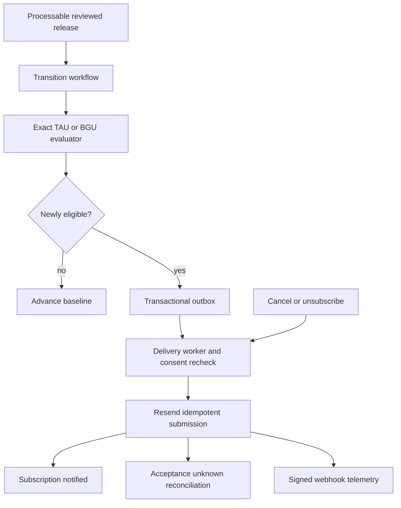

# Admission Change Alerts Completion - Plan

## Goal Capsule

- **Objective:** Deliver one trustworthy support email when a reviewed production admissions change makes a subscribed TAU Computer Science or BGU Computer Science target newly eligible.
- **Product authority:** Only a processable reviewed release and the canonical exact evaluator may trigger an alert.
- **Completion boundary:** Both TAU and BGU must complete subscription, transition processing, provider acceptance, webhook, cancellation, retry, and cycle-reset proofs.
- **Authority order:** This plan owns remaining completion work and cites `docs/plans/2026-07-14-003-feat-admission-change-alerts-plan.md` for unchanged lifecycle and privacy requirements.
- **Dependencies:** Production publication must pass plan 001, and the `tau_cs__tau` and `bgu_cs__bgu` exact pair contracts must pass plan 002; global completion of plan 002 is not a prerequisite for this two-target alert MVP.

---

## Product Contract

### Summary

PR #94 introduced subscription APIs, profile baselines, transition work, an outbox repository, expiration, and UI intent. No runtime invokes the transition processor or delivery worker, no provider can send mail, no signed webhook or unsubscribe path exists, and production lacks the tables. This plan completes the operational path and fixes queue behavior before activation.

### Key Decisions

- KD1. TAU and BGU are both required for completion. (session-settled: user-directed - chosen over a TAU-first completion boundary: alerts must preserve the original two-institution promise.) Governs R1, R13.
- KD2. Secrets are provisioning inputs, not implementation; delivery stays disabled until workers, provider, webhook, cancellation, recovery, and E2E proof exist. Governs R5-R13.
- KD3. Provider acceptance closes the one-notification product promise; webhook delivery events update telemetry but never initiate another send. Governs R8-R10.

### Requirements

**Trigger and transition processing**

- R1. Active subscriptions must support the verified `tau_cs__tau` and `bgu_cs__bgu` targets for the current admissions cycle; other pairs remain capability-gated.
- R2. Only a processable reviewed release may enqueue target-transition work.
- R3. Transition processing must replay the saved profile through the canonical exact evaluator and alert only on a mathematically verified below-to-eligible transition.
- R4. One unavailable or malformed subscription must retry or quarantine independently without blocking healthy peers or losing the target cursor.
- R5. Processing must checkpoint bounded batches and recover work left in `processing` after timeout or worker termination.

**Delivery and user control**

- R6. A transactional outbox must enforce one logical delivery per subscription and transition and one accepted notification per subscription/cycle.
- R7. A worker must recheck subscription, cycle, and category consent immediately before provider submission and suppress cancelled work durably.
- R8. Resend submission must use a stable idempotency key and classify accepted, retryable, permanent, and acceptance-unknown outcomes.
- R9. The Hebrew RTL email must contain no grades or raw academic inputs and must include manage-alerts, unsubscribe, and support links.
- R10. Signed Resend/Svix webhooks must verify the raw body, deduplicate event IDs, and update telemetry monotonically without resending.
- R11. Cancellation and category unsubscribe must suppress every not-yet-accepted delivery; in-flight uncertainty must be communicated accurately.
- R12. October 1 reset must expire prior-cycle subscriptions and prevent stale queued work from sending.
- R13. Data-health, runbooks, browser tests, and one controlled TAU and BGU delivery must prove the complete system before activation.
- R14. Logs, email payloads, provider metadata, webhook telemetry, analytics, and support views must contain no grades, scores, raw profiles, or unnecessary user identifiers.
- R15. Raw webhook bodies and academic inputs must not be retained; webhook deduplication events expire after 30 days; subscription and delivery metadata is deleted or anonymized 12 months after the cycle ends; and account deletion removes recipient addresses, active subscriptions, saved profiles, and revocable tokens without retaining a reversible user tombstone.

### Key Flows

- F1. Reviewed transition to accepted email
  - **Trigger:** A processable release affects a subscribed TAU or BGU pair.
  - **Steps:** Claim transition work, replay saved baseline and current rule, queue one outbox row, recheck consent, submit with idempotency, then close on provider acceptance.
  - **Outcome:** One notification is accepted and the subscription becomes notified.
  - **Covered by:** R1-R10
- F2. Cancellation and recovery
  - **Trigger:** A user cancels or a worker fails around claim/submission.
  - **Steps:** Persist cancellation, suppress safe work, recover expired claims, reconcile acceptance-unknown outcomes, and never initiate a new send after cancellation.
  - **Outcome:** User intent is honored without silent stuck rows or duplicate delivery.
  - **Covered by:** R4-R12

### Acceptance Examples

- AE1. **Covers R1-R9.** Given a BGU subscription was below and a published reviewed rule makes it eligible, when processing completes, then exactly one email is accepted and the subscription closes.
- AE2. **Covers R3-R4.** Given one TAU subscription cannot be evaluated while another becomes eligible, when their target work runs, then the healthy subscription proceeds and the unavailable one retries or quarantines independently.
- AE3. **Covers R6-R8.** Given the provider times out after submission, when reconciliation runs, then the row enters `acceptance_unknown` and no new send occurs until the same logical request is safely resolved.
- AE4. **Covers R7, R11.** Given cancellation occurs after claim but before submission, when the worker rechecks consent, then the outbox is durably suppressed rather than left in `processing`.
- AE5. **Covers R10.** Given duplicate or out-of-order signed webhooks, when they arrive, then telemetry advances monotonically and no notification is reopened or resent.

### Scope Boundaries

- Alerts remain one-time eligibility support messages, not recurring threshold newsletters.
- Inbox receipt is not guaranteed; the product promise ends at provider acceptance with supportable delivery telemetry.
- No raw scraper result, open PR, profile edit, or clock-only schedule may trigger an alert.
- Broader institutions follow exact evaluator capability after TAU and BGU completion.

### Dependencies

- `docs/plans/2026-07-25-001-fix-production-admissions-schema-and-weekly-operations-plan.md` owns deployed tables and processable releases.
- `docs/plans/2026-07-25-002-fix-formula-backed-admission-calculation-verification-plan.md` owns exact TAU and BGU verdicts.
- Resend sender, sending keys, and webhook secrets require environment-specific provisioning after implementation is ready.

---

## Planning Contract

### Current-State Findings

- `src/server/admission-alerts/transitionProcessor.ts` requeues an entire target work item when any subscription returns `retry_later`.
- `src/server/admission-alerts/deliveryWorker.ts` can return `idle` after claiming a row, leaving it in `processing`.
- The processor and delivery worker are referenced only by their modules and tests; no workflow or script invokes them.
- The repository has no Resend adapter, React Email template, signed webhook route, or category-unsubscribe endpoint.
- `.github/workflows/admission-alert-cycle-reset.yml` and expiration code exist and should be preserved.

### Key Technical Decisions

- KTD1. Invoke transition processing through a reusable protected GitHub Actions workflow keyed by release ID, not a public processor endpoint. This implements R2-R5.
- KTD2. Add per-subscription decision isolation and target-level checkpointing so retries cannot starve peers. This implements R4-R5.
- KTD3. Add leases/claim expiry and explicit terminal recovery for transition and outbox rows; no path may return while leaving an unowned `processing` row. This implements R5-R8.
- KTD4. Put Resend behind a provider-neutral adapter while using database uniqueness as the durable at-most-once boundary. This implements R6-R10.
- KTD5. Verify webhooks against the raw body before parsing and store only deduplicated minimal telemetry. This implements R9-R10.
- KTD6. Use opaque hashed unsubscribe tokens scoped to alert category and cycle; cancellation is checked at claim and immediately before send. This implements R7, R11-R12.

### High-Level Technical Design

### Sequencing

1. Deploy and verify the persistence schema through plan 001.
2. Harden transition isolation, leases, retries, and checkpoints.
3. Harden outbox claims and acceptance-unknown reconciliation.
4. Add provider adapter, template, environment validation, and workflow invocation.
5. Add signed webhook, unsubscribe, and user-visible lifecycle status.
6. Prove cycle reset, operations, privacy, and controlled TAU/BGU deliveries.

### Risks and Mitigations

- **Duplicate email after timeout:** Combine database uniqueness, provider idempotency, acceptance-unknown reconciliation, and no blind retry.
- **Cancelled email still sends:** Recheck consent immediately before submission and expose honest in-flight messaging.
- **One bad profile blocks a release:** Isolate retries and quarantine at subscription granularity.
- **Worker crash strands rows:** Use expiring leases, recovery queries, and data-health alerts.
- **Webhook forgery or replay:** Verify raw-body signatures and deduplicate provider event IDs.
- **Academic data reaches provider:** Render only target/support content and test payload metadata.

---

## Implementation Units

### U1. Validate deployed alert persistence and invariants

- **Goal:** Start runtime work only after schema, grants, uniqueness, and RLS are production-ready.
- **Requirements:** R1-R2, R6, R12, R15
- **Files:** alert migration tests, `scripts/verify-operational-db.mjs`, `src/server/data-health/queries.ts`, alert operations documentation
- **Approach:** Consume plan 001's schema evidence and extend data-health for queue counts, stuck leases, failed rows, cycle state, and retention-policy status.
- **Test Scenarios:** Missing table; wrong grant; duplicate logical delivery; stale-cycle row; stuck processing row; cross-user denial; expired webhook telemetry; post-cycle retention boundary.
- **Verification:** Disposable and production-safe database queries plus authenticated data-health.

### U2. Isolate and recover transition processing

- **Goal:** Process healthy subscriptions without starvation and resume safely after failure.
- **Requirements:** R2-R5
- **Files:** `src/server/admission-alerts/transitionProcessor.ts`, `src/server/admission-alerts/transitionWork.ts`, schema/migration if lease fields are needed, focused tests
- **Approach:** Add bounded checkpoints, per-subscription retry/quarantine state, claim expiry, release/cursor idempotency, and safe recovery.
- **Test Scenarios:** One unavailable among healthy peers; worker crash; lease expiry; out-of-order releases; duplicate release; 250 subscriptions across batches; quarantine then recovery.
- **Verification:** Repository and disposable-Postgres concurrency tests.

### U3. Wire protected release processing

- **Goal:** Invoke transition processing exactly for processable reviewed releases.
- **Requirements:** R1-R5, R13
- **Files:** `.github/workflows/admissions-publication.yml`, a reusable alert-processing workflow, a worker script under `scripts/`, workflow/module tests, runbook
- **Approach:** Pass release ID from successful publication, claim work directly through the protected database credential, use release-scoped concurrency, and resume until bounded completion.
- **Test Scenarios:** Successful release; publication failure; duplicate invocation; workflow timeout; no affected targets; BGU and TAU in one release.
- **Verification:** Workflow tests and a controlled protected run.

### U4. Harden outbox delivery and add Resend

- **Goal:** Submit one support email without stuck claims or duplicate sends.
- **Requirements:** R6-R9, R11
- **Files:** `src/server/admission-alerts/deliveryWorker.ts`, provider adapter modules, `package.json`, lockfile, environment validation, worker script/workflow, focused tests
- **Approach:** Add lease recovery, durable suppression, acceptance-unknown reconciliation, retry classification, and a Resend adapter using the database idempotency key.
- **Test Scenarios:** Accepted; transient rate limit; permanent invalid recipient; timeout before/after submission; cancellation after claim; two workers; lease expiry; provider duplicate.
- **Verification:** Unit and disposable-DB concurrency tests without live sending, followed by one authorized test delivery.

### U5. Build the privacy-safe email template

- **Goal:** Send a clear Hebrew RTL support message with safe management links.
- **Requirements:** R9, R11, R14
- **Files:** React Email template modules, renderer tests, provider payload tests
- **Approach:** Render institution/program, reviewed-change context, manage-alerts, category unsubscribe, and support links without grades, scores, hashes, or raw profile data.
- **Test Scenarios:** TAU and BGU content; RTL rendering; escaped program name; no academic values; missing support configuration; snapshot stability.
- **Verification:** Rendered HTML/text tests and payload privacy assertions.

### U6. Implement signed webhooks and unsubscribe

- **Goal:** Make delivery telemetry and cancellation trustworthy.
- **Requirements:** R10-R12, R15
- **Files:** `src/app/api/admission-alerts/webhooks/resend/route.ts`, webhook service, `src/app/api/admission-alerts/unsubscribe/route.ts`, unsubscribe token service, account API/UI, focused tests
- **Approach:** Verify Svix signatures before parsing, deduplicate events, update telemetry monotonically, hash opaque tokens, and suppress active/pending category work transactionally.
- **Test Scenarios:** Valid webhook; forged signature; duplicate event; out-of-order delivered/bounced events; expired token; category unsubscribe; in-flight acceptance unknown; repeated cancellation.
- **Verification:** API, service, database, and browser tests.

### U7. Complete user experience, operations, and TAU/BGU proof

- **Goal:** Activate alerts only after users and operators can understand and control the full lifecycle.
- **Requirements:** R1, R9-R15
- **Files:** `src/components/CalculatorResults.tsx`, profile/manage-alert UI, `src/app/api/admission-alerts/`, `docs/` runbook, data-health queries/dashboard, Playwright tests
- **Approach:** Expose active, needs-profile, pending, notified, cancelled, expired, and failed states; document recovery, secret rotation, retention, and account-deletion cleanup; run one controlled TAU and BGU release-to-accepted-email flow.
- **Test Scenarios:** Signup continuation; active subscription; cancellation; acceptance unknown; delivery failure; October reset; retention cleanup; account deletion; unsupported pair; TAU E2E; BGU E2E; duplicate replay.
- **Verification:** Component/API tests, Playwright, Supabase queries, Resend evidence, signed webhook proof, Vercel logs, and data-health.

---

## Verification Contract

| Gate | Command or evidence | Applies to |
|---|---|---|
| Formatting and types | `npm run format:check` and `npm run typecheck` | All units |
| Alert logic | Focused lifecycle, transition, delivery, webhook, and expiration tests | U2-U7 |
| Database | Migration, RLS, uniqueness, lease, concurrency, and representative role tests | U1-U4, U6 |
| Repository safety | `npm run guard:pre-pr` | All units |
| Provider | Render/payload tests and one authorized idempotent Resend submission | U4-U5, U7 |
| Workflow | Protected publication-to-transition and delivery workflow runs | U3-U4, U7 |
| Browser | Subscription, management, cancellation, and TAU/BGU complete flows | U6-U7 |
| Production | Supabase, correct Vercel deployment, data-health, Resend, webhook, and privacy-safe logs | U7 |

---

## Definition of Done

- Production alert tables, grants, RLS, uniqueness constraints, and queue indexes are verified.
- Processable releases invoke bounded transition work without a public processor endpoint.
- One unavailable subscription cannot block healthy peers, and crashed/stuck work recovers safely.
- Cancellation after claim durably suppresses unsent work; no path leaves an unowned `processing` row.
- Resend acceptance, retry, permanent failure, and acceptance-unknown behavior are implemented and tested.
- Hebrew RTL email, signed webhook, category unsubscribe, manage-alert lifecycle, and October reset are complete.
- Webhook, subscription, delivery, token, and account-deletion cleanup follow the inherited privacy-retention contract and leave no reversible user tombstone.
- Controlled TAU and BGU release transitions each produce one accepted email and no duplicate after retry/replay.
- Data-health and runbooks make stuck, failed, unknown, expired, and suppressed states supportable.
- Full tests, browser verification, production-safety checks, and `npm run guard:pre-pr` pass.
- Abandoned provider experiments, duplicate worker entry points, and test-only runtime wiring are removed.
